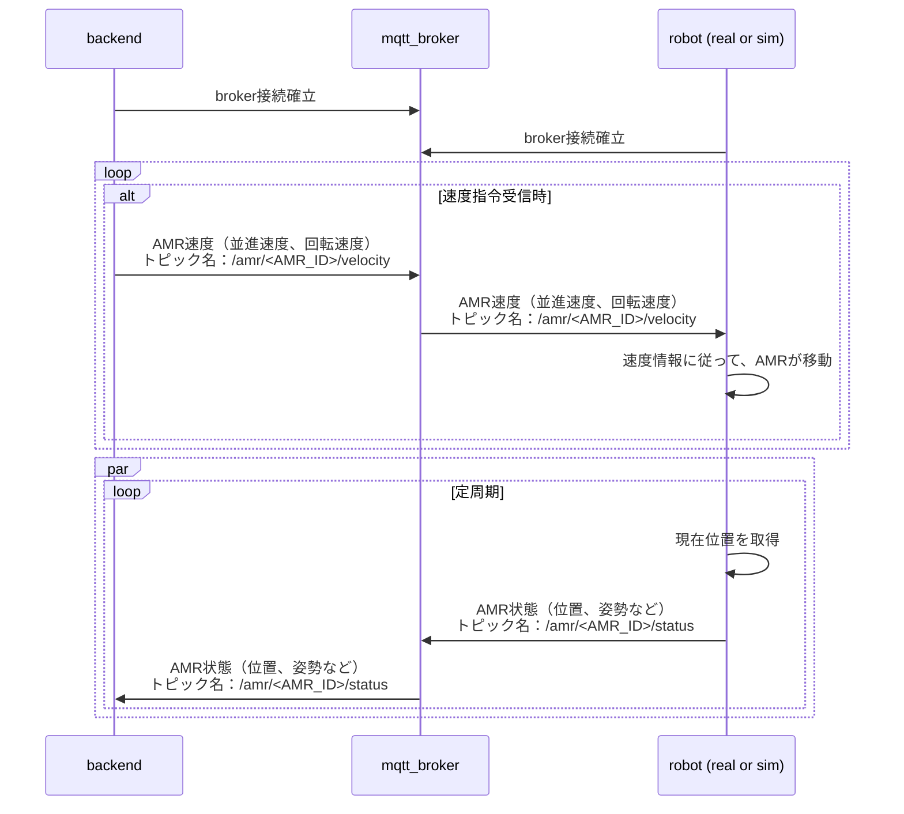
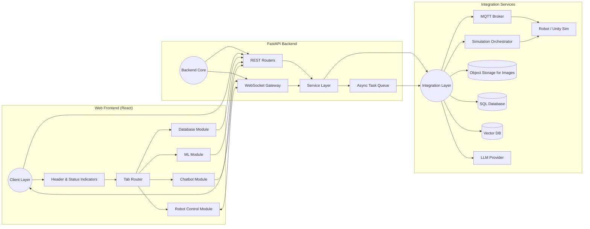
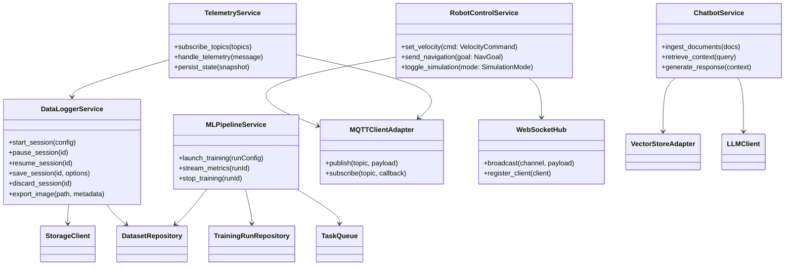
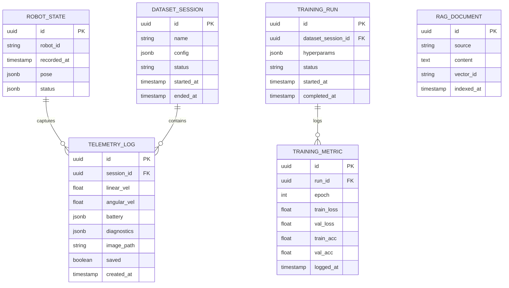
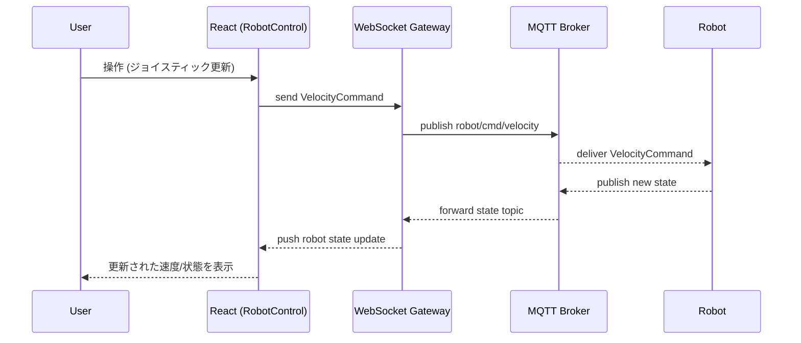
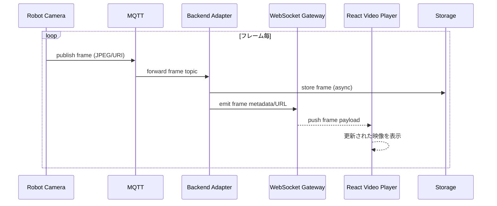
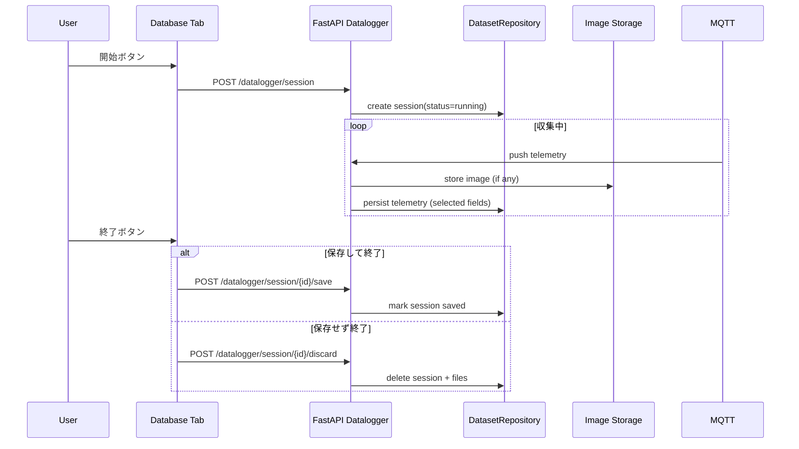
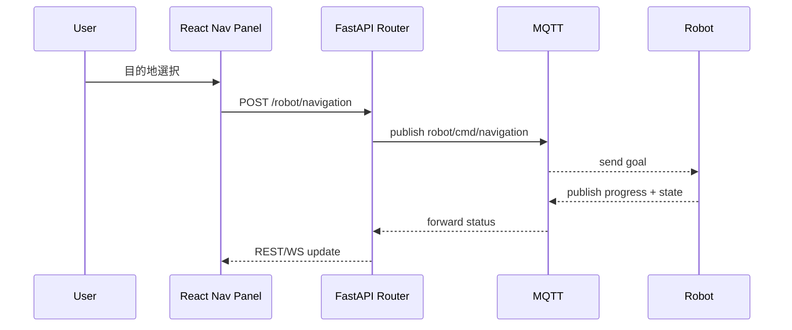
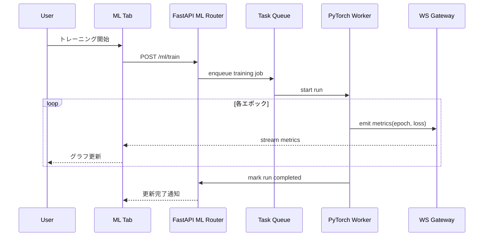
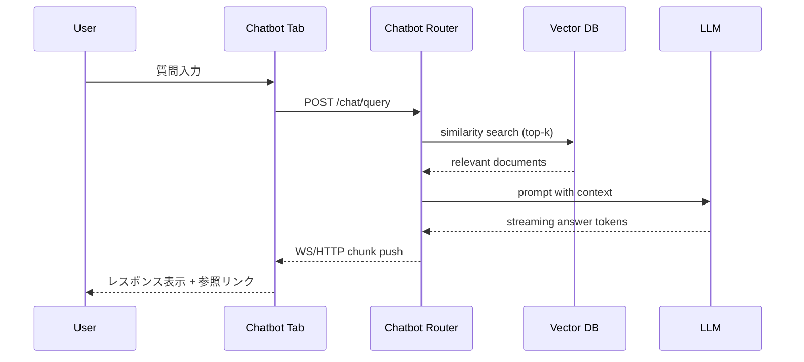

# robot-ml-web-app


# シーケンス図

## 初期接続

backend <-> robot間の初期接続時の流れを示します。



## トピック仕様

```
<AMR_ID> は各AMRを識別するためのユニークなIDに置き換えてください。
```

### トピック一覧

| No | 概要 | トピック名 | 方向 | QOS | レテンション | 備考 |
|----|------|------------|------|-----|--------------|------|
| 1 | [AMR速度指令](#amr速度指令) | /amr/<AMR_ID>/velocity | Backend → Robot | 1 | なし | - |
| 2 | [AMR状態情報](#amr状態) | /amr/<AMR_ID>/status | Robot → Backend | 1 | なし | - |

### 各トピック詳細

```
各payloadは説明用にJSONC形式（コメント付きJSON）で記述していますが、実際の実装では、JSON形式で記述する必要があることに注意してください。
```

#### AMR速度指令

AMRはこのトピックを購読し、受信した速度指令に従って走行します。

- **トピック名**: /amr/<AMR_ID>/velocity
- **方向**: Backend → Robot
- **QOS**: 1
- **レテンション**: なし

Payload

```json
{
  "linear": 1.0,   // 並進速度 (m/s)
  "angular": 0.5   // 回転速度 (rad/s)
}
```

#### AMR状態

AMRの現在の状態情報を送信します。  
Backendはこのトピックを購読し、AMRの位置やバッテリ状態を把握します。

- **トピック名**: /amr/<AMR_ID>/status
- **方向**: Robot → Backend
- **QOS**: 1
- **レテンション**: なし

Payload

```json
{
  "position": {
    "x": 0.0,      // X座標 (m)
    "y": 0.0,      // Y座標 (m)
    "theta": 0.0   // 姿勢角 (rad)
  },
  "timestamp": 0       // Unixタイムスタンプ (ms)
}
```

以下、copilot生成による仮の設計書

## 目次
- [robot-ml-web-app](#robot-ml-web-app)
- [シーケンス図](#シーケンス図)
  - [初期接続](#初期接続)
  - [トピック仕様](#トピック仕様)
    - [トピック一覧](#トピック一覧)
    - [各トピック詳細](#各トピック詳細)
      - [AMR速度指令](#amr速度指令)
      - [AMR状態](#amr状態)
  - [目次](#目次)
  - [1. ゴールとスコープ](#1-ゴールとスコープ)
  - [2. ユースケース概要](#2-ユースケース概要)
  - [3. 全体アーキテクチャ](#3-全体アーキテクチャ)
    - [3.1 コンポーネント構成図](#31-コンポーネント構成図)
    - [3.2 デプロイ・ネットワーク構成](#32-デプロイネットワーク構成)
  - [4. フロントエンド設計](#4-フロントエンド設計)
    - [4.1 ディレクトリ構成案](#41-ディレクトリ構成案)
    - [4.2 共通 UI / ヘッダー設計](#42-共通-ui--ヘッダー設計)
    - [4.3 状態管理と通信レイヤ](#43-状態管理と通信レイヤ)
  - [5. バックエンド設計](#5-バックエンド設計)
    - [5.1 アプリケーションレイヤ構成](#51-アプリケーションレイヤ構成)
    - [5.2 クラス図](#52-クラス図)
    - [5.3 API 一覧](#53-api-一覧)
  - [6. データ管理](#6-データ管理)
    - [6.1 データベーススキーマ](#61-データベーススキーマ)
    - [6.2 ファイルストレージ戦略](#62-ファイルストレージ戦略)
    - [6.3 メッセージ / トピック設計](#63-メッセージ--トピック設計)
  - [7. シーケンス図](#7-シーケンス図)
    - [7.1 ロボット速度制御 (ジョイスティック)](#71-ロボット速度制御-ジョイスティック)
    - [7.2 カメラ映像ストリーミング](#72-カメラ映像ストリーミング)
    - [7.3 状態監視とデータロギング](#73-状態監視とデータロギング)
    - [7.4 ナビゲーション指示](#74-ナビゲーション指示)
    - [7.5 機械学習トレーニング](#75-機械学習トレーニング)
    - [7.6 Chatbot (RAG 質問応答)](#76-chatbot-rag-質問応答)
  - [8. 非機能要件](#8-非機能要件)
  - [9. セキュリティと監視](#9-セキュリティと監視)
  - [10. 将来的な拡張ポイント](#10-将来的な拡張ポイント)

## 1. ゴールとスコープ
- React + FastAPI を基盤としたロボット運用統合 Web アプリを構築する。
- ロボット制御、データ収集/蓄積、機械学習、チャットボット (RAG + LLM) をタブ切り替えで提供する。
- Unity シミュレーション/実機切替機能、MQTT/WebSocket の接続確認 UI を備える。
- Web フロントエンドとバックエンドのディレクトリ構成をタブ毎に分離し、疎結合・保守性を高める。

## 2. ユースケース概要
| タブ | 主機能 | 主な通信 | 補足 |
| ---- | ------ | -------- | ---- |
| ロボット制御 | ジョイスティック操作、リアルタイム映像、状態監視、ナビゲーション指示 | WebSocket / MQTT / REST | シミュレーション切替、通信ステータス表示 |
| データベース画面 | 状態・速度・画像メタデータの蓄積、選択保存、フェイルセーフな保存フロー | REST / WebSocket | 5 ボタン制御 (開始/一時停止/保存/破棄/終了) |
| 機械学習画面 | 保存データを用いた PyTorch トレーニング、学習曲線リアルタイム可視化 | REST / WebSocket | ML パイプラインはバックエンドジョブ + ストリーミング更新 |
| Chatbot | RAG + LLM による FAQ / オペレーション支援 | REST / WebSocket | Vector DB + Document Store |

## 3. 全体アーキテクチャ
### 3.1 コンポーネント構成図


### 3.2 デプロイ・ネットワーク構成
- **フロントエンド**: React + Vite/Next.js, Nginx でホスト。
- **バックエンド**: FastAPI (Uvicorn/Gunicorn) + Celery (Redis/ RabbitMQ) for ML jobs。
- **MQTT ブローカ**: Mosquitto (Docker コンテナ)。
- **データベース**: PostgreSQL + SQLAlchemy。画像用オブジェクトストレージ (MinIO / S3 互換)。
- **Vector DB**: Qdrant or Weaviate。
- **メッセージング**: WebSocket (FastAPI) + MQTT (ロボット) + REST API。
- **監視**: Prometheus + Grafana, Loki でロギング。

## 4. フロントエンド設計
### 4.1 ディレクトリ構成案
```
frontend/
  src/
    app/
      Router.tsx
      store/
      hooks/
      api/
    modules/
      robot-control/
        components/
        hooks/
        services/
      database/
        ...
      ml/
        ...
      chatbot/
        ...
    shared/
      components/
      icons/
      layouts/
      utils/
  public/
```
- 各タブは `modules/<tab>/` 配下で独立管理。
- 共通 Header と WebSocket フックは `shared/` に配置。

### 4.2 共通 UI / ヘッダー設計
- **要素**: タイトル、タブナビゲーション、`シミュレーション起動/終了` ボタン、MQTT/WebSocket ステータスアイコン。
- **接続インジケータ**: `useConnectionStatus` フックが backend REST (`/health`) と WS ping を監視。
- **シミュレーション操作**: API 呼び出し (POST `/simulation/start|stop`) で Unity/実機切替。

### 4.3 状態管理と通信レイヤ
- **状態管理**: Redux Toolkit / Zustand + React Query。
- **リアルタイム**: `useWebSocket` カスタムフックでロボット制御/ML進捗/ログを購読。
- **フォーム管理**: React Hook Form を採用。

## 5. バックエンド設計
### 5.1 アプリケーションレイヤ構成
```
backend/
  app/
    main.py
    core/
      config.py
      logging.py
      dependencies.py
    api/
      router.py
      robot_control/
      database/
      ml/
      chatbot/
    services/
      robot.py
      telemetry.py
      datalogger.py
      ml_pipeline.py
      chatbot.py
    repositories/
      robot_state.py
      datasets.py
      training_runs.py
      rag_documents.py
    schemas/
      robot.py
      telemetry.py
      datasets.py
      ml.py
      chatbot.py
    workers/
      tasks.py
    adapters/
      mqtt_client.py
      websocket_manager.py
      storage_client.py
      vector_store.py
      llm_client.py
```
- `services/` がビジネスロジックを集約。
- `repositories/` はデータアクセス層 (SQLAlchemy)。
- `adapters/` で外部システムと疎結合化。

### 5.2 クラス図


### 5.3 API 一覧
| メソッド | エンドポイント | 概要 |
| -------- | -------------- | ---- |
| GET | `/health` | MQTT/WS ステータス含むシステムヘルスチェック |
| WS | `/ws/robot` | ロボット制御/状態ストリーミング |
| WS | `/ws/ml` | 学習進捗ストリーミング |
| WS | `/ws/chat` | 双方向チャット更新 |
| POST | `/robot/velocity` | 速度指令 |
| POST | `/robot/navigation` | 目標地点指示 |
| POST | `/simulation/start` | シミュレーション起動 |
| POST | `/simulation/stop` | シミュレーション終了 |
| POST | `/datalogger/session` | セッション開始 |
| PATCH | `/datalogger/session/{id}` | 一時停止/再開 |
| POST | `/datalogger/session/{id}/save` | 保存して終了 |
| POST | `/datalogger/session/{id}/discard` | 保存せず終了 |
| GET | `/datasets` | 保存データ一覧 |
| POST | `/ml/train` | トレーニング開始 |
| GET | `/ml/runs/{id}` | 学習メトリクス取得 |
| POST | `/chat/query` | 質問受付 |

## 6. データ管理
### 6.1 データベーススキーマ


### 6.2 ファイルストレージ戦略
- 画像は `/data/uploads/images/{session_id}/{timestamp}.jpg` に保存。
- DB には `image_path` とメタ情報のみ保持。
- 大容量動画は将来のため別バケットを想定。

### 6.3 メッセージ / トピック設計
| チャネル | 用途 | 方向 |
| -------- | ---- | ---- |
| `robot/cmd/velocity` | 速度コマンド | Backend → Robot |
| `robot/cmd/navigation` | ナビゲーション指示 | Backend → Robot |
| `robot/state` | 状態情報 (位置, バッテリ) | Robot → Backend |
| `robot/camera` | カメラフレーム (バイナリ/URI) | Robot → Backend |
| `sim/control` | シミュレーション起動/停止 | Backend → Unity |
| WebSocket `/ws/robot` | 状態ブロードキャスト, joystick フィードバック | Backend ↔ Frontend |
| WebSocket `/ws/ml` | 学習メトリクス push | Backend ↔ Frontend |
| WebSocket `/ws/chat` | ストリーミング回答 | Backend ↔ Frontend |

## 7. シーケンス図


### 7.1 ロボット速度制御 (ジョイスティック)


### 7.2 カメラ映像ストリーミング


### 7.3 状態監視とデータロギング


### 7.4 ナビゲーション指示


### 7.5 機械学習トレーニング


### 7.6 Chatbot (RAG 質問応答)


## 8. 非機能要件
- **リアルタイム性**: 制御系は <100ms 以内の往復を目標。
- **耐障害性**: MQTT 再接続ロジック、WS バックオフ、データ保存時の ACID 保証。
- **スケーラビリティ**: フロントエンドは CDN, バックエンドはコンテナスケール、MQTT ブローカはクラスタリング。
- **セキュリティ**: JWT/OAuth2, ロールベースアクセス制御, TLS 終端。
- **観測性**: OpenTelemetry 対応、構成変更の監査ログ。

## 9. セキュリティと監視
- **認証/認可**: Keycloak or Cognito, Role (Operator, Analyst, Admin)。
- **ネットワーク**: MQTT over TLS, WebSocket w/ Secure cookies, CORS ホワイトリスト。
- **監視**: Prometheus exporter, Grafana ダッシュボード (通信状態, ML job metrics)。
- **ログ**: 構造化 JSON, Loki 集約。

## 10. 将来的な拡張ポイント
- マルチロボット管理 (Robot ID 切替)。
- オフラインバッチ解析 (ETL pipeline)。
- Edge 推論向け Federated Learning。
- 音声インタフェースによる Chatbot 拡張。
- モバイルクライアント (React Native)。
