# robot-ml-web-app


# シーケンス図

backend <-> robot間の初期接続時の流れを示します。

```
「backend <-> robot間」はMQTT brokerを介してMQTT通信を行いますが、以下シーケンス図では、brokerを省略しています。
```

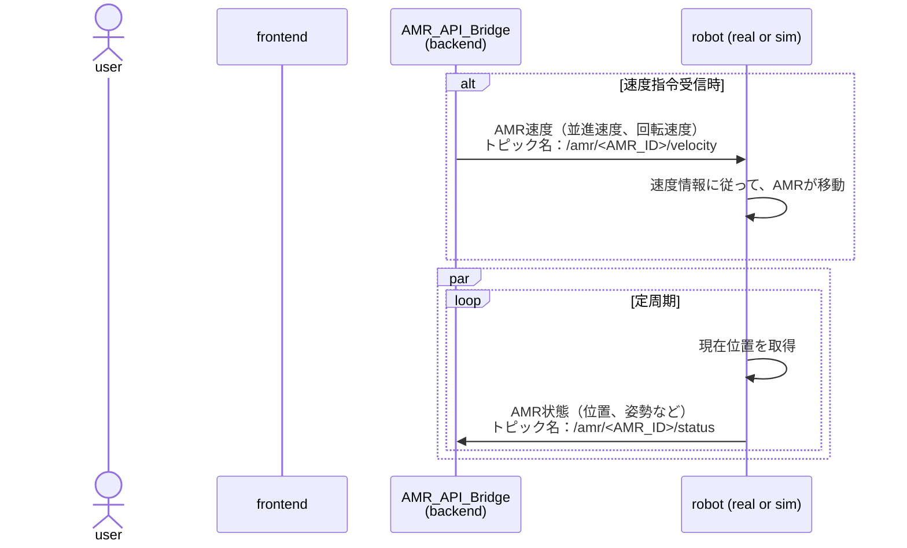

## トピック仕様

```
<AMR_ID> は各AMRを識別するためのユニークなIDに置き換えてください。
```

### トピック一覧

| No | 概要 | トピック名 | 方向 | QOS | レテンション | 備考 |
|----|------|------------|------|-----|--------------|------|
| 1 | [AMR速度指令](#amr速度指令) | /amr/<AMR_ID>/velocity | Backend → Robot | 1 | なし | - |
| 2 | [AMR状態](#amr状態) | /amr/<AMR_ID>/status | Robot → Backend | 1 | なし | - |

### 各トピック詳細

```
各payloadは説明用にJSONC形式（コメント付きJSON）で記述していますが、実際の実装では、JSON形式で記述する必要があることに注意してください。
```

#### AMR速度指令

AMRに対する速度指令を送信します。

- **トピック名**: /amr/<AMR_ID>/velocity
- **方向**: Backend → Robot
- **QOS**: 1
- **レテンション**: なし

Payload

```json
{
  "linear": 1.0,   // 並進速度 (m/s)
  "angular": 0.5   // 回転速度 (rad/s)
}
```

#### AMR状態

AMRの現在の状態を送信します。  

- **トピック名**: /amr/<AMR_ID>/status
- **方向**: Robot → Backend
- **QOS**: 1
- **レテンション**: なし

Payload

```json
{
  "position": {
    "x": 0.0,      // X座標 (m)
    "y": 0.0,      // Y座標 (m)
    "theta": 0.0   // 姿勢角 (rad)
  },
  "timestamp": 0       // Unixタイムスタンプ (ms)
}
```

以下、copilot生成による仮の設計書

## 目次
- [robot-ml-web-app](#robot-ml-web-app)
- [シーケンス図](#シーケンス図)
  - [トピック仕様](#トピック仕様)
    - [トピック一覧](#トピック一覧)
    - [各トピック詳細](#各トピック詳細)
      - [AMR速度指令](#amr速度指令)
      - [AMR状態](#amr状態)
  - [目次](#目次)
  - [0. ディレクトリ構成](#0-ディレクトリ構成)
    - [0.1 全体構成](#01-全体構成)
    - [0.2 フロントエンド詳細](#02-フロントエンド詳細)
    - [0.3 バックエンド詳細](#03-バックエンド詳細)
  - [1. ゴールとスコープ](#1-ゴールとスコープ)
  - [2. ユースケース概要](#2-ユースケース概要)
  - [3. 全体アーキテクチャ](#3-全体アーキテクチャ)
    - [3.1 コンポーネント構成図](#31-コンポーネント構成図)
    - [3.2 デプロイ・ネットワーク構成](#32-デプロイネットワーク構成)
  - [4. フロントエンド設計](#4-フロントエンド設計)
    - [4.1 ディレクトリ構成案](#41-ディレクトリ構成案)
    - [4.2 共通 UI / ヘッダー設計](#42-共通-ui--ヘッダー設計)
    - [4.3 状態管理と通信レイヤ](#43-状態管理と通信レイヤ)
  - [5. バックエンド設計](#5-バックエンド設計)
    - [5.1 アプリケーションレイヤ構成](#51-アプリケーションレイヤ構成)
    - [5.1.1 Robot API の条件付きデータ保存パターン](#511-robot-api-の条件付きデータ保存パターン)
    - [5.2 クラス図](#52-クラス図)
    - [5.2 クラス図](#52-クラス図-1)
    - [5.3 API 一覧](#53-api-一覧)
  - [6. データ管理](#6-データ管理)
    - [6.1 データベーススキーマ](#61-データベーススキーマ)
    - [6.2 ファイルストレージ戦略](#62-ファイルストレージ戦略)
    - [6.3 メッセージ / トピック設計](#63-メッセージ--トピック設計)
  - [7. シーケンス図](#7-シーケンス図)
    - [7.1 ロボット速度制御 (ジョイスティック)](#71-ロボット速度制御-ジョイスティック)
    - [7.2 カメラ映像ストリーミング](#72-カメラ映像ストリーミング)
    - [7.3 状態監視とデータロギング](#73-状態監視とデータロギング)
    - [7.4 ナビゲーション指示](#74-ナビゲーション指示)
    - [7.5 機械学習トレーニング](#75-機械学習トレーニング)
    - [7.6 Chatbot (RAG 質問応答)](#76-chatbot-rag-質問応答)
  - [7.7 バックエンド内 - Robot API 変換フロー（条件付きデータ保存）](#77-バックエンド内---robot-api-変換フロー条件付きデータ保存)
  - [7.8 バックエンド内 - センサデータ取得・保存フロー](#78-バックエンド内---センサデータ取得保存フロー)
  - [7.9 バックエンド内 - ML トレーニングと データ連携](#79-バックエンド内---ml-トレーニングと-データ連携)
  - [7.10 バックエンド内 - Chatbot 質問応答フロー](#710-バックエンド内---chatbot-質問応答フロー)
  - [7.11 バックエンド内 - データ層 統合ビュー](#711-バックエンド内---データ層-統合ビュー)
  - [7.12 データフロー: robot\_api と datalogger の連携](#712-データフロー-robot_api-と-datalogger-の連携)
  - [8. 非機能要件](#8-非機能要件)
  - [9. セキュリティと監視](#9-セキュリティと監視)
  - [10. 将来的な拡張ポイント](#10-将来的な拡張ポイント)

## 0. ディレクトリ構成

### 0.1 全体構成

```
robot-ml-web-app/
├── frontend/                       # React フロントエンド
│   ├── public/
│   ├── src/
│   ├── package.json
│   ├── tsconfig.json
│   └── vite.config.ts
├── backend/                        # FastAPI バックエンド
│   ├── app/
│   ├── requirements.txt
│   ├── pyproject.toml
│   └── Dockerfile
├── mqtt-broker/                    # Mosquitto MQTT ブローカー
│   └── mosquitto.conf
├── docker-compose.yml              # 全サービス統合起動
├── README.md                       # このファイル
└── docs/                          # ドキュメント
    ├── API_SPEC.md
    ├── DEPLOYMENT.md
    └── TROUBLESHOOTING.md
```

### 0.2 フロントエンド詳細

```
frontend/src/
├── app/
│   ├── App.tsx                     # メインアプリケーションコンポーネント
│   ├── Router.tsx                  # タブナビゲーション
│   ├── store/                      # Redux/Zustand 状態管理
│   │   ├── slices/
│   │   │   ├── robotSlice.ts
│   │   │   ├── mlSlice.ts
│   │   │   ├── telemetrySlice.ts
│   │   │   └── chatSlice.ts
│   │   └── index.ts
│   ├── hooks/
│   │   ├── useWebSocket.ts         # WebSocket カスタムフック
│   │   ├── useConnectionStatus.ts  # 接続状態監視
│   │   └── useAsync.ts
│   └── api/
│       ├── axiosConfig.ts          # axios インスタンス
│       ├── robotApi.ts
│       ├── mlApi.ts
│       ├── telemetryApi.ts
│       └── chatbotApi.ts
│
├── modules/                        # タブ毎の独立モジュール
│   │
│   ├── robot-control/
│   │   ├── components/
│   │   │   ├── JoystickPanel.tsx
│   │   │   ├── RobotStatus.tsx
│   │   │   ├── VideoStream.tsx
│   │   │   ├── NavigationMap.tsx
│   │   │   └── SimulationToggle.tsx
│   │   ├── hooks/
│   │   │   └── useRobotControl.ts
│   │   ├── services/
│   │   │   └── robotService.ts
│   │   └── index.tsx               # タブのエントリポイント
│   │
│   ├── database/
│   │   ├── components/
│   │   │   ├── DataLoggerControl.tsx
│   │   │   ├── SessionList.tsx
│   │   │   ├── DataPreview.tsx
│   │   │   └── SessionStatus.tsx
│   │   ├── hooks/
│   │   │   └── useDataLogger.ts
│   │   ├── services/
│   │   │   └── dataloggerService.ts
│   │   └── index.tsx
│   │
│   ├── ml/
│   │   ├── components/
│   │   │   ├── TrainingControl.tsx
│   │   │   ├── HyperparameterForm.tsx
│   │   │   ├── MetricsChart.tsx
│   │   │   ├── TrainingHistory.tsx
│   │   │   └── ModelComparison.tsx
│   │   ├── hooks/
│   │   │   └── useMLTraining.ts
│   │   ├── services/
│   │   │   └── mlService.ts
│   │   └── index.tsx
│   │
│   └── chatbot/
│       ├── components/
│       │   ├── ChatWindow.tsx
│       │   ├── MessageList.tsx
│       │   ├── QueryInput.tsx
│       │   ├── DocumentPreview.tsx
│       │   └── ChatHistory.tsx
│       ├── hooks/
│       │   └── useChatbot.ts
│       ├── services/
│       │   └── chatbotService.ts
│       └── index.tsx
│
├── shared/
│   ├── components/
│   │   ├── Header.tsx              # ヘッダー（共通）
│   │   ├── TabNav.tsx              # タブナビゲーション
│   │   ├── ConnectionStatus.tsx    # 接続ステータスインジケータ
│   │   ├── LoadingSpinner.tsx
│   │   └── ErrorBoundary.tsx
│   ├── icons/                      # SVG アイコン
│   │   ├── RobotIcon.tsx
│   │   ├── DatabaseIcon.tsx
│   │   ├── MLIcon.tsx
│   │   ├── ChatIcon.tsx
│   │   ├── WifiIcon.tsx
│   │   └── MqttIcon.tsx
│   ├── layouts/
│   │   ├── AppLayout.tsx           # 全体レイアウト
│   │   └── TabLayout.tsx           # タブ内レイアウト
│   ├── utils/
│   │   ├── formatters.ts           # データフォーマット関数
│   │   ├── validators.ts           # 入力検証
│   │   ├── constants.ts            # 定数
│   │   └── logger.ts               # クライアント側ログ
│   ├── types/
│   │   ├── robot.ts                # ロボット制御型定義
│   │   ├── telemetry.ts            # センサデータ型定義
│   │   ├── ml.ts                   # ML型定義
│   │   ├── chat.ts                 # チャット型定義
│   │   └── api.ts                  # API通信型定義
│   └── styles/
│       ├── globals.css
│       └── theme.css
│
├── index.tsx                       # エントリポイント
└── vite-env.d.ts
```

### 0.3 バックエンド詳細

```
backend/app/
├── main.py                         # FastAPI アプリケーション初期化
├── core/
│   ├── __init__.py
│   ├── config.py                   # 環境変数、設定管理
│   ├── logging.py                  # ロギング設定
│   ├── dependencies.py             # 依存性注入
│   ├── exceptions.py               # カスタム例外
│   └── security.py                 # JWT, OAuth2 設定
│
├── api/
│   ├── __init__.py
│   ├── router.py                   # API 統一ルーター
│   │
│   ├── robot_api/                  # 1️⃣ Robot API 変換
│   │   ├── __init__.py
│   │   ├── router.py               # POST /robot/velocity, /navigation
│   │   ├── schemas.py              # VelocityCommand, NavigationGoal
│   │   └── models.py               # (オプション) ローカルモデル
│   │
│   ├── telemetry/                  # 3️⃣ センサデータ取得・保存
│   │   ├── __init__.py
│   │   ├── router.py               # POST /datalogger/session, GET /sessions
│   │   ├── schemas.py              # TelemetryLog, SessionConfig
│   │   └── models.py
│   │
│   ├── ml/                         # 2️⃣ 機械学習
│   │   ├── __init__.py
│   │   ├── router.py               # POST /ml/train, GET /ml/runs/{id}
│   │   ├── schemas.py              # TrainingConfig, MetricSnapshot
│   │   └── models.py
│   │
│   └── chatbot/                    # 4️⃣ Chatbot
│       ├── __init__.py
│       ├── router.py               # POST /chat/query, GET /chat/history
│       ├── schemas.py              # QueryRequest, ChatResponse
│       └── models.py
│
├── services/                       # ビジネスロジック層（役割別分離）
│   ├── __init__.py
│   ├── robot_control.py            # RobotControlService
│   │                               # - set_velocity()
│   │                               # - send_navigation()
│   │                               # - toggle_simulation()
│   │
│   ├── telemetry_processor.py      # TelemetryProcessorService
│   │                               # - handle_mqtt_message()
│   │                               # - preprocess_data()
│   │
│   ├── datalogger.py               # DataLoggerService
│   │                               # - start_session()
│   │                               # - save_session()
│   │                               # - discard_session()
│   │
│   ├── ml_pipeline.py              # MLPipelineService
│   │                               # - launch_training()
│   │                               # - stream_metrics()
│   │                               # - stop_training()
│   │
│   └── chatbot_engine.py           # ChatbotService
│                                   # - retrieve_context()
│                                   # - generate_response()
│
├── repositories/                   # データアクセス層（DB/Storage操作）
│   ├── __init__.py
│   ├── base.py                     # BaseRepository
│   ├── robot_state.py              # RobotStateRepository
│   ├── sensor_data.py              # SensorDataRepository
│   │                               # - create(), list_by_session()
│   │                               # - export_for_training()
│   │
│   ├── training_runs.py            # TrainingRunRepository
│   │                               # - create_run(), update_metrics()
│   │
│   ├── training_metrics.py         # TrainingMetricRepository
│   │
│   └── rag_documents.py            # RAGDocumentRepository
│                                   # - index_document(), search()
│
├── models/                         # SQLAlchemy ORM モデル
│   ├── __init__.py
│   ├── robot_state.py              # RobotState テーブル
│   ├── sensor_data.py              # SensorData テーブル
│   ├── dataset_session.py          # DatasetSession テーブル
│   ├── training_run.py             # TrainingRun テーブル
│   ├── training_metric.py          # TrainingMetric テーブル
│   └── rag_document.py             # RAGDocument テーブル
│
├── adapters/                       # 外部システム統合（プロトコル、SDK抽象化）
│   ├── __init__.py
│   ├── mqtt_client.py              # MQTTClientAdapter
│   │                               # - publish(), subscribe_with_callback()
│   │
│   ├── websocket_manager.py        # WebSocketHub
│   │                               # - broadcast_to_channel()
│   │                               # - send_to_client()
│   │
│   ├── storage_client.py           # StorageClient
│   │                               # - upload_image(), download_file()
│   │
│   ├── vector_store.py             # VectorStoreAdapter
│   │                               # - index_document(), similarity_search()
│   │
│   └── llm_client.py               # LLMClientAdapter
│                                   # - generate(), stream_response()
│
├── workers/                        # 非同期タスク（Celery/RQ）
│   ├── __init__.py
│   ├── tasks.py                    # @celery.task デコレータタスク
│   │                               # - train_model_task()
│   │                               # - process_batch_telemetry()
│   │
│   └── celery_app.py               # Celery アプリ初期化
│
├── schemas/                        # Pydantic スキーマ（集約）
│   ├── __init__.py
│   ├── robot.py                    # VelocityCommand など
│   ├── telemetry.py                # TelemetryLog など
│   ├── ml.py                       # TrainingConfig など
│   └── chat.py                     # QueryRequest など
│
├── utils/
│   ├── __init__.py
│   ├── validators.py               # 入力検証関数
│   ├── formatters.py               # データフォーマット
│   ├── logger.py                   # ログ設定
│   ├── constants.py                # 定数
│   └── helpers.py                  # ヘルパー関数
│
├── database/
│   ├── __init__.py
│   ├── session.py                  # SQLAlchemy セッション管理
│   ├── engine.py                   # DB エンジン初期化
│   └── migrations/                 # Alembic マイグレーション
│       ├── versions/
│       └── env.py
│
├── websocket/
│   ├── __init__.py
│   ├── manager.py                  # WebSocket接続管理
│   ├── handlers.py                 # メッセージハンドラ
│   └── subscriptions.py            # チャネル購読管理
│
├── jobs/                           # 長時間実行ジョブ
│   ├── __init__.py
│   ├── training_job.py             # PyTorch学習実行
│   ├── data_export_job.py          # データ抽出
│   └── rag_indexing_job.py         # Vector DB インデックス
│
├── config/
│   ├── __init__.py
│   ├── settings.py                 # Pydantic Settings
│   └── secrets.py                  # シークレット管理
│
└── tests/
    ├── __init__.py
    ├── conftest.py                 # pytest フィクスチャ
    ├── test_robot_api.py
    ├── test_ml_service.py
    ├── test_telemetry.py
    ├── test_chatbot.py
    └── integration/
        └── test_end_to_end.py
```

---

## 1. ゴールとスコープ
- React + FastAPI を基盤としたロボット運用統合 Web アプリを構築する。
- ロボット制御、データ収集/蓄積、機械学習、チャットボット (RAG + LLM) をタブ切り替えで提供する。
- Unity シミュレーション/実機切替機能、MQTT/WebSocket の接続確認 UI を備える。
- Web フロントエンドとバックエンドのディレクトリ構成をタブ毎に分離し、疎結合・保守性を高める。

## 2. ユースケース概要
| タブ | 主機能 | 主な通信 | 補足 |
| ---- | ------ | -------- | ---- |
| ロボット制御 | ジョイスティック操作、リアルタイム映像、状態監視、ナビゲーション指示 | WebSocket / MQTT / REST | シミュレーション切替、通信ステータス表示 |
| データベース画面 | 状態・速度・画像メタデータの蓄積、選択保存、フェイルセーフな保存フロー | REST / WebSocket | 5 ボタン制御 (開始/一時停止/保存/破棄/終了) |
| 機械学習画面 | 保存データを用いた PyTorch トレーニング、学習曲線リアルタイム可視化 | REST / WebSocket | ML パイプラインはバックエンドジョブ + ストリーミング更新 |
| Chatbot | RAG + LLM による FAQ / オペレーション支援 | REST / WebSocket | Vector DB + Document Store |

## 3. 全体アーキテクチャ
### 3.1 コンポーネント構成図
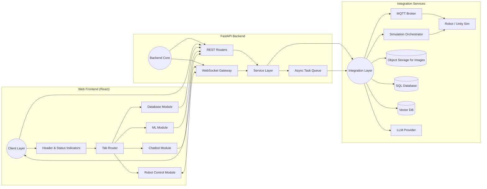

### 3.2 デプロイ・ネットワーク構成
- **フロントエンド**: React + Vite/Next.js, Nginx でホスト。
- **バックエンド**: FastAPI (Uvicorn/Gunicorn) + Celery (Redis/ RabbitMQ) for ML jobs。
- **MQTT ブローカ**: Mosquitto (Docker コンテナ)。
- **データベース**: PostgreSQL + SQLAlchemy。画像用オブジェクトストレージ (MinIO / S3 互換)。
- **Vector DB**: Qdrant or Weaviate。
- **メッセージング**: WebSocket (FastAPI) + MQTT (ロボット) + REST API。
- **監視**: Prometheus + Grafana, Loki でロギング。

## 4. フロントエンド設計
### 4.1 ディレクトリ構成案
```
frontend/
  src/
    app/
      Router.tsx
      store/
      hooks/
      api/
    modules/
      robot-control/
        components/
        hooks/
        services/
      database/
        ...
      ml/
        ...
      chatbot/
        ...
    shared/
      components/
      icons/
      layouts/
      utils/
  public/
```
- 各タブは `modules/<tab>/` 配下で独立管理。
- 共通 Header と WebSocket フックは `shared/` に配置。

### 4.2 共通 UI / ヘッダー設計
- **要素**: タイトル、タブナビゲーション、`シミュレーション起動/終了` ボタン、MQTT/WebSocket ステータスアイコン。
- **接続インジケータ**: `useConnectionStatus` フックが backend REST (`/health`) と WS ping を監視。
- **シミュレーション操作**: API 呼び出し (POST `/simulation/start|stop`) で Unity/実機切替。

### 4.3 状態管理と通信レイヤ
- **状態管理**: Redux Toolkit / Zustand + React Query。
- **リアルタイム**: `useWebSocket` カスタムフックでロボット制御/ML進捗/ログを購読。
- **フォーム管理**: React Hook Form を採用。

## 5. バックエンド設計
### 5.1 アプリケーションレイヤ構成

*詳細なディレクトリ構成は [0.3 バックエンド詳細](#03-バックエンド詳細) を参照*

```
backend/app/
  main.py
  core/                          # 共有設定・ロギング
    config.py
    logging.py
    dependencies.py
  
  # === 役割ごとのモジュール ===
  api/
    router.py                    # 統一エントリポイント
    
    robot_api/                   # 1️⃣ Frontend→Robot API変換
      router.py
      schemas.py
    
    ml/                          # 2️⃣ 機械学習
      router.py
      schemas.py
    
    telemetry/                   # 3️⃣ センサデータ→SQL保存
      router.py
      schemas.py
    
    chatbot/                     # 4️⃣ Chatbot
      router.py
      schemas.py
  
  services/                      # ビジネスロジック（分ける）
    robot_control.py             # Robot API変換ロジック
    ml_pipeline.py               # ML実行・進捗管理
    telemetry_processor.py       # センサデータ処理・永続化
    chatbot_engine.py            # Chatbot質問応答
    
  repositories/                  # データアクセス層（共有）
    robot_state.py
    sensor_data.py
    training_runs.py
    rag_documents.py
  
  adapters/                      # 外部連携（共有）
    mqtt_client.py               # MQTT接続
    websocket_manager.py         # WebSocket
    storage_client.py            # 画像保存
    vector_store.py              # Vector DB
    llm_client.py                # LLM API
  
  workers/                       # 非同期ジョブ（共有）
    tasks.py                     # Celery/RQ タスク
  
  models/                        # SQLAlchemy ORM（共有）
    __init__.py
    robot_state.py
    sensor_data.py
    training_run.py
    rag_document.py
```

### 5.1.1 Robot API の条件付きデータ保存パターン

**基本設計:** robot_api は 単なる「通信ブリッジ」ですが、**セッション記録中は同時にデータを保存** します

```
┌─────────────────────────────────────────────┐
│ Robot API（robot_control/router.py）        │
│                                             │
│  POST /robot/velocity                       │
│    ├─ [常に実行] MQTTへ速度指令を送信       │
│    │   └─ MQTT: /amr/<ID>/velocity         │
│    │                                        │
│    └─ [条件付き] セッション記録中？         │
│        ├─ YES: 受信データをSensorDataに保存│
│        │   └─ Repository.create(telemetry)│
│        └─ NO: 単にブリッジ（保存しない）   │
│                                             │
│  POST /robot/velocity (受信側)              │
│    ├─ [常に実行] 受信データをWS配信         │
│    │   └─ WebSocket: status update        │
│    │                                        │
│    └─ [条件付き] セッション記録中？         │
│        ├─ YES: 受信データをSensorDataに保存│
│        │   └─ Repository.create(telemetry)│
│        └─ NO: 単にブリッジ（保存しない）   │
└─────────────────────────────────────────────┘
```

**セッション状態の管理:**
- `DataLoggerService` が「現在アクティブなセッションID」を管理
- `RobotControlService` が `DataLoggerService` をチェック
- セッション記録中 → `SensorDataRepository` へ保存
- セッション未開始/終了後 → 保存せず、単にMQTT/WS転送のみ

### 5.2 クラス図
```
backend/
  app/
    main.py
    core/
      config.py
      logging.py
      dependencies.py
    api/
      router.py
      robot_control/
      database/
      ml/
      chatbot/
    services/
      robot.py
      telemetry.py
      datalogger.py
      ml_pipeline.py
      chatbot.py
    repositories/
      robot_state.py
      datasets.py
      training_runs.py
      rag_documents.py
    schemas/
      robot.py
      telemetry.py
      datasets.py
      ml.py
      chatbot.py
    workers/
      tasks.py
    adapters/
      mqtt_client.py
      websocket_manager.py
      storage_client.py
      vector_store.py
      llm_client.py
```
- `services/` がビジネスロジックを集約。
- `repositories/` はデータアクセス層 (SQLAlchemy)。
- `adapters/` で外部システムと疎結合化。

### 5.2 クラス図
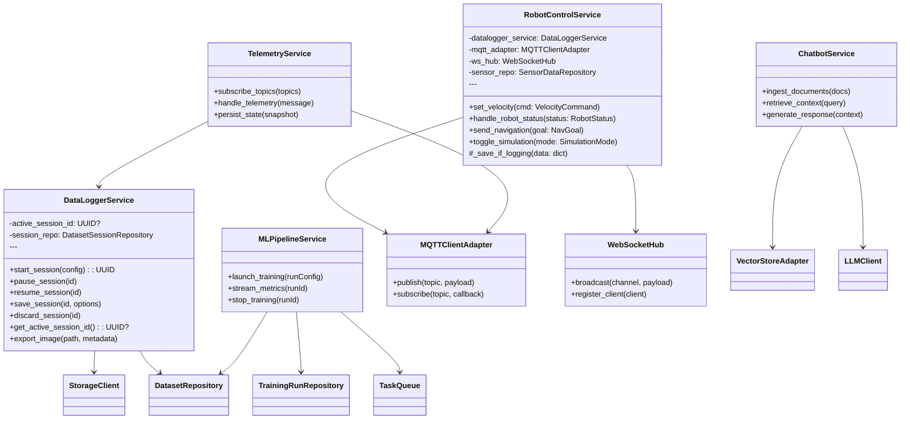

### 5.3 API 一覧
| メソッド | エンドポイント | 概要 |
| -------- | -------------- | ---- |
| GET | `/health` | MQTT/WS ステータス含むシステムヘルスチェック |
| WS | `/ws/robot` | ロボット制御/状態ストリーミング |
| WS | `/ws/ml` | 学習進捗ストリーミング |
| WS | `/ws/chat` | 双方向チャット更新 |
| POST | `/robot/velocity` | 速度指令 |
| POST | `/robot/navigation` | 目標地点指示 |
| POST | `/simulation/start` | シミュレーション起動 |
| POST | `/simulation/stop` | シミュレーション終了 |
| POST | `/datalogger/session` | セッション開始 |
| PATCH | `/datalogger/session/{id}` | 一時停止/再開 |
| POST | `/datalogger/session/{id}/save` | 保存して終了 |
| POST | `/datalogger/session/{id}/discard` | 保存せず終了 |
| GET | `/datasets` | 保存データ一覧 |
| POST | `/ml/train` | トレーニング開始 |
| GET | `/ml/runs/{id}` | 学習メトリクス取得 |
| POST | `/chat/query` | 質問受付 |

## 6. データ管理
### 6.1 データベーススキーマ
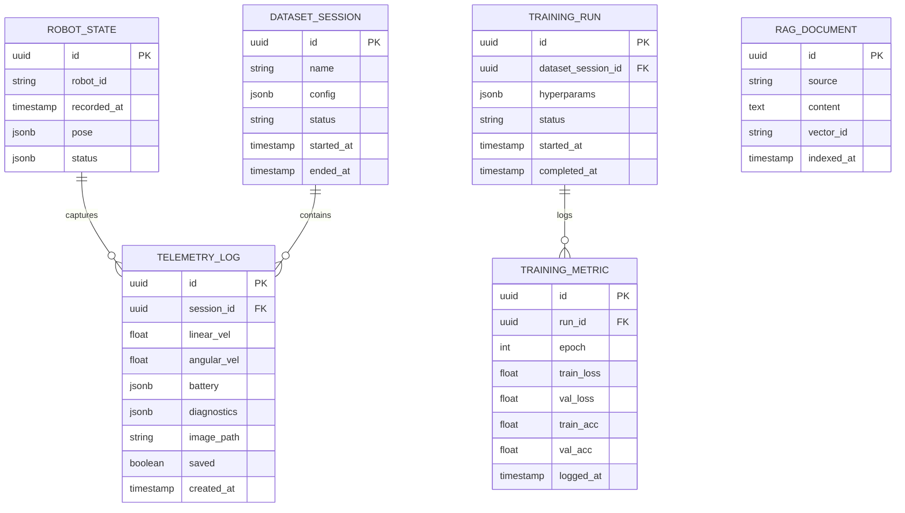

### 6.2 ファイルストレージ戦略
- 画像は `/data/uploads/images/{session_id}/{timestamp}.jpg` に保存。
- DB には `image_path` とメタ情報のみ保持。
- 大容量動画は将来のため別バケットを想定。

### 6.3 メッセージ / トピック設計
| チャネル | 用途 | 方向 |
| -------- | ---- | ---- |
| `robot/cmd/velocity` | 速度コマンド | Backend → Robot |
| `robot/cmd/navigation` | ナビゲーション指示 | Backend → Robot |
| `robot/state` | 状態情報 (位置, バッテリ) | Robot → Backend |
| `robot/camera` | カメラフレーム (バイナリ/URI) | Robot → Backend |
| `sim/control` | シミュレーション起動/停止 | Backend → Unity |
| WebSocket `/ws/robot` | 状態ブロードキャスト, joystick フィードバック | Backend ↔ Frontend |
| WebSocket `/ws/ml` | 学習メトリクス push | Backend ↔ Frontend |
| WebSocket `/ws/chat` | ストリーミング回答 | Backend ↔ Frontend |

## 7. シーケンス図


### 7.1 ロボット速度制御 (ジョイスティック)
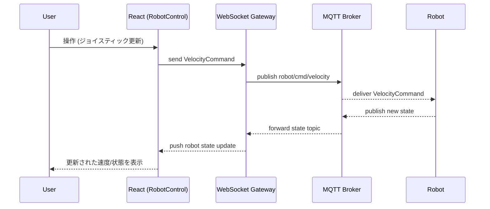

### 7.2 カメラ映像ストリーミング
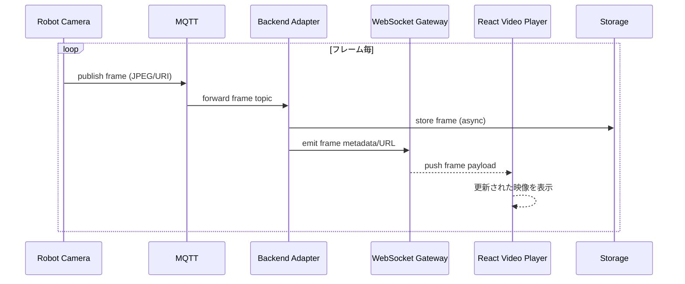

### 7.3 状態監視とデータロギング
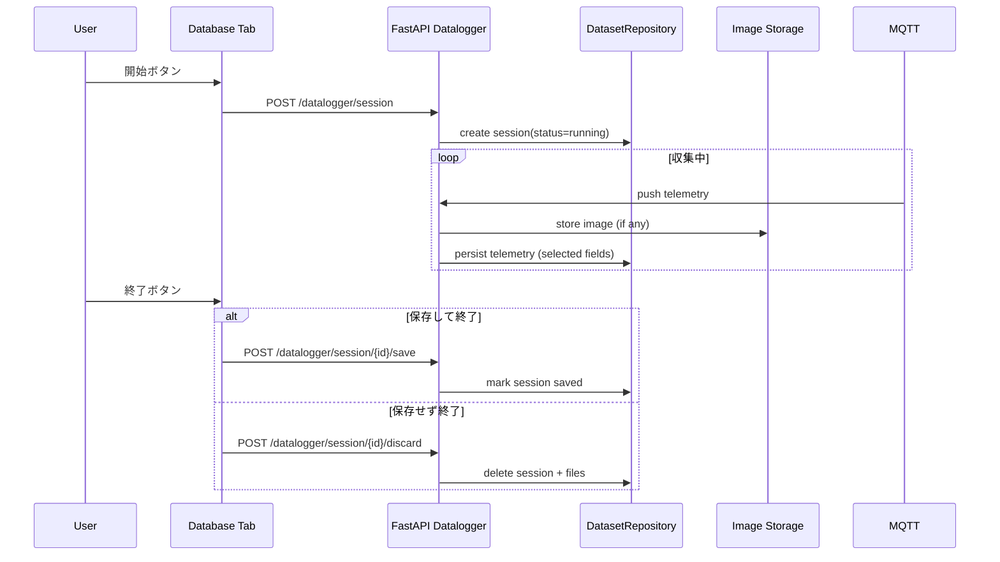

### 7.4 ナビゲーション指示
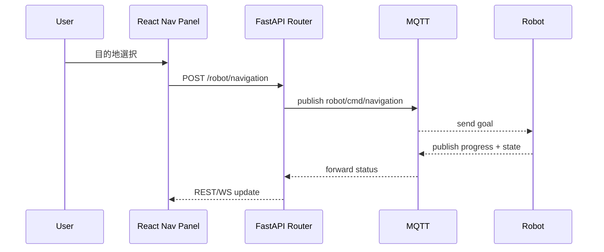

### 7.5 機械学習トレーニング
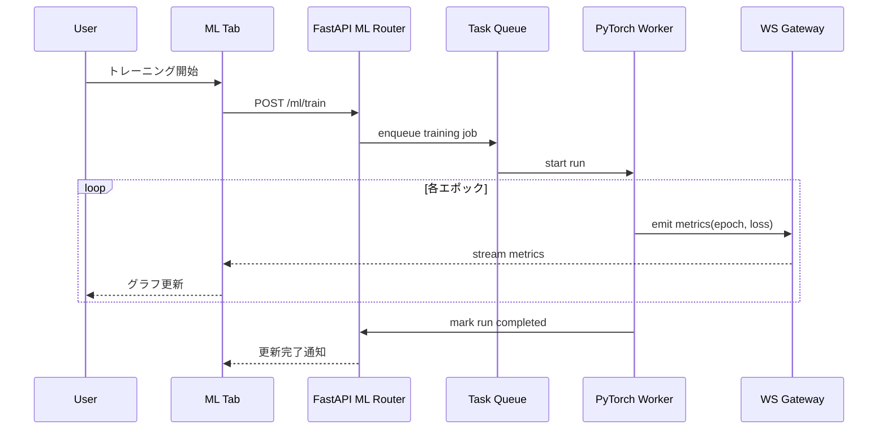

### 7.6 Chatbot (RAG 質問応答)
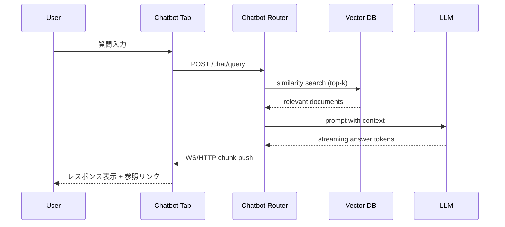

## 7.7 バックエンド内 - Robot API 変換フロー（条件付きデータ保存）

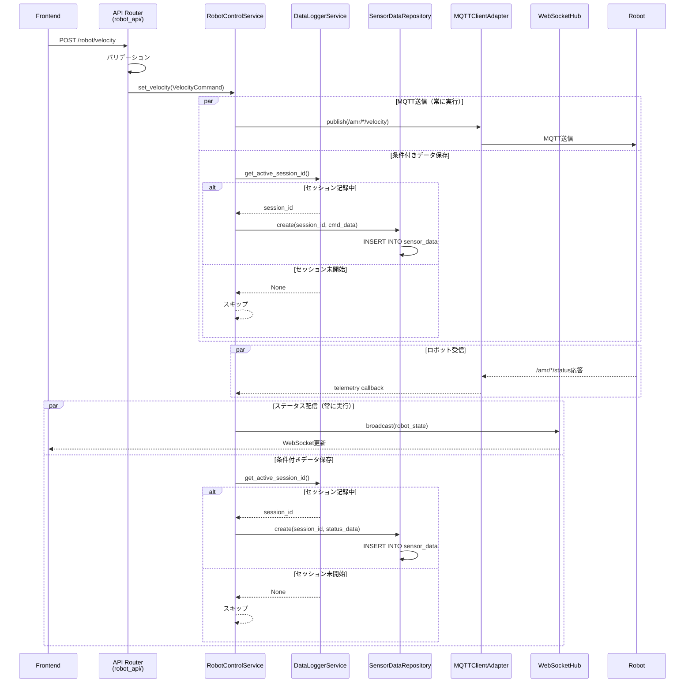

**役割:**
- **Router**: HTTP リクエスト受け取り、スキーマチェック
- **Service**: ビジネスロジック＋条件付きデータ保存判定
- **DataLoggerService**: 現在のセッション状態を提供
- **SensorDataRepository**: コマンド・ステータスデータを DB に保存
- **Adapter**: MQTT プロトコル操作

---

## 7.8 バックエンド内 - センサデータ取得・保存フロー

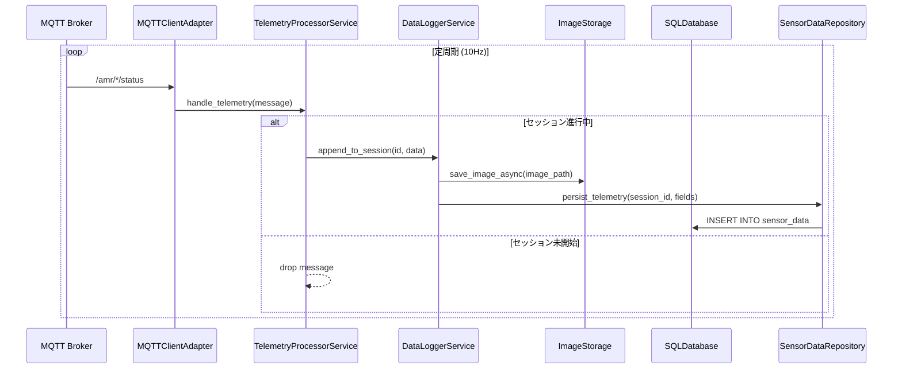

**役割:**
- **MQTTClientAdapter**: リアルタイム購読、コールバック呼び出し
- **TelemetryProcessorService**: データ前処理（フィルタ、型変換）
- **DataLoggerService**: セッション単位での蓄積管理
- **SensorDataRepository**: DB 永続化ロジック

---

## 7.9 バックエンド内 - ML トレーニングと データ連携

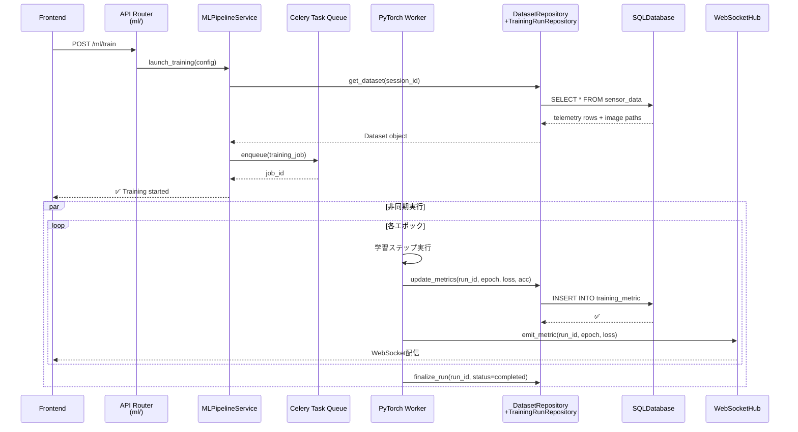

**役割:**
- **MLPipelineService**: トレーニング設定、キューイング、進捗監視
- **DatasetRepository**: 保存済みセンサデータを Dataset に変換
- **Worker (Celery)**: GPU/CPU 上で実際の学習実行
- **TrainingRunRepository**: メトリクス記録、ハイパーパラメータ管理

---

## 7.10 バックエンド内 - Chatbot 質問応答フロー

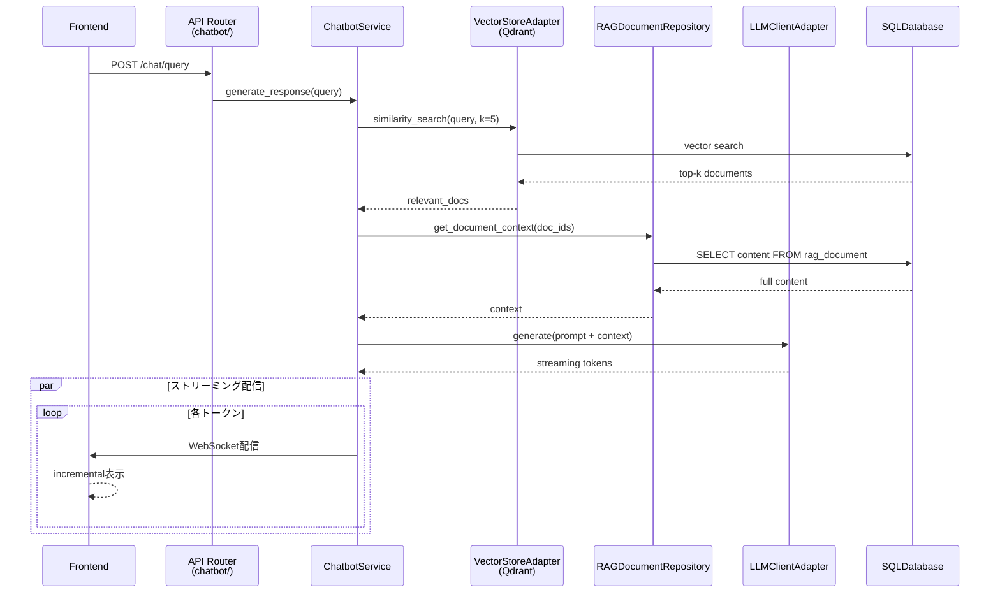

**役割:**
- **ChatbotService**: クエリ解釈、コンテキスト構築、LLM オーケストレーション
- **VectorStoreAdapter**: 意味的検索、Vector DB 操作
- **RAGDocumentRepository**: 検索結果のメタデータ・内容取得
- **LLMClientAdapter**: OpenAI/Anthropic API 呼び出し、ストリーミング管理

---

## 7.11 バックエンド内 - データ層 統合ビュー

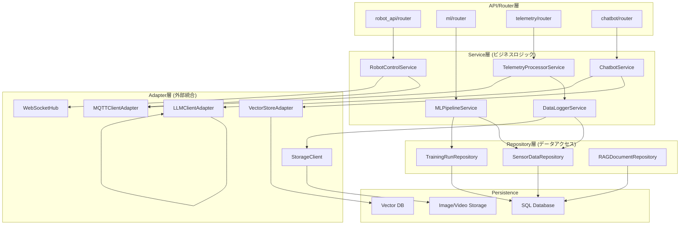

**層の責任分離:**
- **API層**: HTTP 受け取り、入力チェック
- **Service層**: ビジネスロジック、複数 Repository/Adapter の調整
- **Repository層**: SQL 操作、SQL-ORM マッピング
- **Adapter層**: プロトコル/SDK 操作の抽象化
- **Persistence層**: 実データ保存先

---

## 7.12 データフロー: robot_api と datalogger の連携

**基本フロー:**

```
セッション未開始時
├─ Frontend: POST /robot/velocity
│  └─ Backend: 単なるMQTTブリッジ（保存しない）
└─ ロボットステータスは WS でのみ配信

セッション開始時（保存ボタン: ON）
├─ Frontend: POST /datalogger/session/start
│  └─ DataLoggerService: active_session_id = UUID
├─ Frontend: POST /robot/velocity
│  └─ Backend:
│     ├─ MQTTへ速度指令を送信
│     └─ ✅ SensorData に保存
└─ ロボットステータス受信時
   ├─ WS でステータス配信
   └─ ✅ SensorData に保存

セッション終了時（保存ボタン: OFF）
├─ Frontend: POST /datalogger/session/{id}/save
│  └─ DataLoggerService: active_session_id = None
├─ Frontend: POST /robot/velocity
│  └─ Backend: 単なるMQTTブリッジ（保存しない）
└─ ロボットステータスは WS でのみ配信
```

**実装時のポイント:**

| 処理 | 常時実行 | 条件付き（セッション記録中） |
|------|--------|--------------------------|
| **コマンド送信（POST /robot/velocity）** | ✅ MQTT送信 | ✅ SensorData.create() |
| **ステータス受信（MQTT /amr/*/status）** | ✅ WS配信 | ✅ SensorData.create() |
| **画像保存** | ✅ (撮影時) | ✅ ObjectStorage + メタデータ |

**Service層での実装パターン:**

```python
# RobotControlService の例
class RobotControlService:
    def __init__(self, 
                 mqtt_adapter, 
                 ws_hub, 
                 datalogger_service,
                 sensor_repo):
        self.mqtt = mqtt_adapter
        self.ws = ws_hub
        self.datalogger = datalogger_service
        self.sensor_repo = sensor_repo
    
    async def set_velocity(self, cmd: VelocityCommand):
        # [常に実行] MQTT送信
        await self.mqtt.publish("/amr/robot1/velocity", cmd.dict())
        
        # [条件付き] セッション記録中なら保存
        session_id = self.datalogger.get_active_session_id()
        if session_id:
            await self.sensor_repo.create(
                session_id=session_id,
                data_type="command",
                payload=cmd.dict()
            )
    
    async def handle_robot_status(self, status: RobotStatus):
        # [常に実行] WebSocket配信
        await self.ws.broadcast("/ws/robot", status.dict())
        
        # [条件付き] セッション記録中なら保存
        session_id = self.datalogger.get_active_session_id()
        if session_id:
            await self.sensor_repo.create(
                session_id=session_id,
                data_type="status",
                payload=status.dict()
            )
```

## 8. 非機能要件
- **リアルタイム性**: 制御系は <100ms 以内の往復を目標。
- **耐障害性**: MQTT 再接続ロジック、WS バックオフ、データ保存時の ACID 保証。
- **スケーラビリティ**: フロントエンドは CDN, バックエンドはコンテナスケール、MQTT ブローカはクラスタリング。
- **セキュリティ**: JWT/OAuth2, ロールベースアクセス制御, TLS 終端。
- **観測性**: OpenTelemetry 対応、構成変更の監査ログ。

## 9. セキュリティと監視
- **認証/認可**: Keycloak or Cognito, Role (Operator, Analyst, Admin)。
- **ネットワーク**: MQTT over TLS, WebSocket w/ Secure cookies, CORS ホワイトリスト。
- **監視**: Prometheus exporter, Grafana ダッシュボード (通信状態, ML job metrics)。
- **ログ**: 構造化 JSON, Loki 集約。

## 10. 将来的な拡張ポイント
- マルチロボット管理 (Robot ID 切替)。
- オフラインバッチ解析 (ETL pipeline)。
- Edge 推論向け Federated Learning。
- 音声インタフェースによる Chatbot 拡張。
- モバイルクライアント (React Native)。
