# robot-ml-web-app


# シーケンス図

backend <-> robot間の初期接続時の流れを示します。

```
「backend <-> robot間」はMQTT brokerを介してMQTT通信を行いますが、以下シーケンス図では、brokerを省略しています。
```

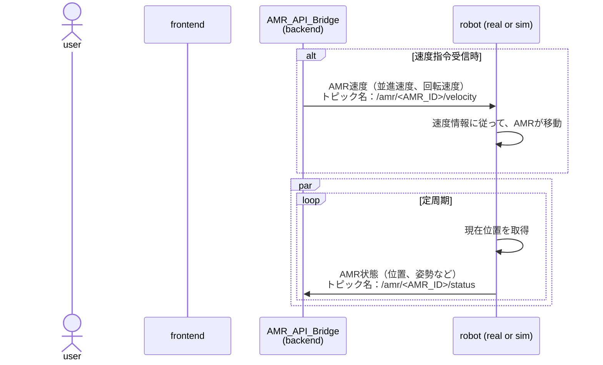

```
    core/
        base_dependencies.py       # 共通依存性 (DB, state, adapters)
        dependencies.py            # Feature 依存性の集約

    features/
        robot/
            router.py                # HTTP/WS インタフェース
            service.py               # RobotControlService
            dependencies.py          # get_robot_control_service
            schemas.py
        telemetry/
            router.py
            service.py               # DataLoggerService / TelemetryProcessorService
            dependencies.py          # get_datalogger_service 等
            schemas.py
        ml/
            router.py
            service.py               # MLPipelineService
            dependencies.py          # get_ml_pipeline_service
            schemas.py
        chat/
            router.py
            service.py               # ChatbotService
            dependencies.py          # get_chatbot_service
            schemas.py

    repositories/
        robot_state.py
        sensor_data.py
        ```
            api/
                router.py                  # 統一エントリポイント（feature ルータ集約）

            features/
                robot/
                    router.py
                    service.py
                    dependencies.py
                    schemas.py
                telemetry/
                    router.py
                    service.py
                    dependencies.py
                    schemas.py
                ml/
                    router.py
                    service.py
                    dependencies.py
                    schemas.py
                chat/
                    router.py
                    service.py
                    dependencies.py
                    schemas.py

            core/
                base_dependencies.py       # DB・MQTT・WS など共通依存性
                dependencies.py            # FastAPI DI エントリ

            repositories/                # データアクセス層（共有）
                robot_state.py
                sensor_data.py
                training_runs.py
                rag_documents.py

            adapters/                    # 外部連携（共有）
                mqtt_client.py             # MQTT接続
                storage_client.py          # 画像保存
                vector_store.py            # Vector DB
                llm_client.py              # LLM API

            infrastructure/
                messaging/
                    topics.py              # MQTTトピック定義
                realtime/
                    __init__.py            # Hub/チャンネルのエクスポート
                    handlers.py            # WebSocketルータ
                    manager.py             # WebSocket Hub
                    subscriptions.py       # チャンネル名定義

            workers/
                tasks.py                   # Celery/RQ タスク

            models/                      # SQLAlchemy ORM
                robot_state.py
                sensor_data.py
                training_run.py
                rag_document.py
        ```
```

以下、copilot生成による仮の設計書

## 目次
- [robot-ml-web-app](#robot-ml-web-app)
- [シーケンス図](#シーケンス図)
  - [目次](#目次)
  - [1. ゴールとスコープ](#1-ゴールとスコープ)
  - [2. ユースケース概要](#2-ユースケース概要)
  - [3. 全体アーキテクチャ](#3-全体アーキテクチャ)
    - [3.1 システムコンポーネント構成](#31-システムコンポーネント構成)
    - [3.2 デプロイ・ネットワーク構成](#32-デプロイネットワーク構成)
  - [4. バックエンド設計](#4-バックエンド設計)
    - [4.1 役割別アーキテクチャ](#41-役割別アーキテクチャ)
    - [4.2 4つの主要役割](#42-4つの主要役割)
      - [**1️⃣ Robot API - Frontend → Robot 通信変換**](#1️⃣-robot-api---frontend--robot-通信変換)
      - [**2️⃣ Telemetry - センサデータ取得・保存**](#2️⃣-telemetry---センサデータ取得保存)
      - [**3️⃣ ML Pipeline - 機械学習実行**](#3️⃣-ml-pipeline---機械学習実行)
      - [**4️⃣ Chatbot - RAG + LLM 質問応答**](#4️⃣-chatbot---rag--llm-質問応答)
    - [4.3 バックエンド内データフロー](#43-バックエンド内データフロー)
    - [4.3.1 Service層の並列実行パターン](#431-service層の並列実行パターン)
    - [4.3.2 Service 間の同期 vs 非同期](#432-service-間の同期-vs-非同期)
    - [4.3.3 実装における並列化手法](#433-実装における並列化手法)
    - [4.3.4 業界標準：同期 vs 非同期の使い分け](#434-業界標準同期-vs-非同期の使い分け)
    - [4.3.5 実装時の決定フロー](#435-実装時の決定フロー)
    - [4.3.6 現代的ベストプラクティス](#436-現代的ベストプラクティス)
    - [4.3.4 並列実行の実例](#434-並列実行の実例)
    - [4.3.5 並列実行時の注意点](#435-並列実行時の注意点)
    - [4.3.6 推奨される並列処理設定](#436-推奨される並列処理設定)
    - [4.4 実装パターン](#44-実装パターン)
  - [5. フロントエンド設計](#5-フロントエンド設計)
    - [5.1 UI/UX概要](#51-uiux概要)
    - [5.2 状態管理と通信](#52-状態管理と通信)
  - [6. データ管理](#6-データ管理)
    - [6.1 データベーススキーマ](#61-データベーススキーマ)
    - [6.2 ファイルストレージ戦略](#62-ファイルストレージ戦略)
    - [6.3 メッセージ / トピック設計](#63-メッセージ--トピック設計)
  - [7. エンドツーエンド シーケンス図](#7-エンドツーエンド-シーケンス図)
    - [7.1 ロボット速度制御 (ジョイスティック)](#71-ロボット速度制御-ジョイスティック)
    - [7.2 カメラ映像ストリーミング](#72-カメラ映像ストリーミング)
    - [7.3 状態監視とデータロギング](#73-状態監視とデータロギング)
    - [7.4 ナビゲーション指示](#74-ナビゲーション指示)
    - [7.5 機械学習トレーニング](#75-機械学習トレーニング)
    - [7.6 Chatbot (RAG 質問応答)](#76-chatbot-rag-質問応答)
  - [8. バックエンド内詳細シーケンス](#8-バックエンド内詳細シーケンス)
    - [8.1 Robot API 変換フロー（条件付きデータ保存）](#81-robot-api-変換フロー条件付きデータ保存)
    - [8.2 センサデータ取得・保存フロー](#82-センサデータ取得保存フロー)
    - [8.3 ML トレーニングとデータ連携](#83-ml-トレーニングとデータ連携)
    - [8.4 Chatbot 質問応答フロー](#84-chatbot-質問応答フロー)
    - [8.5 データ層統合ビュー](#85-データ層統合ビュー)
    - [8.6 robot\_api と datalogger の連携](#86-robot_api-と-datalogger-の連携)
  - [9. ディレクトリ構成](#9-ディレクトリ構成)
    - [9.1 全体構成](#91-全体構成)
    - [9.2 フロントエンド詳細](#92-フロントエンド詳細)
    - [9.3 バックエンド詳細](#93-バックエンド詳細)
  - [10. API 一覧](#10-api-一覧)
  - [11. 非機能要件](#11-非機能要件)
  - [12. セキュリティと監視](#12-セキュリティと監視)
  - [13. 将来的な拡張ポイント](#13-将来的な拡張ポイント)
    - [3.2 デプロイ・ネットワーク構成](#32-デプロイネットワーク構成-1)
  - [4. フロントエンド設計](#4-フロントエンド設計)
    - [4.1 ディレクトリ構成案](#41-ディレクトリ構成案)
    - [4.2 共通 UI / ヘッダー設計](#42-共通-ui--ヘッダー設計)
    - [4.3 状態管理と通信レイヤ](#43-状態管理と通信レイヤ)
  - [5. バックエンド設計](#5-バックエンド設計)
    - [5.1 アプリケーションレイヤ構成](#51-アプリケーションレイヤ構成)
    - [5.1.1 Robot API の条件付きデータ保存パターン](#511-robot-api-の条件付きデータ保存パターン)
    - [5.2 クラス図](#52-クラス図)
    - [5.2 クラス図](#52-クラス図-1)
    - [5.3 API 一覧](#53-api-一覧)
  - [6. データ管理](#6-データ管理-1)
    - [6.1 データベーススキーマ](#61-データベーススキーマ-1)
    - [6.2 ファイルストレージ戦略](#62-ファイルストレージ戦略-1)
    - [6.3 メッセージ / トピック設計](#63-メッセージ--トピック設計-1)
  - [7. シーケンス図](#7-シーケンス図)
    - [7.1 ロボット速度制御 (ジョイスティック)](#71-ロボット速度制御-ジョイスティック-1)
    - [7.2 カメラ映像ストリーミング](#72-カメラ映像ストリーミング-1)
    - [7.3 状態監視とデータロギング](#73-状態監視とデータロギング-1)
    - [7.4 ナビゲーション指示](#74-ナビゲーション指示-1)
    - [7.5 機械学習トレーニング](#75-機械学習トレーニング-1)
    - [7.6 Chatbot (RAG 質問応答)](#76-chatbot-rag-質問応答-1)
  - [7.7 バックエンド内 - Robot API 変換フロー（条件付きデータ保存）](#77-バックエンド内---robot-api-変換フロー条件付きデータ保存)
  - [7.8 バックエンド内 - センサデータ取得・保存フロー](#78-バックエンド内---センサデータ取得保存フロー)
  - [7.9 バックエンド内 - ML トレーニングと データ連携](#79-バックエンド内---ml-トレーニングと-データ連携)
  - [7.10 バックエンド内 - Chatbot 質問応答フロー](#710-バックエンド内---chatbot-質問応答フロー)
  - [7.11 バックエンド内 - データ層 統合ビュー](#711-バックエンド内---データ層-統合ビュー)
  - [7.12 データフロー: robot\_api と datalogger の連携](#712-データフロー-robot_api-と-datalogger-の連携)
  - [11. 非機能要件](#11-非機能要件-1)
  - [12. セキュリティと監視](#12-セキュリティと監視-1)
  - [13. 将来的な拡張ポイント](#13-将来的な拡張ポイント-1)

## 1. ゴールとスコープ
- React + FastAPI を基盤としたロボット運用統合 Web アプリを構築する。
- ロボット制御、データ収集/蓄積、機械学習、チャットボット (RAG + LLM) をタブ切り替えで提供する。
- Unity シミュレーション/実機切替機能、MQTT/WebSocket の接続確認 UI を備える。
- **バックエンドの 4 つの役割を明確に分離**: Robot API、ML、Sensor Data、Chatbot。

## 2. ユースケース概要

| タブ | 主機能 | 主な通信 | 補足 |
| ---- | ------ | -------- | ---- |
| ロボット制御 | ジョイスティック操作、リアルタイム映像、状態監視、ナビゲーション指示 | WebSocket / MQTT / REST | シミュレーション切替、通信ステータス表示 |
| データベース画面 | 状態・速度・画像メタデータの蓄積、選択保存、フェイルセーフな保存フロー | REST / WebSocket | 5 ボタン制御 (開始/一時停止/保存/破棄/終了) |
| 機械学習画面 | 保存データを用いた PyTorch トレーニング、学習曲線リアルタイム可視化 | REST / WebSocket | ML パイプラインはバックエンドジョブ + ストリーミング更新 |
| Chatbot | RAG + LLM による FAQ / オペレーション支援 | REST / WebSocket | Vector DB + Document Store |

## 3. 全体アーキテクチャ

### 3.1 システムコンポーネント構成

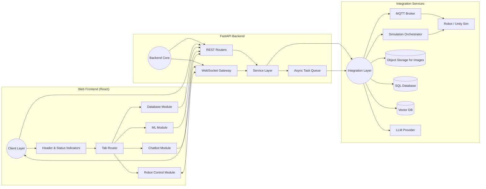

### 3.2 デプロイ・ネットワーク構成
- **フロントエンド**: React + Vite/Next.js, Nginx でホスト。
- **バックエンド**: FastAPI (Uvicorn/Gunicorn) + Celery (Redis/ RabbitMQ) for ML jobs。
- **MQTT ブローカ**: Mosquitto (Docker コンテナ)。
- **データベース**: PostgreSQL + SQLAlchemy。画像用オブジェクトストレージ (MinIO / S3 互換)。
- **Vector DB**: Qdrant or Weaviate。
- **メッセージング**: WebSocket (FastAPI) + MQTT (ロボット) + REST API。
- **監視**: Prometheus + Grafana, Loki でロギング。

## 4. バックエンド設計

### 4.1 役割別アーキテクチャ

バックエンドは **4つの独立した役割** に分離されます：

```
┌────────────────────────────────────────────────────────────┐
│               FastAPI バックエンド                          │
├────────────────────────────────────────────────────────────┤
│                                                             │
│  【API層】                                                  │
│  ├─ robot_api/        🤖 Frontend → Robot API変換           │
│  ├─ telemetry/        📊 センサデータ取得・保存              │
│  ├─ ml/              🧠 機械学習パイプライン               │
│  └─ chatbot/         💬 Chatbot・RAG                       │
│                                                             │
│  【Service層】                                              │
│  ├─ RobotControlService      (MQTT送信 + 条件付き保存)      │
│  ├─ TelemetryProcessorService (リアルタイム受信・処理)      │
│  ├─ DataLoggerService        (セッション管理)              │
│  ├─ MLPipelineService        (学習実行・進捗監視)          │
│  └─ ChatbotService           (RAG検索・LLM呼び出し)        │
│                                                             │
│  【Repository層】（全Service が共有）                        │
│  ├─ SensorDataRepository      (センサ DB操作)              │
│  ├─ TrainingRunRepository     (学習メトリクス DB操作)       │
│  └─ RAGDocumentRepository     (RAG DB操作)                │
│                                                             │
│  【Adapter層】（外部統合、全Service が共有）                 │
│  ├─ MQTTClientAdapter        (MQTT プロトコル)            │
│  ├─ WebSocketHub             (WebSocket管理)              │
│  ├─ StorageClient            (画像保存)                   │
│  ├─ VectorStoreAdapter       (Vector DB)                  │
│  └─ LLMClientAdapter         (LLM API)                    │
│                                                             │
└────────────────────────────────────────────────────────────┘
```

### 4.2 4つの主要役割

#### **1️⃣ Robot API - Frontend → Robot 通信変換**
- **責務**: HTTP リクエストを MQTT コマンドに変換し、ロボットに送信
- **ファイル**: `features/robot/`
- **機能**:
  - POST `/robot/velocity` → MQTT `/amr/<ID>/velocity`
  - POST `/robot/navigation` → MQTT `/amr/<ID>/navigation`
  - シミュレーション/実機の切替
- **データ保存**: セッション記録中のみ、受送信データを保存

#### **2️⃣ Telemetry - センサデータ取得・保存**
- **責務**: MQTT から定周期で受信するロボット状態をキャッチし、DB に保存
- **ファイル**: `features/telemetry/`
- **機能**:
  - MQTT `/amr/<ID>/status` をリスニング
  - JSON パースと前処理
  - セッション単位でのデータ蓄積
  - 画像ファイルの Object Storage への保存

#### **3️⃣ ML Pipeline - 機械学習実行**
- **責務**: 保存されたセンサデータを使用して学習を実行
- **ファイル**: `features/ml/`
- **機能**:
  - Dataset を SensorDataRepository から取得
  - PyTorch 学習を Celery で非同期実行
  - 進捗メトリクス（loss, acc）を WebSocket でリアルタイム配信
  - 学習結果の保存

#### **4️⃣ Chatbot - RAG + LLM 質問応答**
- **責務**: Vector DB を用いたドキュメント検索と LLM による応答生成
- **ファイル**: `features/chat/`
- **機能**:
  - クエリをベクトル化し、Vector DB で類似ドキュメント検索
  - 検索結果をコンテキストとして LLM に入力
  - ストリーミング応答を WebSocket で配信

### 4.3 バックエンド内データフロー

```
┌─────────────┐
│  Frontend   │
└──────┬──────┘
       │
       ├──────────────────────────┬──────────────────────────┐
       │                          │                          │
    【robot_api】             【telemetry/logger】       【ml】
       │                          │                          │
       ├─ MQTT送信（常に）        ├─ MQTT受信（常に）        ├─ Dataset取得
       │  /amr/*/velocity        │  /amr/*/status          │
       │                          │                          │
       ├─ WS配信（常に）          ├─ WS配信（常に）          ├─ Celery起動
       │  robot_state            │  telemetry_update       │
       │                          │                          │
       ├─ DB保存               │  DB保存               │
       │（セッション中）        │（セッション中）        │  進捗配信
       │                          │                          │  メトリクス
       └──────────────────────────┴──────────────────────────┘
```

### 4.3.1 Service層の並列実行パターン

**基本原則: 各 Service は独立して動作し、複数の Service が並列実行されます**

```
【リクエスト受信時の実行パターン】

1️⃣ Robot API 呼び出し時:
   ┌─ RobotControlService.set_velocity()
   │
   ├─ [非ブロッキング] MQTT送信
   │   └─ asyncio.create_task() で実行
   │
   ├─ [非ブロッキング] WS配信
   │   └─ asyncio.create_task() で実行
   │
   └─ [条件付き] DB保存（非ブロッキング）
       └─ asyncio.create_task() で実行

【独立した Service の並列動作】

時刻 T0 ── T1 ── T2 ── T3 ── T4 ── T5
     │
   RobotControl      ════════════╗
                                 ║（MQTT受信待機）
   TelemetryProcessor      ════╗ ║
                                ╠─ 同時処理（並列）
   DataLogger             ═══╗ ║
                              ║ ║
   ML Pipeline (Celery)  ═════╝ ║
                              ║ ║
   Chatbot                    ╝═╝

各 Service は独立したプロセス/非同期タスク として動作
→ 同時に複数の Service が処理を実行

【具体例: ロボット操作中に学習を実行】

User A: POST /robot/velocity
        │
        ├─ RobotControlService ──> MQTT送信 ──> Robot
        │
        └─ [即座にレスポンス返却]

User B: POST /ml/train
        │
        ├─ MLPipelineService ──> Celery ──> GPU Worker (バックグラウンド)
        │
        └─ [即座にレスポンス返却]

同時並行 (レスポンス返却後も動作):
  MQTT Subscribe ──> TelemetryProcessorService ──> DB保存・WS配信
  GPU Worker    ──> 学習実行（複数エポック）
  WebSocket     ──> クライアントへのメトリクス配信
```

### 4.3.2 Service 間の同期 vs 非同期

| Service | 実行モード | 説明 |
|---------|----------|------|
| **RobotControlService** | 非同期（FastAPI + AsyncIO） | HTTP レスポンス即座返却、MQTT/DB は `asyncio.create_task()` で並列実行 |
| **TelemetryProcessorService** | 非同期リスナー | MQTT ブローカから常時リッスン、受信イベント時に非同期で処理 |
| **DataLoggerService** | 同期/非同期混在 | セッション管理は同期、DB保存は非同期（オプション） |
| **MLPipelineService** | 非同期キューイング + 非同期実行 | トレーニングを Celery Task として バックグラウンド実行 |
| **ChatbotService** | 同期（長時間I/O待機） | LLM API 呼び出しを非ブロッキングで待機、WebSocket ストリーミング |

### 4.3.3 実装における並列化手法

**① AsyncIO + FastAPI（軽量タスク向け）**
```python
import asyncio
from fastapi import FastAPI

app = FastAPI()

@app.post("/robot/velocity")
async def set_velocity(cmd: VelocityCommand):
    service = RobotControlService(...)
    
    # MQTT送信（即座に返す、処理は別途）
    asyncio.create_task(service.mqtt.publish(...))
    
    # DB保存も非ブロッキング
    asyncio.create_task(service.save_telemetry(...))
    
    # 即座にレスポンス返却
    return {"status": "ok"}
```

**② Celery（重い計算タスク向け）**
```python
from celery import Celery

celery_app = Celery('robot_ml')

@celery_app.task
def train_model_task(run_id: UUID):
    # 別プロセス（GPU/CPU）で実行
    worker = TrainingWorker()
    worker.train(run_id)  # 長時間実行
    # 進捗は WebSocket で配信

@app.post("/ml/train")
async def launch_training(config: TrainingConfig):
    # Celery に委譲（即座に返す）
    job = train_model_task.delay(config.session_id)
    return {"job_id": job.id, "status": "queued"}
```

**③ バックグラウンドリスナー（イベント駆動向け）**
```python
@app.on_event("startup")
async def start_mqtt_listener():
    # アプリ起動時に MQTT リスナーを開始
    mqtt_adapter = MQTTClientAdapter(...)
    
    # バックグラウンドで常時リッスン
    asyncio.create_task(mqtt_adapter.listen_and_handle())

async def listen_and_handle(self):
    while True:
        topic, payload = await self.mqtt_client.subscribe()
        
        # メッセージ到着時に非同期処理
        asyncio.create_task(
            telemetry_service.handle_telemetry(payload)
        )
```

### 4.3.4 業界標準：同期 vs 非同期の使い分け

**結論：FastAPI/Python では非同期が標準**

現代的な Python Web サーバでは**非同期(async/await)が業界標準**です。特に robotics/ML/IoT 領域では以下の理由から非同期が必須：

| 項目 | 同期実行 | 非同期実行 |
|------|--------|----------|
| **I/O 待機** | ブロック（スレッド確保） | 他の要求も処理（効率的） |
| **CPU/GPU タスク** | スレッド数制限 | Celery で worker 分離 |
| **IoT/MQTT** | ポーリング型（遅延大） | イベント駆動（即座） |
| **リアルタイム** | スケール困難 | WebSocket/SSE 対応 |
| **リソース消費** | 高（スレッド数 × メモリ） | 低（event loop） |
| **業界採用** | レガシーシステム | **FastAPI, Starlette, Uvicorn** |

**このプロジェクトでの推奨構成：**

```
API Layer (FastAPI)
  ├─ I/O待機 → AsyncIO (MQTT publish, DB save)
  ├─ 重計算 → Celery (ML training, image processing)
  └─ リアルタイム配信 → WebSocket + asyncio
  
背景リスナー
  └─ MQTT subscribe → asyncio.create_task() で委譲
```

**各 Service の推奨実装パターン：**

| Service | パターン | 理由 |
|---------|---------|------|
| **RobotControlService** | 非同期 | HTTP は I/O バウンド、FastAPI に統合 |
| **TelemetryProcessorService** | 非同期リスナー | MQTT events を即座に処理、メモリ効率 |
| **DataLoggerService** | 非同期 repository | DB への保存を非ブロッキング化 |
| **MLPipelineService** | Celery（非同期キューイング） | GPU/CPU 負荷を worker に分散 |
| **ChatbotService** | 非同期 | LLM API の I/O 待機を効率化 |

**具体例：従来型（同期）との比較**

❌ **従来型（同期）** - スケーリング困難：
```python
# ❌ 悪い例：スレッド1つあたり 1 接続
@app.post("/robot/velocity")  # 同期関数
def set_velocity(cmd):
    service.mqtt.publish(...)     # ブロック
    service.save_to_db(...)       # ブロック
    return {"status": "ok"}
# 10 ロボット = 10 スレッド必要、メモリ大量消費
```

✅ **非同期（推奨）** - 効率的スケーリング：
```python
# ✅ 良い例：event loop で 1000+ 接続対応
@app.post("/robot/velocity")  # 非同期
async def set_velocity(cmd):
    asyncio.create_task(service.mqtt.publish(...))  # ノンブロック
    asyncio.create_task(service.save_to_db(...))    # ノンブロック
    return {"status": "ok"}
# 1000 ロボット = event loop 1 つで対応、メモリ効率的
```

### 4.3.5 実装時の決定フロー

Service 実装時、以下フローで同期/非同期を決定：

```
Q1: 長時間処理（GPU/CPU）？
    YES → Celery (バックグラウンドワーカー)
    NO  → Q2へ

Q2: I/O 待機（DB/API/MQTT）？
    YES → AsyncIO (非ブロッキング)
    NO  → Q3へ

Q3: リアルタイム応答必須？
    YES → AsyncIO + WebSocket
    NO  → 同期でも可能（ただし AsyncIO 推奨）

最終結論：ほぼ全てのケースで「非同期」が推奨
        （実行時はスレッド/Celery で CPU バウンドを分離）
```

### 4.3.6 現代的ベストプラクティス

FastAPI の公式ドキュメント、Starlette、および Uvicorn コミュニティの推奨：

1. **API ハンドラは async で定義**
   - FastAPI は自動的に適切な event loop を管理
   - ブロッキング操作は避ける

2. **I/O タスクは asyncio.create_task() または asyncio.gather()**
   - 複数のタスクを非ブロッキングで並列実行
   - CPU/GPU タスクは明示的に Celery へ

3. **MQTT/WebSocket リスナーは startup event で開始**
   - アプリ起動時に asyncio.create_task() で登録
   - graceful shutdown で cleanup

4. **DB アクセスは非同期対応ライブラリを使用**
   - SQLAlchemy Async
   - asyncpg (PostgreSQL)
   - motor (MongoDB)

**このプロジェクトでの採用：**
- ✅ FastAPI + Uvicorn (非同期 ASGI)
- ✅ AsyncIO + asyncio.create_task()
- ✅ Celery (CPU/GPU バウンド)
- ✅ SQLAlchemy Async (DB)
- ✅ MQTT listener in startup event

### 4.3.4 並列実行の実例

```
【ユースケース】
User A: ロボット操作 | User B: 学習実行 | User C: チャット質問

時刻    Robot Control       Telemetry          ML Pipeline       Chatbot
────    ─────────────       ─────────          ──────────        ──────
T0      POST /velocity
        ├─ MQTT送信
        └─ [200 OK]
                            MQTT受信 10Hz
                            ├─ JSON解析
                            ├─ WS配信
                            └─ DB保存
                                                               POST /chat
                                                               ├─ Vector検索
                                                               └─ LLM呼び出し

T1      POST /navigation    ┌─ 定周期受信       POST /ml/train
        ├─ MQTT送信         │ ├─ 処理          ├─ Dataset取得
        └─ [200 OK]         │ └─ DB保存         ├─ Celery起動
                            └─ ...             └─ [202 Accepted]

T2      [操作中]            ┌─ 定周期受信       ┌─ エポック 1
                            │ ├─ 処理          │  ├─ Forward pass
                            │ └─ DB保存         │  ├─ Backward pass
                            └─ ...             │  ├─ WS配信
                                               │  └─ 損失: 2.3

T3      [操作中]            ┌─ 定周期受信       ├─ エポック 2
                            │ ├─ 処理          │  ├─ Forward pass
                            │ └─ DB保存         │  ├─ WS配信
                            └─ ...             │  └─ 損失: 1.8
                                                               [LLM処理中]
T4      [操作中]            ┌─ 定周期受信       └─ [学習完了]
                            │ ├─ 処理          
                            │ └─ DB保存         
                            └─ ...
                                                               [レスポンス]
                                                               ├─ トークン配信
                                                               └─ 完了

✅ 4つのタスク が独立して並列実行
   - ロボット操作のレイテンシ: <100ms
   - 学習は GPU で継続実行
   - チャットは LLM 呼び出しを待機
   - センサデータは 10Hz で常時処理
```

### 4.3.5 並列実行時の注意点

| 潜在的な問題 | 対策 |
|------------|------|
| **DB コネクション枯渇** | Connection pool サイズ設定、`max_overflow=10` |
| **MQTT メッセージロス** | QoS 1以上、再接続ロジック実装 |
| **GPU メモリ枯渇** | バッチサイズ調整、モデルオフロード |
| **WebSocket 接続数制限** | リバースプロキシ（Nginx）で接続管理 |
| **非同期タスクの無限増殖** | Semaphore で同時タスク数を制限 |

### 4.3.6 推奨される並列処理設定

```python
# app/core/config.py
from pydantic import BaseSettings

class Settings(BaseSettings):
    # AsyncIO 設定
    MAX_CONCURRENT_ASYNCIO_TASKS = 100
    
    # Celery 設定
    CELERY_CONCURRENCY = 2  # GPU ワーカー数
    CELERY_MAX_TASKS_PER_CHILD = 100  # メモリリーク対策
    
    # DB コネクション
    SQLALCHEMY_POOL_SIZE = 20
    SQLALCHEMY_MAX_OVERFLOW = 10
    
    # MQTT 設定
    MQTT_QOS = 1  # メッセージ配信保証
    MQTT_RECONNECT_DELAY = 5
    
    # WebSocket 設定
    WS_MAX_CONNECTIONS = 1000

# app/main.py
import asyncio
from concurrent.futures import Semaphore

app = FastAPI()

# AsyncIO タスク数制限
semaphore = asyncio.Semaphore(Settings.MAX_CONCURRENT_ASYNCIO_TASKS)

@app.post("/robot/velocity")
async def set_velocity(cmd: VelocityCommand):
    async with semaphore:
        return await robot_service.set_velocity(cmd)

@app.on_event("startup")
async def startup():
    # MQTT バックグラウンドリスナー起動
    asyncio.create_task(mqtt_adapter.listen())
    
    # Celery ワーカー起動確認
    celery_app.control.inspect().active()
```

### 4.4 実装パターン

**Service層の基本パターン:**

```python
# RobotControlService の例
class RobotControlService:
    def __init__(self, 
                 mqtt_adapter, 
                 ws_hub, 
                 datalogger_service,
                 sensor_repo):
        self.mqtt = mqtt_adapter
        self.ws = ws_hub
        self.datalogger = datalogger_service
        self.sensor_repo = sensor_repo
    
    async def set_velocity(self, cmd: VelocityCommand):
        # [常に実行] MQTT送信
        await self.mqtt.publish("/amr/robot1/velocity", cmd.dict())
        
        # [条件付き] セッション記録中なら保存
        session_id = self.datalogger.get_active_session_id()
        if session_id:
            await self.sensor_repo.create(
                session_id=session_id,
                data_type="command",
                payload=cmd.dict()
            )
    
    async def handle_robot_status(self, status: RobotStatus):
        # [常に実行] WebSocket配信
        await self.ws.broadcast("/ws/robot", status.dict())
        
        # [条件付き] セッション記録中なら保存
        session_id = self.datalogger.get_active_session_id()
        if session_id:
            await self.sensor_repo.create(
                session_id=session_id,
                data_type="status",
                payload=status.dict()
            )
```

## 5. フロントエンド設計

### 5.1 UI/UX概要
- **共通ヘッダー**: タイトル、タブナビゲーション、接続ステータスインジケータ
- **4 つのタブ**: Robot Control, Database, ML, Chatbot
- **シミュレーション操作**: Header に統一された起動/終了ボタン
- **リアルタイム更新**: WebSocket でロボット制御/ML進捗/ログを購読

### 5.2 状態管理と通信
- **状態管理**: Redux Toolkit / Zustand + React Query
- **リアルタイム**: `useWebSocket` カスタムフックで購読
- **フォーム管理**: React Hook Form
- **タブの独立性**: 各タブは `features/<tab>/` 配下で自己完結

## 6. データ管理

### 6.1 データベーススキーマ

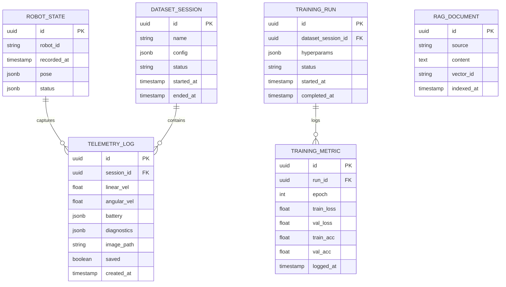

### 6.2 ファイルストレージ戦略
- 画像は `/data/uploads/images/{session_id}/{timestamp}.jpg` に保存
- DB には `image_path` とメタ情報のみ保持
- 大容量動画は将来のため別バケットを想定

### 6.3 メッセージ / トピック設計

| チャネル | 用途 | 方向 |
| -------- | ---- | ---- |
| `robot/cmd/velocity` | 速度コマンド | Backend → Robot |
| `robot/cmd/navigation` | ナビゲーション指示 | Backend → Robot |
| `robot/state` | 状態情報 (位置, バッテリ) | Robot → Backend |
| `robot/camera` | カメラフレーム (バイナリ/URI) | Robot → Backend |
| `sim/control` | シミュレーション起動/停止 | Backend → Unity |
| WebSocket `/ws/robot` | 状態ブロードキャスト, joystick フィードバック | Backend ↔ Frontend |
| WebSocket `/ws/ml` | 学習メトリクス push | Backend ↔ Frontend |
| WebSocket `/ws/chat` | ストリーミング回答 | Backend ↔ Frontend |

## 7. エンドツーエンド シーケンス図

### 7.1 ロボット速度制御 (ジョイスティック)
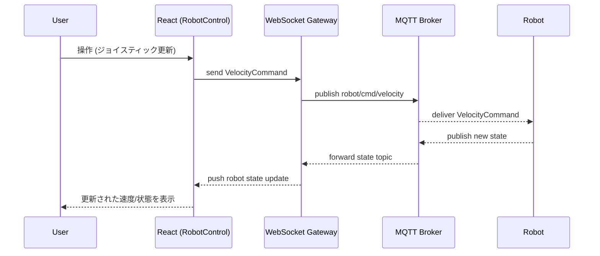

### 7.2 カメラ映像ストリーミング
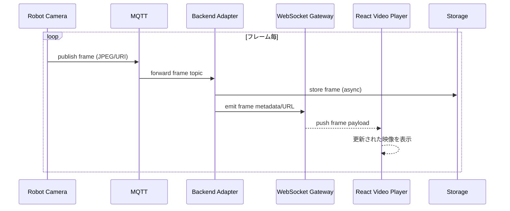

### 7.3 状態監視とデータロギング
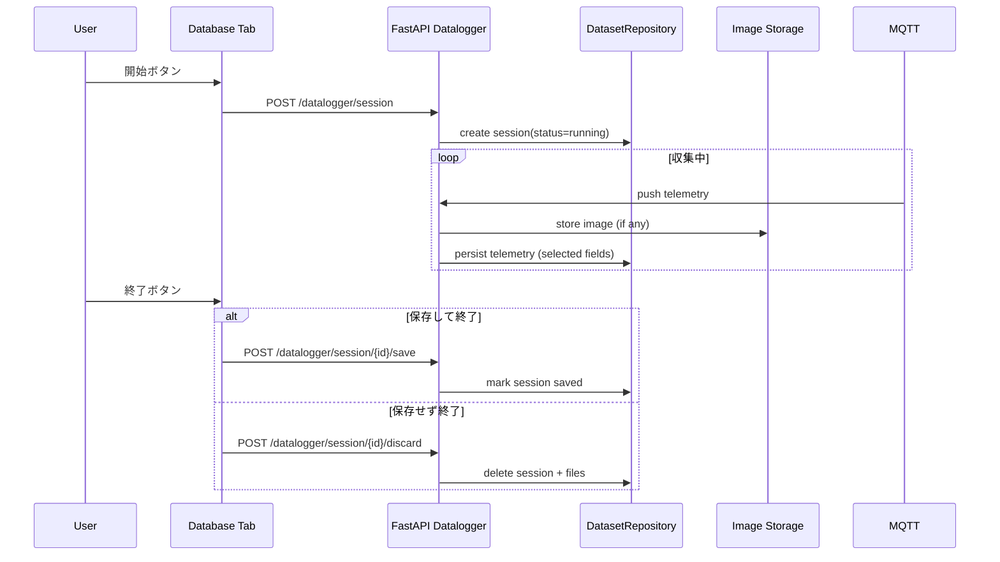

### 7.4 ナビゲーション指示
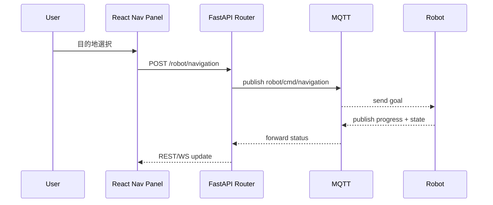

### 7.5 機械学習トレーニング
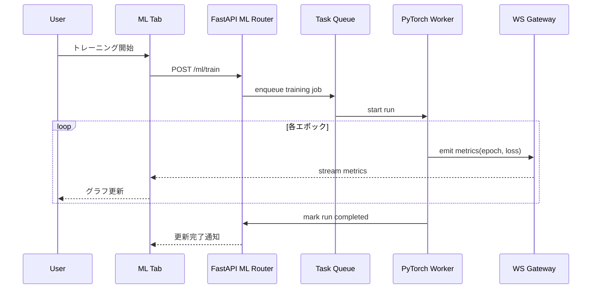

### 7.6 Chatbot (RAG 質問応答)
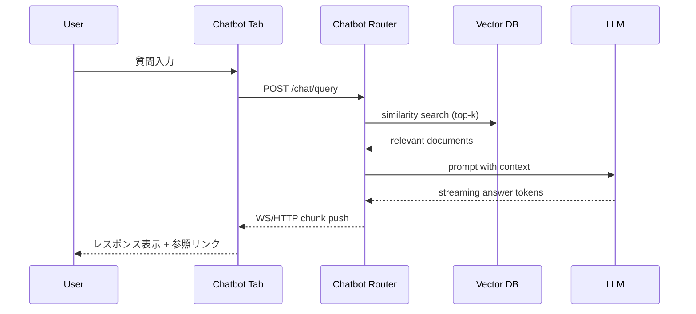

## 8. バックエンド内詳細シーケンス

### 8.1 Robot API 変換フロー（条件付きデータ保存）

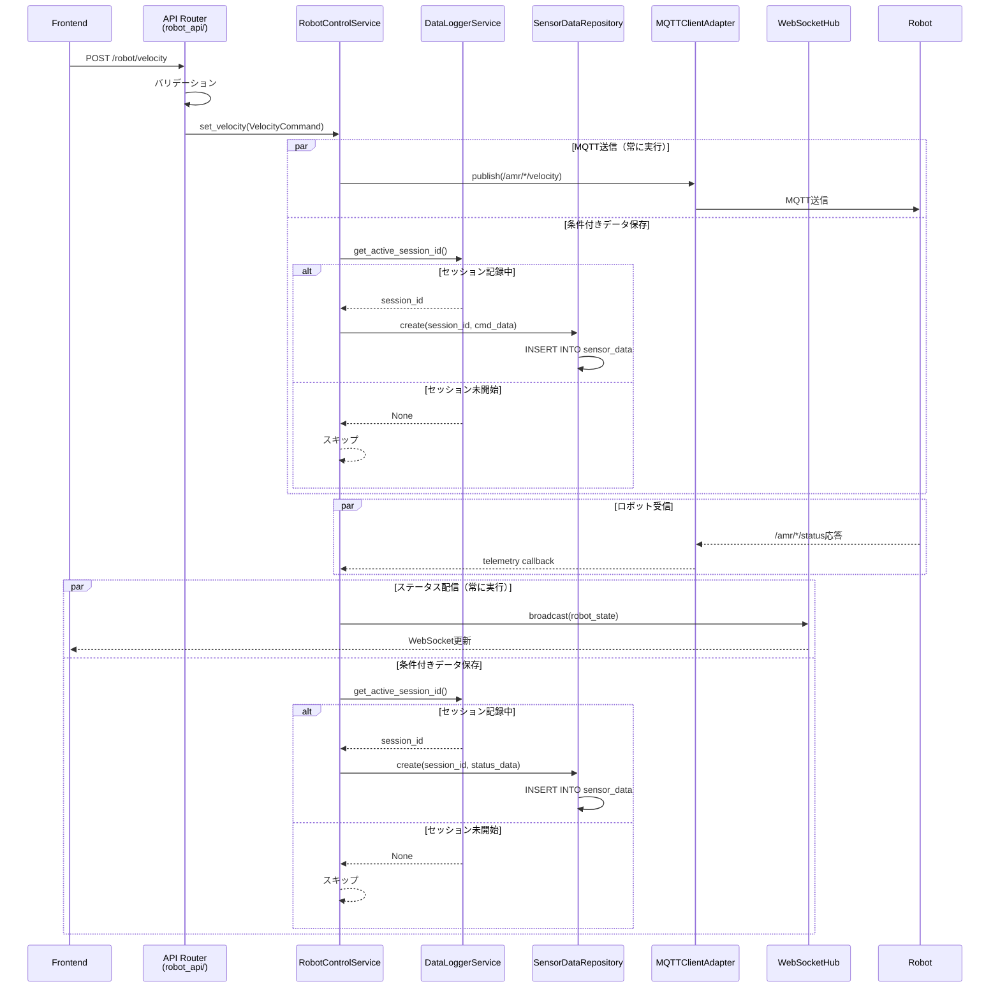

### 8.2 センサデータ取得・保存フロー

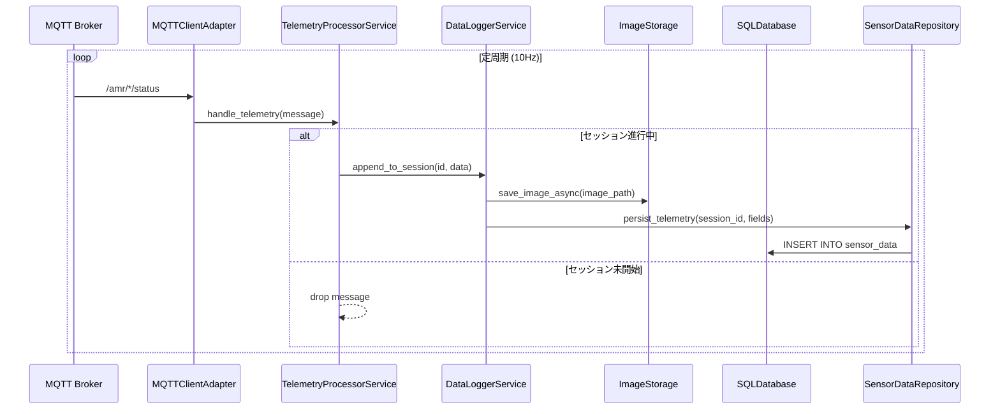

### 8.3 ML トレーニングとデータ連携

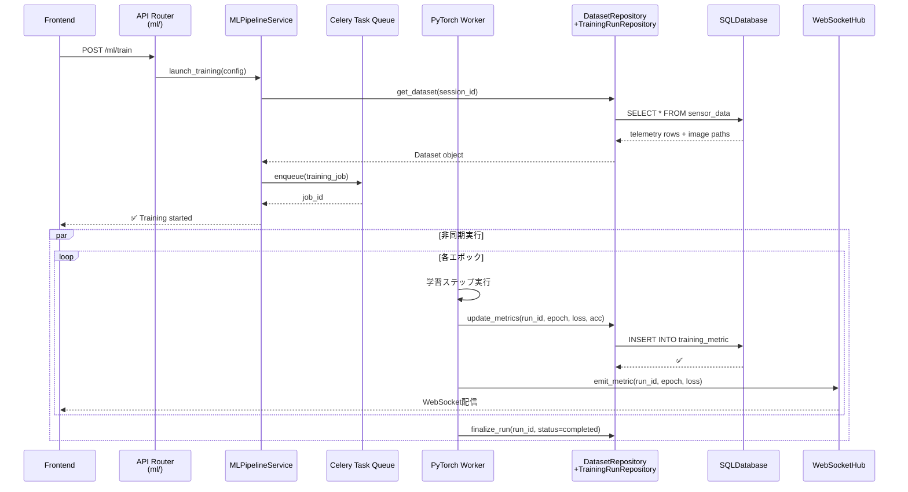

### 8.4 Chatbot 質問応答フロー

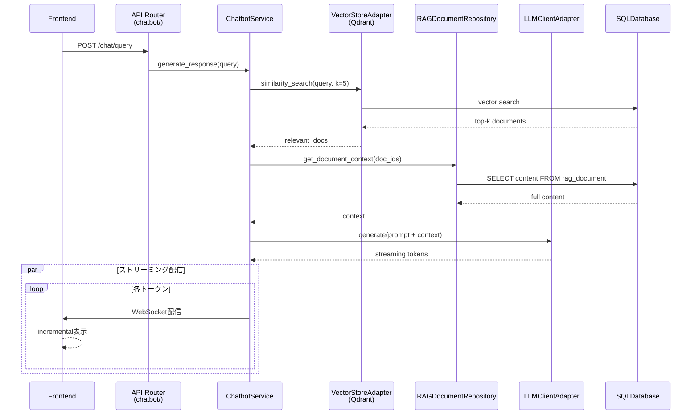

### 8.5 データ層統合ビュー

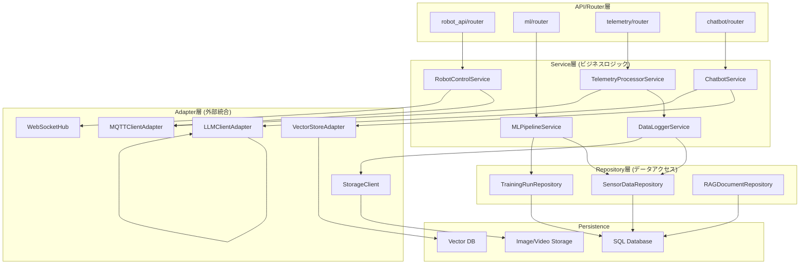

### 8.6 robot_api と datalogger の連携

**基本フロー:**

```
セッション未開始時
├─ Frontend: POST /robot/velocity
│  └─ Backend: 単なるMQTTブリッジ（保存しない）
└─ ロボットステータスは WS でのみ配信

セッション開始時（保存ボタン: ON）
├─ Frontend: POST /datalogger/session/start
│  └─ DataLoggerService: active_session_id = UUID
├─ Frontend: POST /robot/velocity
│  └─ Backend:
│     ├─ MQTTへ速度指令を送信
│     └─ ✅ SensorData に保存
└─ ロボットステータス受信時
   ├─ WS でステータス配信
   └─ ✅ SensorData に保存

セッション終了時（保存ボタン: OFF）
├─ Frontend: POST /datalogger/session/{id}/save
│  └─ DataLoggerService: active_session_id = None
├─ Frontend: POST /robot/velocity
│  └─ Backend: 単なるMQTTブリッジ（保存しない）
└─ ロボットステータスは WS でのみ配信
```

**実装時のポイント:**

| 処理 | 常時実行 | 条件付き（セッション記録中） |
|------|--------|--------------------------|
| **コマンド送信（POST /robot/velocity）** | ✅ MQTT送信 | ✅ SensorData.create() |
| **ステータス受信（MQTT /amr/*/status）** | ✅ WS配信 | ✅ SensorData.create() |
| **画像保存** | ✅ (撮影時) | ✅ ObjectStorage + メタデータ |

## 9. ディレクトリ構成

### 9.1 全体構成

```
robot-ml-web-app/
├── frontend/                       # React フロントエンド
│   ├── public/
│   ├── src/
│   ├── package.json
│   ├── tsconfig.json
│   └── vite.config.ts
├── backend/                        # FastAPI バックエンド
│   ├── app/
│   ├── requirements.txt
│   ├── pyproject.toml
│   └── Dockerfile
├── mqtt-broker/                    # Mosquitto MQTT ブローカー
│   └── mosquitto.conf
├── docker-compose.yml              # 全サービス統合起動
├── README.md                       # このファイル
└── docs/                          # ドキュメント
    ├── API_SPEC.md
    ├── DEPLOYMENT.md
    └── TROUBLESHOOTING.md
```

### 9.2 フロントエンド詳細

```
frontend/src/
├── app/
│   ├── App.tsx                     # メインアプリケーションコンポーネント
│   ├── Router.tsx                  # タブナビゲーション
│   ├── store/                      # Redux/Zustand 状態管理
│   │   ├── slices/
│   │   │   ├── robotSlice.ts
│   │   │   ├── mlSlice.ts
│   │   │   ├── telemetrySlice.ts
│   │   │   └── chatSlice.ts
│   │   └── index.ts
│   ├── hooks/
│   │   ├── useWebSocket.ts         # WebSocket カスタムフック
│   │   ├── useConnectionStatus.ts  # 接続状態監視
│   │   └── useAsync.ts
│   └── api/
│       ├── axiosConfig.ts          # axios インスタンス
│       ├── robotApi.ts
│       ├── mlApi.ts
│       ├── telemetryApi.ts
│       └── chatbotApi.ts
│
├── features/                      # UI・状態・型を内包した機能レイヤ
│   ├── robotControl/
│   │   ├── components/
│   │   │   └── RobotControlPanel.tsx
│   │   ├── model/
│   │   │   └── robotStore.ts
│   │   └── types.ts
│   ├── datasets/
│   │   └── components/
│   │       └── DatasetBrowser.tsx
│   ├── ml/
│   │   └── components/
│   │       └── MLDashboard.tsx
│   └── chat/
│       └── components/
│           └── ChatConsole.tsx
│
├── shared/
│   ├── components/
│   │   ├── Header.tsx              # ヘッダー（共通）
│   │   ├── TabNav.tsx              # タブナビゲーション
│   │   ├── ConnectionStatus.tsx    # 接続ステータスインジケータ
│   │   ├── LoadingSpinner.tsx
│   │   └── ErrorBoundary.tsx
│   ├── icons/                      # SVG アイコン
│   │   ├── RobotIcon.tsx
│   │   ├── DatabaseIcon.tsx
│   │   ├── MLIcon.tsx
│   │   ├── ChatIcon.tsx
│   │   ├── WifiIcon.tsx
│   │   └── MqttIcon.tsx
│   ├── layouts/
│   │   ├── AppLayout.tsx           # 全体レイアウト
│   │   └── TabLayout.tsx           # タブ内レイアウト
│   ├── utils/
│   │   ├── formatters.ts           # データフォーマット関数
│   │   ├── validators.ts           # 入力検証
│   │   ├── constants.ts            # 定数
│   │   └── logger.ts               # クライアント側ログ
│   ├── types/
│   │   ├── telemetry.ts            # センサデータ型定義
│   │   ├── ml.ts                   # ML型定義
│   │   ├── chat.ts                 # チャット型定義
│   │   └── api.ts                  # API通信型定義
│   └── styles/
│       ├── globals.css
│       └── theme.css
│
├── styles/
│   └── global.css など
├── index.tsx                       # エントリポイント
└── vite-env.d.ts
```

### 9.3 バックエンド詳細

```
backend/app/
├── main.py                         # FastAPI アプリケーション初期化
├── core/
│   ├── __init__.py
│   ├── config.py                   # 環境変数、設定管理
│   ├── logging.py                  # ロギング設定
│   ├── base_dependencies.py        # 共通インフラ依存性（DB, state アダプタ）
│   ├── dependencies.py             # Feature 依存性を集約
│   ├── exceptions.py               # カスタム例外
│   └── security.py                 # JWT, OAuth2 設定
│
├── api/
│   ├── __init__.py
│   └── router.py                   # 各 feature ルーターを束ねる
│
├── features/                       # ドメインごとの機能境界
│   ├── robot/
│   │   ├── __init__.py
│   │   ├── dependencies.py         # get_robot_control_service
│   │   ├── router.py               # POST /robot/velocity|navigation, WS /robot/velocity
│   │   ├── schemas.py              # VelocityCommandPayload など
│   │   └── service.py              # RobotControlService (MQTT ブリッジ)
│   │
│   ├── telemetry/
│   │   ├── __init__.py
│   │   ├── dependencies.py         # get_datalogger_service / get_telemetry_processor_service
│   │   ├── router.py               # セッション管理・計測取得 API
│   │   ├── schemas.py              # TelemetryLogPayload 等
│   │   └── service.py              # TelemetryProcessorService
│   │
│   ├── ml/
│   │   ├── __init__.py
│   │   ├── dependencies.py         # get_ml_pipeline_service
│   │   ├── router.py               # 学習実行・進捗取得 API
│   │   ├── schemas.py              # TrainingConfigPayload 等
│   │   └── service.py              # MLPipelineService
│   │
│   └── chat/
│       ├── __init__.py
│       ├── dependencies.py         # get_chatbot_service
│       ├── router.py               # Chat リクエスト/履歴 API
│       ├── schemas.py              # QueryRequestPayload 等
│       └── service.py              # ChatbotService
│   ├── __init__.py
│   ├── robot_control.py            # app.features.robot.service を再エクスポート
│   ├── telemetry_processor.py      # app.features.telemetry.service を再エクスポート
│   ├── datalogger.py               # app.features.telemetry.service 内ロジックを委譲
│   ├── ml_pipeline.py              # app.features.ml.service を再エクスポート
│   └── chatbot_engine.py           # app.features.chat.service を再エクスポート
│
├── repositories/                   # データアクセス層（DB/Storage操作）
│   ├── __init__.py
│   ├── base.py                     # BaseRepository
│   ├── robot_state.py              # RobotStateRepository
│   ├── sensor_data.py              # SensorDataRepository
│   │                               # - create(), list_by_session()
│   │                               # - export_for_training()
│   │
│   ├── training_runs.py            # TrainingRunRepository
│   │                               # - create_run(), update_metrics()
│   │
│   ├── training_metrics.py         # TrainingMetricRepository
│   │
│   └── rag_documents.py            # RAGDocumentRepository
│                                   # - index_document(), search()
│
├── models/                         # SQLAlchemy ORM モデル
│   ├── __init__.py
│   ├── robot_state.py              # RobotState テーブル
│   ├── sensor_data.py              # SensorData テーブル
│   ├── dataset_session.py          # DatasetSession テーブル
│   ├── training_run.py             # TrainingRun テーブル
│   ├── training_metric.py          # TrainingMetric テーブル
│   └── rag_document.py             # RAGDocument テーブル
│
├── adapters/                       # 外部システム統合（プロトコル、SDK抽象化）
│   ├── __init__.py
│   ├── mqtt_client.py              # MQTTClientAdapter
│   │                               # - publish(), subscribe_with_callback()
│   │
│   ├── storage_client.py           # StorageClient
│   │                               # - upload_image(), download_file()
│   │
│   ├── vector_store.py             # VectorStoreAdapter
│   │                               # - index_document(), similarity_search()
│   │
│   └── llm_client.py               # LLMClientAdapter
│                                   # - generate(), stream_response()

├── infrastructure/                 # リアルタイム通信・共通基盤
│   ├── __init__.py
│   ├── messaging/
│   │   ├── __init__.py
│   │   └── topics.py               # MQTT トピック定義・ヘルパ
│   └── realtime/
│       ├── __init__.py             # WebSocket Hub/チャンネルのエクスポート
│       ├── handlers.py             # WebSocket ルータ実装
│       ├── manager.py              # WebSocketHub 実装
│       └── subscriptions.py        # チャンネル名の定数
│
├── workers/                        # 非同期タスク（Celery/RQ）
│   ├── __init__.py
│   ├── tasks.py                    # @celery.task デコレータタスク
│   │                               # - train_model_task()
│   │                               # - process_batch_telemetry()
│   │
│   └── celery_app.py               # Celery アプリ初期化
│
├── schemas/                        # Pydantic スキーマ（集約）
│   ├── __init__.py
│   ├── robot.py                    # VelocityCommand など
│   ├── telemetry.py                # TelemetryLog など
│   ├── ml.py                       # TrainingConfig など
│   └── chat.py                     # QueryRequest など
│
├── utils/
│   ├── __init__.py
│   ├── validators.py               # 入力検証関数
│   ├── formatters.py               # データフォーマット
│   ├── logger.py                   # ログ設定
│   ├── constants.py                # 定数
│   └── helpers.py                  # ヘルパー関数
│
├── database/
│   ├── __init__.py
│   ├── session.py                  # SQLAlchemy セッション管理
│   ├── engine.py                   # DB エンジン初期化
│   └── migrations/                 # Alembic マイグレーション
│       ├── versions/
│       └── env.py
│
├── websocket/
│   ├── __init__.py
│   ├── manager.py                  # WebSocket接続管理
│   ├── handlers.py                 # メッセージハンドラ
│   └── subscriptions.py            # チャネル購読管理
│
├── jobs/                           # 長時間実行ジョブ
│   ├── __init__.py
│   ├── training_job.py             # PyTorch学習実行
│   ├── data_export_job.py          # データ抽出
│   └── rag_indexing_job.py         # Vector DB インデックス
│
├── config/
│   ├── __init__.py
│   ├── settings.py                 # Pydantic Settings
│   └── secrets.py                  # シークレット管理
│
└── tests/
    ├── __init__.py
    ├── conftest.py                 # pytest フィクスチャ
    ├── test_robot_api.py
    ├── test_ml_service.py
    ├── test_telemetry.py
    ├── test_chatbot.py
    └── integration/
        └── test_end_to_end.py
```

## 10. API 一覧

| メソッド | エンドポイント | 概要 |
| -------- | -------------- | ---- |
| GET | `/health` | MQTT/WS ステータス含むシステムヘルスチェック |
| WS | `/ws/robot` | ロボット制御/状態ストリーミング |
| WS | `/ws/ml` | 学習進捗ストリーミング |
| WS | `/ws/chat` | 双方向チャット更新 |
| POST | `/robot/velocity` | 速度指令 |
| POST | `/robot/navigation` | 目標地点指示 |
| POST | `/simulation/start` | シミュレーション起動 |
| POST | `/simulation/stop` | シミュレーション終了 |
| POST | `/datalogger/session` | セッション開始 |
| PATCH | `/datalogger/session/{id}` | 一時停止/再開 |
| POST | `/datalogger/session/{id}/save` | 保存して終了 |
| POST | `/datalogger/session/{id}/discard` | 保存せず終了 |
| GET | `/datasets` | 保存データ一覧 |
| POST | `/ml/train` | トレーニング開始 |
| GET | `/ml/runs/{id}` | 学習メトリクス取得 |
| POST | `/chat/query` | 質問受付 |

## 11. 非機能要件
- **リアルタイム性**: 制御系は <100ms 以内の往復を目標。
- **耐障害性**: MQTT 再接続ロジック、WS バックオフ、データ保存時の ACID 保証。
- **スケーラビリティ**: フロントエンドは CDN, バックエンドはコンテナスケール、MQTT ブローカはクラスタリング。
- **セキュリティ**: JWT/OAuth2, ロールベースアクセス制御, TLS 終端。
- **観測性**: OpenTelemetry 対応、構成変更の監査ログ。

## 12. セキュリティと監視
- **認証/認可**: Keycloak or Cognito, Role (Operator, Analyst, Admin)。
- **ネットワーク**: MQTT over TLS, WebSocket w/ Secure cookies, CORS ホワイトリスト。
- **監視**: Prometheus exporter, Grafana ダッシュボード (通信状態, ML job metrics)。
- **ログ**: 構造化 JSON, Loki 集約。

## 13. 将来的な拡張ポイント
- マルチロボット管理 (Robot ID 切替)。
- オフラインバッチ解析 (ETL pipeline)。
- Edge 推論向け Federated Learning。
- 音声インタフェースによる Chatbot 拡張。
- モバイルクライアント (React Native)。

├── frontend/                       # React フロントエンド
│   ├── public/
│   ├── src/
│   ├── package.json
│   ├── tsconfig.json
│   └── vite.config.ts
├── backend/                        # FastAPI バックエンド
│   ├── app/
│   ├── requirements.txt
│   ├── pyproject.toml
│   └── Dockerfile
├── mqtt-broker/                    # Mosquitto MQTT ブローカー
│   └── mosquitto.conf
├── docker-compose.yml              # 全サービス統合起動
├── README.md                       # このファイル
└── docs/                          # ドキュメント
    ├── API_SPEC.md
    ├── DEPLOYMENT.md
    └── TROUBLESHOOTING.md
```

### 0.2 フロントエンド詳細

```
frontend/src/
├── app/
│   ├── App.tsx                     # メインアプリケーションコンポーネント
│   ├── Router.tsx                  # タブナビゲーション
│   ├── store/                      # Redux/Zustand 状態管理
│   │   ├── slices/
│   │   │   ├── robotSlice.ts
│   │   │   ├── mlSlice.ts
│   │   │   ├── telemetrySlice.ts
│   │   │   └── chatSlice.ts
│   │   └── index.ts
│   ├── hooks/
│   │   ├── useWebSocket.ts         # WebSocket カスタムフック
│   │   ├── useConnectionStatus.ts  # 接続状態監視
│   │   └── useAsync.ts
│   └── api/
│       ├── axiosConfig.ts          # axios インスタンス
│       ├── robotApi.ts
│       ├── mlApi.ts
│       ├── telemetryApi.ts
│       └── chatbotApi.ts
│
├── features/                      # 機能毎に UI / 状態 / 型を集約
│   ├── robotControl/
│   │   ├── components/
│   │   │   └── RobotControlPanel.tsx
│   │   ├── model/
│   │   │   └── robotStore.ts
│   │   └── types.ts
│   ├── datasets/
│   │   └── components/
│   │       └── DatasetBrowser.tsx
│   ├── ml/
│   │   └── components/
│   │       └── MLDashboard.tsx
│   └── chat/
│       └── components/
│           └── ChatConsole.tsx
│
├── shared/
│   ├── components/
│   │   ├── Header.tsx              # ヘッダー（共通）
│   │   ├── TabNav.tsx              # タブナビゲーション
│   │   ├── ConnectionStatus.tsx    # 接続ステータスインジケータ
│   │   ├── LoadingSpinner.tsx
│   │   └── ErrorBoundary.tsx
│   ├── icons/                      # SVG アイコン
│   │   ├── RobotIcon.tsx
│   │   ├── DatabaseIcon.tsx
│   │   ├── MLIcon.tsx
│   │   ├── ChatIcon.tsx
│   │   ├── WifiIcon.tsx
│   │   └── MqttIcon.tsx
│   ├── layouts/
│   │   ├── AppLayout.tsx           # 全体レイアウト
│   │   └── TabLayout.tsx           # タブ内レイアウト
│   ├── utils/
│   │   ├── formatters.ts           # データフォーマット関数
│   │   ├── validators.ts           # 入力検証
│   │   ├── constants.ts            # 定数
│   │   └── logger.ts               # クライアント側ログ
│   ├── types/
│   │   ├── telemetry.ts            # センサデータ型定義
│   │   ├── ml.ts                   # ML型定義
│   │   ├── chat.ts                 # チャット型定義
│   │   └── api.ts                  # API通信型定義
│   └── styles/
│       ├── globals.css
│       └── theme.css
│
├── index.tsx                       # エントリポイント
└── vite-env.d.ts
```

### 0.3 バックエンド詳細

```
backend/app/
├── main.py                         # FastAPI アプリケーション初期化
├── core/
│   ├── __init__.py
│   ├── config.py                   # 環境変数、設定管理
│   ├── logging.py                  # ロギング設定
│   ├── dependencies.py             # 依存性注入
│   ├── exceptions.py               # カスタム例外
│   └── security.py                 # JWT, OAuth2 設定
│
├── api/
│   ├── __init__.py
│   └── router.py                   # 各 feature ルーターを束ねる
│
├── features/                       # ドメインごとの機能境界
│   ├── robot/
│   │   ├── __init__.py
│   │   ├── dependencies.py         # get_robot_control_service
│   │   ├── router.py               # POST /robot/velocity|navigation, WS /robot/velocity
│   │   ├── schemas.py              # VelocityCommandPayload など
│   │   └── service.py              # RobotControlService (MQTT ブリッジ)
│   │
│   ├── telemetry/
│   │   ├── __init__.py
│   │   ├── dependencies.py         # get_datalogger_service / get_telemetry_processor_service
│   │   ├── router.py               # セッション管理・計測取得 API
│   │   ├── schemas.py              # TelemetryLogPayload 等
│   │   └── service.py              # TelemetryProcessorService
│   │
│   ├── ml/
│   │   ├── __init__.py
│   │   ├── dependencies.py         # get_ml_pipeline_service
│   │   ├── router.py               # 学習実行・進捗取得 API
│   │   ├── schemas.py              # TrainingConfigPayload 等
│   │   └── service.py              # MLPipelineService
│   │
│   └── chat/
│       ├── __init__.py
│       ├── dependencies.py         # get_chatbot_service
│       ├── router.py               # Chat リクエスト/履歴 API
│       ├── schemas.py              # QueryRequestPayload 等
│       └── service.py              # ChatbotService
│
├── repositories/                   # データアクセス層（DB/Storage操作）
│   ├── __init__.py
│   ├── base.py                     # BaseRepository
│   ├── robot_state.py              # RobotStateRepository
│   ├── sensor_data.py              # SensorDataRepository
│   │                               # - create(), list_by_session()
│   │                               # - export_for_training()
│   │
│   ├── training_runs.py            # TrainingRunRepository
│   │                               # - create_run(), update_metrics()
│   │
│   ├── training_metrics.py         # TrainingMetricRepository
│   │
│   └── rag_documents.py            # RAGDocumentRepository
│                                   # - index_document(), search()
│
├── models/                         # SQLAlchemy ORM モデル
│   ├── __init__.py
│   ├── robot_state.py              # RobotState テーブル
│   ├── sensor_data.py              # SensorData テーブル
│   ├── dataset_session.py          # DatasetSession テーブル
│   ├── training_run.py             # TrainingRun テーブル
│   ├── training_metric.py          # TrainingMetric テーブル
│   └── rag_document.py             # RAGDocument テーブル
│
├── adapters/                       # 外部システム統合（プロトコル、SDK抽象化）
│   ├── __init__.py
│   ├── mqtt_client.py              # MQTTClientAdapter
│   │                               # - publish(), subscribe_with_callback()
│   │
│   ├── storage_client.py           # StorageClient
│   │                               # - upload_image(), download_file()
│   │
│   ├── vector_store.py             # VectorStoreAdapter
│   │                               # - index_document(), similarity_search()
│   │
│   └── llm_client.py               # LLMClientAdapter
│                                   # - generate(), stream_response()

├── infrastructure/                 # リアルタイム通信・基盤サービス
│   ├── __init__.py
│   ├── messaging/
│   │   ├── __init__.py
│   │   └── topics.py               # MQTTトピック定義・ヘルパー
│   └── realtime/
│       ├── __init__.py             # WebSocket Hub/チャンネルのエクスポート
│       ├── handlers.py             # WebSocketルータ実装
│       ├── manager.py              # WebSocketHub 実装
│       └── subscriptions.py        # チャンネル名定数
│
├── workers/                        # 非同期タスク（Celery/RQ）
│   ├── __init__.py
│   ├── tasks.py                    # @celery.task デコレータタスク
│   │                               # - train_model_task()
│   │                               # - process_batch_telemetry()
│   │
│   └── celery_app.py               # Celery アプリ初期化
│
├── schemas/                        # Pydantic スキーマ（集約）
│   ├── __init__.py
│   ├── robot.py                    # VelocityCommand など
│   ├── telemetry.py                # TelemetryLog など
│   ├── ml.py                       # TrainingConfig など
│   └── chat.py                     # QueryRequest など
│
├── utils/
│   ├── __init__.py
│   ├── validators.py               # 入力検証関数
│   ├── formatters.py               # データフォーマット
│   ├── logger.py                   # ログ設定
│   ├── constants.py                # 定数
│   └── helpers.py                  # ヘルパー関数
│
├── database/
│   ├── __init__.py
│   ├── session.py                  # SQLAlchemy セッション管理
│   ├── engine.py                   # DB エンジン初期化
│   └── migrations/                 # Alembic マイグレーション
│       ├── versions/
│       └── env.py
│
├── websocket/
│   ├── __init__.py
│   ├── manager.py                  # WebSocket接続管理
│   ├── handlers.py                 # メッセージハンドラ
│   └── subscriptions.py            # チャネル購読管理
│
├── jobs/                           # 長時間実行ジョブ
│   ├── __init__.py
│   ├── training_job.py             # PyTorch学習実行
│   ├── data_export_job.py          # データ抽出
│   └── rag_indexing_job.py         # Vector DB インデックス
│
├── config/
│   ├── __init__.py
│   ├── settings.py                 # Pydantic Settings
│   └── secrets.py                  # シークレット管理
│
└── tests/
    ├── __init__.py
    ├── conftest.py                 # pytest フィクスチャ
    ├── test_robot_api.py
    ├── test_ml_service.py
    ├── test_telemetry.py
    ├── test_chatbot.py
    └── integration/
        └── test_end_to_end.py
```

---

## 1. ゴールとスコープ
- React + FastAPI を基盤としたロボット運用統合 Web アプリを構築する。
- ロボット制御、データ収集/蓄積、機械学習、チャットボット (RAG + LLM) をタブ切り替えで提供する。
- Unity シミュレーション/実機切替機能、MQTT/WebSocket の接続確認 UI を備える。
- Web フロントエンドとバックエンドのディレクトリ構成をタブ毎に分離し、疎結合・保守性を高める。

## 2. ユースケース概要
| タブ | 主機能 | 主な通信 | 補足 |
| ---- | ------ | -------- | ---- |
| ロボット制御 | ジョイスティック操作、リアルタイム映像、状態監視、ナビゲーション指示 | WebSocket / MQTT / REST | シミュレーション切替、通信ステータス表示 |
| データベース画面 | 状態・速度・画像メタデータの蓄積、選択保存、フェイルセーフな保存フロー | REST / WebSocket | 5 ボタン制御 (開始/一時停止/保存/破棄/終了) |
| 機械学習画面 | 保存データを用いた PyTorch トレーニング、学習曲線リアルタイム可視化 | REST / WebSocket | ML パイプラインはバックエンドジョブ + ストリーミング更新 |
| Chatbot | RAG + LLM による FAQ / オペレーション支援 | REST / WebSocket | Vector DB + Document Store |

## 3. 全体アーキテクチャ
### 3.1 コンポーネント構成図


### 3.2 デプロイ・ネットワーク構成
- **フロントエンド**: React + Vite/Next.js, Nginx でホスト。
- **バックエンド**: FastAPI (Uvicorn/Gunicorn) + Celery (Redis/ RabbitMQ) for ML jobs。
- **MQTT ブローカ**: Mosquitto (Docker コンテナ)。
- **データベース**: PostgreSQL + SQLAlchemy。画像用オブジェクトストレージ (MinIO / S3 互換)。
- **Vector DB**: Qdrant or Weaviate。
- **メッセージング**: WebSocket (FastAPI) + MQTT (ロボット) + REST API。
- **監視**: Prometheus + Grafana, Loki でロギング。

## 4. フロントエンド設計
### 4.1 ディレクトリ構成案
```
frontend/
  src/
        app/
            Router.tsx
            hooks/
            api/
        features/
            robotControl/
                components/
                model/
                types.ts
            datasets/
                components/
            ml/
                components/
            chat/
                components/
    shared/
      components/
      icons/
      layouts/
      utils/
  public/
```
- 各タブは `features/<tab>/` 配下で独立管理。
- 共通 Header と WebSocket フックは `shared/` に配置。

### 4.2 共通 UI / ヘッダー設計
- **要素**: タイトル、タブナビゲーション、`シミュレーション起動/終了` ボタン、MQTT/WebSocket ステータスアイコン。
- **接続インジケータ**: `useConnectionStatus` フックが backend REST (`/health`) と WS ping を監視。
- **シミュレーション操作**: API 呼び出し (POST `/simulation/start|stop`) で Unity/実機切替。

### 4.3 状態管理と通信レイヤ
- **状態管理**: Redux Toolkit / Zustand + React Query。
- **リアルタイム**: `useWebSocket` カスタムフックでロボット制御/ML進捗/ログを購読。
- **フォーム管理**: React Hook Form を採用。

## 5. バックエンド設計
### 5.1 アプリケーションレイヤ構成

*詳細なディレクトリ構成は [0.3 バックエンド詳細](#03-バックエンド詳細) を参照*

```
backend/app/
    main.py
    core/                          # 共有設定・ロギング
        config.py
        logger.py
        base_dependencies.py
        dependencies.py

    application/
        interfaces/
            messaging.py           # MQTTPublisher プロトコル
            realtime.py            # WebSocketBroadcaster プロトコル

    api/
        router.py                    # 統一エントリポイント（feature ルータを集約）

    features/
        robot/
            router.py
            service.py
            dependencies.py
            schemas.py
        telemetry/
            router.py
            service.py
            dependencies.py
            schemas.py
        ml/
            router.py
            service.py
            dependencies.py
            schemas.py
        chat/
            router.py
            service.py
            dependencies.py
            schemas.py

    repositories/                  # データアクセス層（共有）
        robot_state.py
        sensor_data.py
        training_runs.py
        rag_documents.py

    adapters/                      # 外部連携（共有）
        mqtt_client.py               # MQTT接続
        storage_client.py            # 画像保存
        vector_store.py              # Vector DB
        llm_client.py                # LLM API

    infrastructure/
        messaging/
            topics.py                # MQTTトピック定義
        realtime/
            handlers.py              # WebSocket ルータ
            manager.py               # WebSocket Hub
            subscriptions.py         # WS チャンネル定義

    workers/                       # 非同期ジョブ（共有）
        tasks.py                     # Celery/RQ タスク

    models/                        # SQLAlchemy ORM（共有）
        robot_state.py
        sensor_data.py
        training_run.py
        rag_document.py
```

### 5.1.1 Robot API の条件付きデータ保存パターン

**基本設計:** Robot feature は 単なる「通信ブリッジ」ですが、**セッション記録中は同時にデータを保存** します

```
┌─────────────────────────────────────────────┐
│ Robot API（features/robot/router.py）       │
│                                             │
│  POST /robot/velocity                       │
│    ├─ [常に実行] MQTTへ速度指令を送信       │
│    │   └─ MQTT: /amr/<ID>/velocity         │
│    │                                        │
│    └─ [条件付き] セッション記録中？         │
│        ├─ YES: 受信データをSensorDataに保存│
│        │   └─ Repository.create(telemetry)│
│        └─ NO: 単にブリッジ（保存しない）   │
│                                             │
│  POST /robot/velocity (受信側)              │
│    ├─ [常に実行] 受信データをWS配信         │
│    │   └─ WebSocket: status update        │
│    │                                        │
│    └─ [条件付き] セッション記録中？         │
│        ├─ YES: 受信データをSensorDataに保存│
│        │   └─ Repository.create(telemetry)│
│        └─ NO: 単にブリッジ（保存しない）   │
└─────────────────────────────────────────────┘
```

**セッション状態の管理:**
- `DataLoggerService` (features/telemetry/service.py) が「現在アクティブなセッションID」を管理
- `RobotControlService` (features/robot/service.py) が `DataLoggerService` をチェック
- セッション記録中 → `SensorDataRepository` へ保存
- セッション未開始/終了後 → 保存せず、単にMQTT/WS転送のみ

### 5.2 クラス図
```
backend/
    app/
        main.py
        core/
            config.py
            logger.py
            base_dependencies.py
            dependencies.py
        application/
            interfaces/
                messaging.py
                realtime.py
        api/
            router.py
        features/
            robot/
                router.py
                service.py
                dependencies.py
                schemas.py
            telemetry/
                router.py
                service.py
                dependencies.py
                schemas.py
            ml/
                router.py
                service.py
                dependencies.py
                schemas.py
            chat/
                router.py
                service.py
                dependencies.py
                schemas.py
        repositories/
            robot_state.py
            sensor_data.py
            training_runs.py
            rag_documents.py
        workers/
            tasks.py
        adapters/
            mqtt_client.py
            storage_client.py
            vector_store.py
            llm_client.py
        infrastructure/
            messaging/
                topics.py
            realtime/
                handlers.py
                manager.py
                subscriptions.py
```
- `application/interfaces/` が Feature から利用する抽象プロトコル (MQTT・WebSocket・UnitOfWork など) を提供。
- `application/use_cases/` がユースケース（ビジネスオーケストレーション）を実装。
- ビジネスロジックは各 feature ディレクトリの `service.py` に集約。
- `repositories/` はデータアクセス層 (SQLAlchemy)。
- `adapters/` で外部システムと疎結合化。
- `infrastructure/` が WebSocket Hub や MQTT トピック等の共通リアルタイム基盤を提供。
- `infrastructure/database/` に UnitOfWork 実装等の永続化向けヘルパーを配置。

### 5.2 クラス図


### 5.3 API 一覧
| メソッド | エンドポイント | 概要 |
| -------- | -------------- | ---- |
| GET | `/health` | MQTT/WS ステータス含むシステムヘルスチェック |
| WS | `/ws/robot` | ロボット制御/状態ストリーミング |
| WS | `/ws/ml` | 学習進捗ストリーミング |
| WS | `/ws/chat` | 双方向チャット更新 |
| POST | `/robot/velocity` | 速度指令 |
| POST | `/robot/navigation` | 目標地点指示 |
| POST | `/simulation/start` | シミュレーション起動 |
| POST | `/simulation/stop` | シミュレーション終了 |
| POST | `/datalogger/session` | セッション開始 |
| PATCH | `/datalogger/session/{id}` | 一時停止/再開 |
| POST | `/datalogger/session/{id}/save` | 保存して終了 |
| POST | `/datalogger/session/{id}/discard` | 保存せず終了 |
| GET | `/datasets` | 保存データ一覧 |
| POST | `/ml/train` | トレーニング開始 |
| GET | `/ml/runs/{id}` | 学習メトリクス取得 |
| POST | `/chat/query` | 質問受付 |

## 6. データ管理
### 6.1 データベーススキーマ


### 6.2 ファイルストレージ戦略
- 画像は `/data/uploads/images/{session_id}/{timestamp}.jpg` に保存。
- DB には `image_path` とメタ情報のみ保持。
- 大容量動画は将来のため別バケットを想定。

### 6.3 メッセージ / トピック設計
| チャネル | 用途 | 方向 |
| -------- | ---- | ---- |
| `robot/cmd/velocity` | 速度コマンド | Backend → Robot |
| `robot/cmd/navigation` | ナビゲーション指示 | Backend → Robot |
| `robot/state` | 状態情報 (位置, バッテリ) | Robot → Backend |
| `robot/camera` | カメラフレーム (バイナリ/URI) | Robot → Backend |
| `sim/control` | シミュレーション起動/停止 | Backend → Unity |
| WebSocket `/ws/robot` | 状態ブロードキャスト, joystick フィードバック | Backend ↔ Frontend |
| WebSocket `/ws/ml` | 学習メトリクス push | Backend ↔ Frontend |
| WebSocket `/ws/chat` | ストリーミング回答 | Backend ↔ Frontend |

## 7. シーケンス図


### 7.1 ロボット速度制御 (ジョイスティック)


### 7.2 カメラ映像ストリーミング


### 7.3 状態監視とデータロギング


### 7.4 ナビゲーション指示
```mermaid
sequenceDiagram
    participant User
    participant UI as React Nav Panel
    participant API as FastAPI Router
    participant MQTT
    participant Robot

    User->>UI: 目的地選択
    UI->>API: POST /robot/navigation
    API->>MQTT: publish robot/cmd/navigation
    MQTT-->>Robot: send goal
    Robot-->>MQTT: publish progress + state
    MQTT-->>API: forward status
    API-->>UI: REST/WS update
```

### 7.5 機械学習トレーニング
```mermaid
sequenceDiagram
    participant User
    participant UI as ML Tab
    participant API as FastAPI ML Router
    participant Tasks as Task Queue
    participant Trainer as PyTorch Worker
    participant WS as WS Gateway

    User->>UI: トレーニング開始
    UI->>API: POST /ml/train
    API->>Tasks: enqueue training job
    Tasks->>Trainer: start run
    loop 各エポック
        Trainer->>WS: emit metrics(epoch, loss)
        WS-->>UI: stream metrics
        UI-->>User: グラフ更新
    end
    Trainer->>API: mark run completed
    API-->>UI: 更新完了通知
```

### 7.6 Chatbot (RAG 質問応答)
```mermaid
sequenceDiagram
    participant User
    participant UI as Chatbot Tab
    participant API as Chatbot Router
    participant Vector as Vector DB
    participant LLM

    User->>UI: 質問入力
    UI->>API: POST /chat/query
    API->>Vector: similarity search (top-k)
    Vector-->>API: relevant documents
    API->>LLM: prompt with context
    LLM-->>API: streaming answer tokens
    API-->>UI: WS/HTTP chunk push
    UI-->>User: レスポンス表示 + 参照リンク
```

## 7.7 バックエンド内 - Robot API 変換フロー（条件付きデータ保存）

```mermaid
sequenceDiagram
    participant Frontend
    participant Router as API Router<br>(robot_api/)
    participant Service as RobotControlService
    participant Logger as DataLoggerService
    participant Repo as SensorDataRepository
    participant Adapter as MQTTClientAdapter
    participant WS as WebSocketHub
    participant Robot

    Frontend->>Router: POST /robot/velocity
    Router->>Router: バリデーション
    Router->>Service: set_velocity(VelocityCommand)
    
    par MQTT送信（常に実行）
        Service->>Adapter: publish(/amr/*/velocity)
        Adapter->>Robot: MQTT送信
    and 条件付きデータ保存
        Service->>Logger: get_active_session_id()
        alt セッション記録中
            Logger-->>Service: session_id
            Service->>Repo: create(session_id, cmd_data)
            Repo->>Repo: INSERT INTO sensor_data
        else セッション未開始
            Logger-->>Service: None
            Service-->>Service: スキップ
        end
    end
    
    par ロボット受信
        Robot-->>Adapter: /amr/*/status応答
        Adapter-->>Service: telemetry callback
    end
    
    par ステータス配信（常に実行）
        Service->>WS: broadcast(robot_state)
        WS-->>Frontend: WebSocket更新
    and 条件付きデータ保存
        Service->>Logger: get_active_session_id()
        alt セッション記録中
            Logger-->>Service: session_id
            Service->>Repo: create(session_id, status_data)
            Repo->>Repo: INSERT INTO sensor_data
        else セッション未開始
            Logger-->>Service: None
            Service-->>Service: スキップ
        end
    end
```

**役割:**
- **Router**: HTTP リクエスト受け取り、スキーマチェック
- **Service**: ビジネスロジック＋条件付きデータ保存判定
- **DataLoggerService**: 現在のセッション状態を提供
- **SensorDataRepository**: コマンド・ステータスデータを DB に保存
- **Adapter**: MQTT プロトコル操作

---

## 7.8 バックエンド内 - センサデータ取得・保存フロー

```mermaid
sequenceDiagram
    participant MQTT as MQTT Broker
    participant Listener as MQTTClientAdapter
    participant Service as TelemetryProcessorService
    participant Logger as DataLoggerService
    participant Storage as ImageStorage
    participant DB as SQLDatabase
    participant Repo as SensorDataRepository

    loop 定周期 (10Hz)
        MQTT->>Listener: /amr/*/status
        Listener->>Service: handle_telemetry(message)
        alt セッション進行中
            Service->>Logger: append_to_session(id, data)
            Logger->>Storage: save_image_async(image_path)
            Logger->>Repo: persist_telemetry(session_id, fields)
            Repo->>DB: INSERT INTO sensor_data
        else セッション未開始
            Service-->>Service: drop message
        end
    end
```

**役割:**
- **MQTTClientAdapter**: リアルタイム購読、コールバック呼び出し
- **TelemetryProcessorService**: データ前処理（フィルタ、型変換）
- **DataLoggerService**: セッション単位での蓄積管理
- **SensorDataRepository**: DB 永続化ロジック

---

## 7.9 バックエンド内 - ML トレーニングと データ連携

```mermaid
sequenceDiagram
    participant Frontend
    participant Router as API Router<br>(ml/)
    participant Service as MLPipelineService
    participant TaskQueue as Celery Task Queue
    participant Worker as PyTorch Worker
    participant Repo as DatasetRepository<br>+TrainingRunRepository
    participant DB as SQLDatabase
    participant WS as WebSocketHub

    Frontend->>Router: POST /ml/train
    Router->>Service: launch_training(config)
    Service->>Repo: get_dataset(session_id)
    Repo->>DB: SELECT * FROM sensor_data
    DB-->>Repo: telemetry rows + image paths
    Repo-->>Service: Dataset object
    Service->>TaskQueue: enqueue(training_job)
    TaskQueue-->>Service: job_id
    Service-->>Frontend: ✅ Training started
    
    par 非同期実行
        loop 各エポック
            Worker->>Worker: 学習ステップ実行
            Worker->>Repo: update_metrics(run_id, epoch, loss, acc)
            Repo->>DB: INSERT INTO training_metric
            DB-->>Repo: ✅
            Worker->>WS: emit_metric(run_id, epoch, loss)
            WS-->>Frontend: WebSocket配信
        end
        Worker->>Repo: finalize_run(run_id, status=completed)
    end
```

**役割:**
- **MLPipelineService**: トレーニング設定、キューイング、進捗監視
- **DatasetRepository**: 保存済みセンサデータを Dataset に変換
- **Worker (Celery)**: GPU/CPU 上で実際の学習実行
- **TrainingRunRepository**: メトリクス記録、ハイパーパラメータ管理

---

## 7.10 バックエンド内 - Chatbot 質問応答フロー

```mermaid
sequenceDiagram
    participant Frontend
    participant Router as API Router<br>(chatbot/)
    participant Service as ChatbotService
    participant VectorStore as VectorStoreAdapter<br>(Qdrant)
    participant Repo as RAGDocumentRepository
    participant LLMClient as LLMClientAdapter
    participant DB as SQLDatabase

    Frontend->>Router: POST /chat/query
    Router->>Service: generate_response(query)
    
    Service->>VectorStore: similarity_search(query, k=5)
    VectorStore->>DB: vector search
    DB-->>VectorStore: top-k documents
    VectorStore-->>Service: relevant_docs
    
    Service->>Repo: get_document_context(doc_ids)
    Repo->>DB: SELECT content FROM rag_document
    DB-->>Repo: full content
    Repo-->>Service: context
    
    Service->>LLMClient: generate(prompt + context)
    LLMClient-->>Service: streaming tokens
    
    par ストリーミング配信
        loop 各トークン
            Service->>Frontend: WebSocket配信
            Frontend-->>Frontend: incremental表示
        end
    end
```

**役割:**
- **ChatbotService**: クエリ解釈、コンテキスト構築、LLM オーケストレーション
- **VectorStoreAdapter**: 意味的検索、Vector DB 操作
- **RAGDocumentRepository**: 検索結果のメタデータ・内容取得
- **LLMClientAdapter**: OpenAI/Anthropic API 呼び出し、ストリーミング管理

---

## 7.11 バックエンド内 - データ層 統合ビュー

```mermaid
graph TB
    subgraph API["API/Router層"]
        RobotRouter["robot_api/router"]
        MLRouter["ml/router"]
        TelemetryRouter["telemetry/router"]
        ChatRouter["chatbot/router"]
    end
    
    subgraph Service["Service層 (ビジネスロジック)"]
        RobotService["RobotControlService"]
        MLService["MLPipelineService"]
        TelemetryService["TelemetryProcessorService"]
        LoggerService["DataLoggerService"]
        ChatService["ChatbotService"]
    end
    
    subgraph Repository["Repository層 (データアクセス)"]
        SensorRepo["SensorDataRepository"]
        TrainingRepo["TrainingRunRepository"]
        RAGRepo["RAGDocumentRepository"]
    end
    
    subgraph Adapter["Adapter層 (外部統合)"]
        MQTT["MQTTClientAdapter"]
        WS["WebSocketHub"]
        Storage["StorageClient"]
        VectorDB["VectorStoreAdapter"]
        LLM["LLMClientAdapter"]
    end
    
    subgraph DB["Persistence"]
        SQL["SQL Database"]
        ObjectStorage["Image/Video Storage"]
        Vector["Vector DB"]
    end
    
    RobotRouter-->RobotService
    MLRouter-->MLService
    TelemetryRouter-->TelemetryService
    TelemetryService-->LoggerService
    ChatRouter-->ChatService
    
    RobotService-->MQTT
    RobotService-->WS
    TelemetryService-->MQTT
    LoggerService-->SensorRepo
    LoggerService-->Storage
    MLService-->SensorRepo
    MLService-->TrainingRepo
    ChatService-->VectorDB
    ChatService-->LLM
    
    SensorRepo-->SQL
    TrainingRepo-->SQL
    RAGRepo-->SQL
    Storage-->ObjectStorage
    VectorDB-->Vector
    LLM-->LLM
```

**層の責任分離:**
- **API層**: HTTP 受け取り、入力チェック
- **Service層**: ビジネスロジック、複数 Repository/Adapter の調整
- **Repository層**: SQL 操作、SQL-ORM マッピング
- **Adapter層**: プロトコル/SDK 操作の抽象化
- **Persistence層**: 実データ保存先

---

## 7.12 データフロー: robot_api と datalogger の連携

**基本フロー:**

```
セッション未開始時
├─ Frontend: POST /robot/velocity
│  └─ Backend: 単なるMQTTブリッジ（保存しない）
└─ ロボットステータスは WS でのみ配信

セッション開始時（保存ボタン: ON）
├─ Frontend: POST /datalogger/session/start
│  └─ DataLoggerService: active_session_id = UUID
├─ Frontend: POST /robot/velocity
│  └─ Backend:
│     ├─ MQTTへ速度指令を送信
│     └─ ✅ SensorData に保存
└─ ロボットステータス受信時
   ├─ WS でステータス配信
   └─ ✅ SensorData に保存

セッション終了時（保存ボタン: OFF）
├─ Frontend: POST /datalogger/session/{id}/save
│  └─ DataLoggerService: active_session_id = None
├─ Frontend: POST /robot/velocity
│  └─ Backend: 単なるMQTTブリッジ（保存しない）
└─ ロボットステータスは WS でのみ配信
```

**実装時のポイント:**

| 処理 | 常時実行 | 条件付き（セッション記録中） |
|------|--------|--------------------------|
| **コマンド送信（POST /robot/velocity）** | ✅ MQTT送信 | ✅ SensorData.create() |
| **ステータス受信（MQTT /amr/*/status）** | ✅ WS配信 | ✅ SensorData.create() |
| **画像保存** | ✅ (撮影時) | ✅ ObjectStorage + メタデータ |

**Service層での実装パターン:**

```python
# RobotControlService の例
class RobotControlService:
    def __init__(self, 
                 mqtt_adapter, 
                 ws_hub, 
                 datalogger_service,
                 sensor_repo):
        self.mqtt = mqtt_adapter
        self.ws = ws_hub
        self.datalogger = datalogger_service
        self.sensor_repo = sensor_repo
    
    async def set_velocity(self, cmd: VelocityCommand):
        # [常に実行] MQTT送信
        await self.mqtt.publish("/amr/robot1/velocity", cmd.dict())
        
        # [条件付き] セッション記録中なら保存
        session_id = self.datalogger.get_active_session_id()
        if session_id:
            await self.sensor_repo.create(
                session_id=session_id,
                data_type="command",
                payload=cmd.dict()
            )
    
    async def handle_robot_status(self, status: RobotStatus):
        # [常に実行] WebSocket配信
        await self.ws.broadcast("/ws/robot", status.dict())
        
        # [条件付き] セッション記録中なら保存
        session_id = self.datalogger.get_active_session_id()
        if session_id:
            await self.sensor_repo.create(
                session_id=session_id,
                data_type="status",
                payload=status.dict()
            )
```

## 11. 非機能要件
- **リアルタイム性**: 制御系は <100ms 以内の往復を目標。
- **耐障害性**: MQTT 再接続ロジック、WS バックオフ、データ保存時の ACID 保証。
- **スケーラビリティ**: フロントエンドは CDN, バックエンドはコンテナスケール、MQTT ブローカはクラスタリング。
- **セキュリティ**: JWT/OAuth2, ロールベースアクセス制御, TLS 終端。
- **観測性**: OpenTelemetry 対応、構成変更の監査ログ。

## 12. セキュリティと監視
- **認証/認可**: Keycloak or Cognito, Role (Operator, Analyst, Admin)。
- **ネットワーク**: MQTT over TLS, WebSocket w/ Secure cookies, CORS ホワイトリスト。
- **監視**: Prometheus exporter, Grafana ダッシュボード (通信状態, ML job metrics)。
- **ログ**: 構造化 JSON, Loki 集約。

## 13. 将来的な拡張ポイント
- マルチロボット管理 (Robot ID 切替)。
- オフラインバッチ解析 (ETL pipeline)。
- Edge 推論向け Federated Learning。
- 音声インタフェースによる Chatbot 拡張。
- モバイルクライアント (React Native)。
