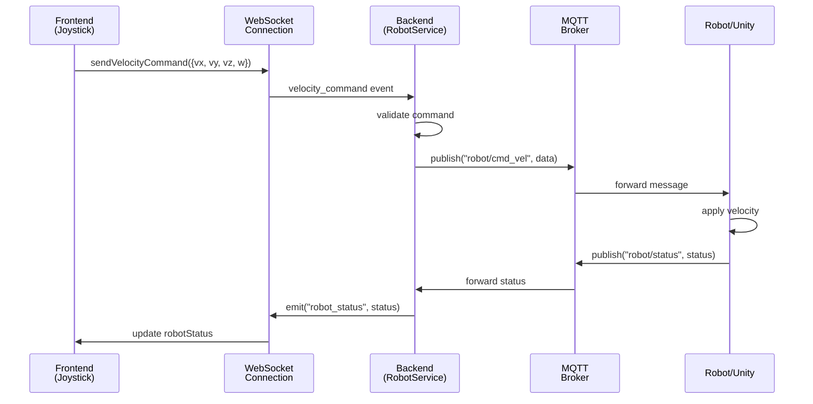
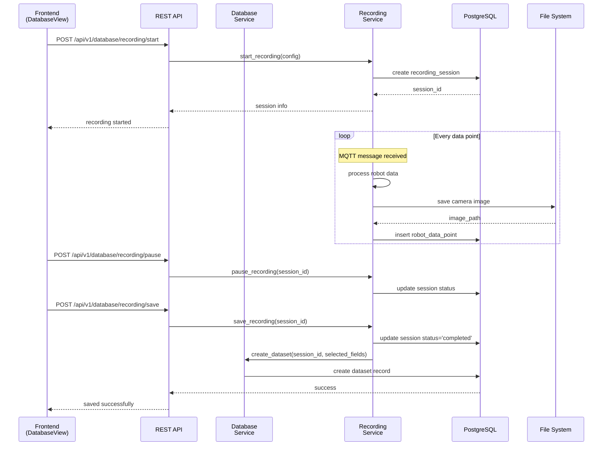
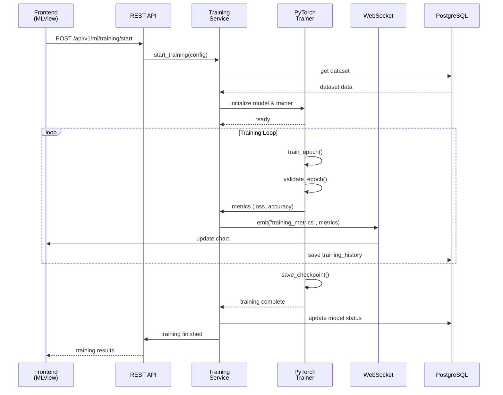
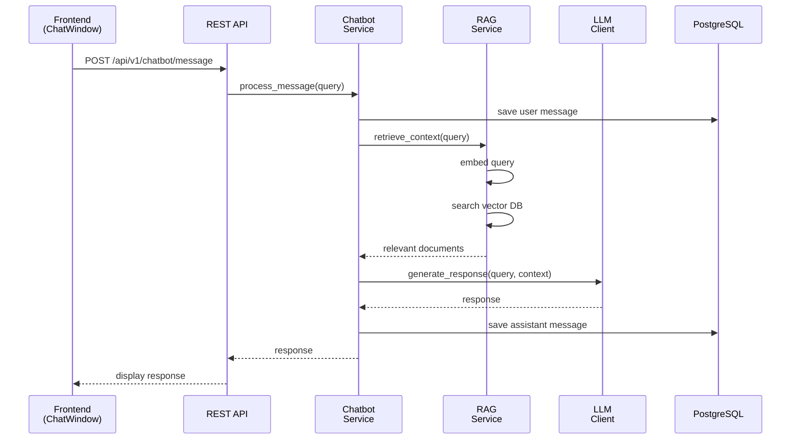
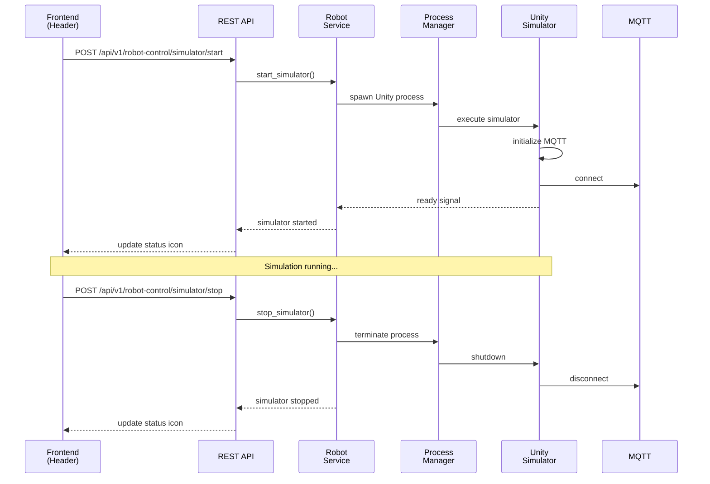

# Robot ML Web Application - システム設計書

## 1. プロジェクト概要

### 1.1 目的
ロボットの制御、データ収集、機械学習、チャットボットを統合したWebアプリケーション

### 1.2 技術スタック
- **フロントエンド**: Vue.js 3 (Composition API + TypeScript)
- **バックエンド**: FastAPI (Python 3.10+)
- **データベース**: PostgreSQL
- **通信プロトコル**: 
  - WebSocket (フロントエンド ↔ バックエンド)
  - MQTT (バックエンド ↔ ロボット)
  - REST API (一部機能)
- **機械学習**: PyTorch
- **メッセージブローカー**: Mosquitto (MQTT)
- **ロボットシミュレータ**: Unity

---

## 2. システム構成図

```
┌─────────────────────────────────────────────────────────────────┐
│                         Frontend (Vue.js)                        │
│  ┌──────────┬──────────┬──────────┬──────────┐                 │
│  │ Robot    │ Database │    ML    │ Chatbot  │                 │
│  │ Control  │  Screen  │  Screen  │          │                 │
│  └──────────┴──────────┴──────────┴──────────┘                 │
│                      │                                           │
│              ┌───────┴────────┐                                 │
│              │   WebSocket    │   REST API                      │
└──────────────┴────────────────┴─────────────────────────────────┘
                      │              │
┌─────────────────────┴──────────────┴─────────────────────────────┐
│                      Backend (FastAPI)                           │
│  ┌────────────┬────────────┬────────────┬────────────┐          │
│  │  Robot     │  Database  │     ML     │  Chatbot   │          │
│  │  Service   │  Service   │  Service   │  Service   │          │
│  └────────────┴────────────┴────────────┴────────────┘          │
│         │            │            │            │                 │
│    ┌────┴────┐  ┌───┴────┐  ┌───┴────┐  ┌───┴────┐            │
│    │  MQTT   │  │   DB   │  │PyTorch │  │  RAG   │            │
│    │ Client  │  │Manager │  │Trainer │  │  LLM   │            │
│    └────┬────┘  └───┬────┘  └───┬────┘  └────────┘            │
└─────────┼───────────┼───────────┼───────────────────────────────┘
          │           │           │
    ┌─────┴─────┐     │      ┌────┴─────┐
    │   MQTT    │     │      │  Model   │
    │  Broker   │     │      │ Storage  │
    └─────┬─────┘     │      └──────────┘
          │      ┌────┴────┐
    ┌─────┴─────┐│PostgreSQL│
    │  Unity /  ││  Image  │
    │  Real     ││ Storage │
    │  Robot    │└─────────┘
    └───────────┘
```

---

## 3. アーキテクチャパターン

### 3.1 全体アーキテクチャ
- **フロントエンド**: Component-Based Architecture
- **バックエンド**: Layered Architecture + Domain-Driven Design (軽量版)
  - API Layer (FastAPI routers)
  - Service Layer (Business Logic)
  - Repository Layer (Database Access)
  - Domain Layer (Models, Entities)

### 3.2 通信フロー

#### ロボット制御
```
Frontend Joystick → WebSocket → Backend → MQTT → Robot
Robot Camera → MQTT → Backend → WebSocket → Frontend
Robot Status → MQTT → Backend → WebSocket → Frontend
Navigation → REST API → Backend → External Service
```

#### データ収集
```
Robot Data → MQTT → Backend → PostgreSQL
Robot Images → MQTT → Backend → File System → Path to PostgreSQL
```

#### 機械学習
```
Frontend → REST API → Backend ML Service → PyTorch Training
Training Metrics → WebSocket → Frontend (Real-time updates)
```

#### チャットボット
```
Frontend → WebSocket/REST → Backend → RAG + LLM → Response
```

---

## 4. ディレクトリ構成

```
robot-ml-web-app/
├── README.md
├── SYSTEM_DESIGN.md
├── docker-compose.yml
├── .env.example
├── .gitignore
│
├── frontend/                          # Vue.js フロントエンド
│   ├── package.json
│   ├── tsconfig.json
│   ├── vite.config.ts
│   ├── index.html
│   ├── public/
│   │   └── assets/
│   └── src/
│       ├── main.ts
│       ├── App.vue
│       ├── router/
│       │   └── index.ts
│       ├── store/                     # Pinia Store
│       │   ├── index.ts
│       │   ├── robot.ts
│       │   ├── database.ts
│       │   ├── ml.ts
│       │   └── chatbot.ts
│       ├── components/                # 共通コンポーネント
│       │   ├── layout/
│       │   │   ├── Header.vue
│       │   │   ├── Sidebar.vue
│       │   │   └── Footer.vue
│       │   ├── common/
│       │   │   ├── Button.vue
│       │   │   ├── Modal.vue
│       │   │   └── StatusIndicator.vue
│       │   └── shared/
│       │       └── ConnectionStatus.vue
│       ├── views/                     # 各タブのメインビュー
│       │   ├── RobotControl/
│       │   │   ├── RobotControlView.vue
│       │   │   ├── components/
│       │   │   │   ├── Joystick.vue
│       │   │   │   ├── CameraFeed.vue
│       │   │   │   ├── RobotStatus.vue
│       │   │   │   └── NavigationPanel.vue
│       │   │   └── composables/
│       │   │       ├── useJoystick.ts
│       │   │       ├── useWebSocket.ts
│       │   │       └── useRobotControl.ts
│       │   ├── Database/
│       │   │   ├── DatabaseView.vue
│       │   │   ├── components/
│       │   │   │   ├── DataSelector.vue
│       │   │   │   ├── RecordingControls.vue
│       │   │   │   ├── DataPreview.vue
│       │   │   │   └── SaveDialog.vue
│       │   │   └── composables/
│       │   │       ├── useDataRecording.ts
│       │   │       └── useDatabase.ts
│       │   ├── MachineLearning/
│       │   │   ├── MLView.vue
│       │   │   ├── components/
│       │   │   │   ├── DatasetSelector.vue
│       │   │   │   ├── ModelConfigurator.vue
│       │   │   │   ├── TrainingControls.vue
│       │   │   │   ├── TrainingChart.vue
│       │   │   │   └── ModelEvaluation.vue
│       │   │   └── composables/
│       │   │       ├── useMLTraining.ts
│       │   │       └── useChartData.ts
│       │   └── Chatbot/
│       │       ├── ChatbotView.vue
│       │       ├── components/
│       │       │   ├── ChatWindow.vue
│       │       │   ├── MessageList.vue
│       │       │   ├── MessageInput.vue
│       │       │   └── ChatHistory.vue
│       │       └── composables/
│       │           └── useChatbot.ts
│       ├── services/                  # API通信サービス
│       │   ├── api.ts
│       │   ├── websocket.ts
│       │   ├── robot-control.service.ts
│       │   ├── database.service.ts
│       │   ├── ml.service.ts
│       │   └── chatbot.service.ts
│       ├── types/                     # TypeScript型定義
│       │   ├── robot.types.ts
│       │   ├── database.types.ts
│       │   ├── ml.types.ts
│       │   └── chatbot.types.ts
│       └── utils/
│           ├── validators.ts
│           └── formatters.ts
│
├── backend/                           # FastAPI バックエンド
│   ├── pyproject.toml
│   ├── requirements.txt
│   ├── requirements-dev.txt
│   ├── alembic.ini
│   ├── .env
│   └── app/
│       ├── main.py                    # FastAPIアプリケーションエントリーポイント
│       ├── config.py                  # 設定管理
│       ├── dependencies.py            # 依存性注入
│       │
│       ├── core/                      # コア機能
│       │   ├── __init__.py
│       │   ├── database.py            # DB接続設定
│       │   ├── mqtt.py                # MQTT接続設定
│       │   ├── websocket.py           # WebSocket管理
│       │   ├── exceptions.py          # カスタム例外
│       │   ├── logger.py              # ロギング設定
│       │   └── security.py            # セキュリティ設定
│       │
│       ├── models/                    # SQLAlchemy モデル
│       │   ├── __init__.py
│       │   ├── base.py
│       │   ├── robot.py               # ロボット関連モデル
│       │   ├── dataset.py             # データセットモデル
│       │   ├── ml_model.py            # ML モデルメタデータ
│       │   └── chat.py                # チャット履歴モデル
│       │
│       ├── schemas/                   # Pydantic スキーマ
│       │   ├── __init__.py
│       │   ├── robot.py
│       │   ├── database.py
│       │   ├── ml.py
│       │   └── chatbot.py
│       │
│       ├── repositories/              # データアクセス層
│       │   ├── __init__.py
│       │   ├── base.py
│       │   ├── robot.py
│       │   ├── dataset.py
│       │   ├── ml_model.py
│       │   └── chat.py
│       │
│       ├── services/                  # ビジネスロジック層
│       │   ├── __init__.py
│       │   ├── robot_control/
│       │   │   ├── __init__.py
│       │   │   ├── robot_service.py
│       │   │   ├── mqtt_handler.py
│       │   │   ├── camera_service.py
│       │   │   └── navigation_service.py
│       │   ├── database/
│       │   │   ├── __init__.py
│       │   │   ├── recording_service.py
│       │   │   ├── image_storage_service.py
│       │   │   └── data_export_service.py
│       │   ├── ml/
│       │   │   ├── __init__.py
│       │   │   ├── training_service.py
│       │   │   ├── model_manager.py
│       │   │   ├── dataset_service.py
│       │   │   └── evaluation_service.py
│       │   └── chatbot/
│       │       ├── __init__.py
│       │       ├── chatbot_service.py
│       │       ├── rag_service.py
│       │       └── llm_client.py
│       │
│       ├── api/                       # APIルーター
│       │   ├── __init__.py
│       │   ├── deps.py                # APIレベルの依存性
│       │   ├── v1/
│       │   │   ├── __init__.py
│       │   │   ├── robot_control.py
│       │   │   ├── database.py
│       │   │   ├── ml.py
│       │   │   ├── chatbot.py
│       │   │   └── websocket.py
│       │   └── router.py
│       │
│       ├── ml_models/                 # PyTorch モデル定義
│       │   ├── __init__.py
│       │   ├── base_model.py
│       │   ├── robot_predictor.py
│       │   └── custom_models.py
│       │
│       └── utils/
│           ├── __init__.py
│           ├── image_processing.py
│           ├── data_validation.py
│           └── mqtt_topics.py
│
├── database/                          # データベース関連
│   ├── migrations/                    # Alembic マイグレーション
│   │   └── versions/
│   └── init.sql
│
├── data/                              # データストレージ
│   ├── images/                        # ロボットカメラ画像
│   │   ├── raw/
│   │   └── processed/
│   ├── datasets/                      # 収集したデータセット
│   ├── models/                        # 学習済みモデル
│   │   └── checkpoints/
│   └── rag/                           # RAG用ドキュメント
│       └── embeddings/
│
├── unity-simulator/                   # Unity シミュレータ
│   ├── README.md
│   ├── build/                         # ビルド済み実行ファイル
│   └── Assets/
│       └── Scripts/
│           └── MQTTController.cs
│
├── mqtt-broker/                       # MQTT ブローカー設定
│   ├── mosquitto.conf
│   └── Dockerfile
│
├── docs/                              # ドキュメント
│   ├── api/
│   ├── architecture/
│   └── user-guide/
│
├── tests/                             # テスト
│   ├── frontend/
│   └── backend/
│       ├── unit/
│       └── integration/
│
└── scripts/                           # ユーティリティスクリプト
    ├── start-dev.sh
    ├── setup-db.sh
    └── build-unity.sh
```

---

## 5. データベース設計

### 5.1 ER図

```
┌─────────────────────────┐
│   recording_sessions    │
├─────────────────────────┤
│ id (PK)                 │
│ name                    │
│ description             │
│ start_time              │
│ end_time                │
│ status                  │  (recording, paused, completed, discarded)
│ created_at              │
└──────────┬──────────────┘
           │
           │ 1:N
           │
┌──────────┴──────────────┐
│    robot_data_points    │
├─────────────────────────┤
│ id (PK)                 │
│ session_id (FK)         │
│ timestamp               │
│ velocity_x              │
│ velocity_y              │
│ velocity_z              │
│ angular_velocity        │
│ position_x              │
│ position_y              │
│ position_z              │
│ battery_level           │
│ camera_image_path       │  ← ファイルパス
│ status_json             │  ← その他ステータス(JSONB)
└─────────────────────────┘

┌─────────────────────────┐
│       datasets          │
├─────────────────────────┤
│ id (PK)                 │
│ session_id (FK)         │
│ name                    │
│ description             │
│ data_types              │  ← 選択されたデータ種別
│ created_at              │
│ updated_at              │
└──────────┬──────────────┘
           │
           │ 1:N
           │
┌──────────┴──────────────┐
│      ml_models          │
├─────────────────────────┤
│ id (PK)                 │
│ dataset_id (FK)         │
│ name                    │
│ model_type              │
│ architecture            │
│ hyperparameters (JSONB) │
│ training_status         │
│ model_path              │
│ metrics (JSONB)         │
│ created_at              │
│ updated_at              │
└──────────┬──────────────┘
           │
           │ 1:N
           │
┌──────────┴──────────────┐
│    training_history     │
├─────────────────────────┤
│ id (PK)                 │
│ model_id (FK)           │
│ epoch                   │
│ train_loss              │
│ val_loss                │
│ train_accuracy          │
│ val_accuracy            │
│ learning_rate           │
│ timestamp               │
└─────────────────────────┘

┌─────────────────────────┐
│    chat_conversations   │
├─────────────────────────┤
│ id (PK)                 │
│ session_id              │
│ created_at              │
└──────────┬──────────────┘
           │
           │ 1:N
           │
┌──────────┴──────────────┐
│     chat_messages       │
├─────────────────────────┤
│ id (PK)                 │
│ conversation_id (FK)    │
│ role                    │  (user, assistant)
│ content                 │
│ timestamp               │
│ metadata (JSONB)        │
└─────────────────────────┘
```

---

## 6. クラス図

### 6.1 バックエンド - Robot Control Service

```
┌────────────────────────────────┐
│    RobotControlService         │
├────────────────────────────────┤
│ - mqtt_handler: MQTTHandler    │
│ - camera_service: CameraService│
│ - nav_service: NavigationSvc   │
├────────────────────────────────┤
│ + send_velocity_command()      │
│ + get_robot_status()           │
│ + get_camera_feed()            │
│ + send_navigation_goal()       │
└───────────┬────────────────────┘
            │
            │ uses
            │
┌───────────┴────────────────────┐
│       MQTTHandler              │
├────────────────────────────────┤
│ - client: MQTTClient           │
│ - topics: Dict[str, str]       │
├────────────────────────────────┤
│ + connect()                    │
│ + disconnect()                 │
│ + publish(topic, payload)      │
│ + subscribe(topic, callback)   │
│ + on_message()                 │
└────────────────────────────────┘

┌────────────────────────────────┐
│      CameraService             │
├────────────────────────────────┤
│ - image_buffer: Queue          │
├────────────────────────────────┤
│ + process_image()              │
│ + get_latest_frame()           │
│ + compress_image()             │
└────────────────────────────────┘

┌────────────────────────────────┐
│    NavigationService           │
├────────────────────────────────┤
│ - goals: List[Goal]            │
├────────────────────────────────┤
│ + set_goal(position)           │
│ + cancel_goal()                │
│ + get_navigation_status()      │
└────────────────────────────────┘
```

### 6.2 バックエンド - ML Service

```
┌────────────────────────────────┐
│     TrainingService            │
├────────────────────────────────┤
│ - model_manager: ModelManager  │
│ - dataset_service: DatasetSvc  │
│ - trainer: PyTorchTrainer      │
├────────────────────────────────┤
│ + start_training()             │
│ + pause_training()             │
│ + stop_training()              │
│ + get_training_metrics()       │
└───────────┬────────────────────┘
            │
            │ uses
            │
┌───────────┴────────────────────┐
│      PyTorchTrainer            │
├────────────────────────────────┤
│ - model: nn.Module             │
│ - optimizer: Optimizer         │
│ - criterion: Loss              │
│ - device: torch.device         │
├────────────────────────────────┤
│ + train_epoch()                │
│ + validate_epoch()             │
│ + save_checkpoint()            │
│ + load_checkpoint()            │
└────────────────────────────────┘

┌────────────────────────────────┐
│      ModelManager              │
├────────────────────────────────┤
│ - models_dir: Path             │
├────────────────────────────────┤
│ + save_model()                 │
│ + load_model()                 │
│ + list_models()                │
│ + delete_model()               │
└────────────────────────────────┘

┌────────────────────────────────┐
│      DatasetService            │
├────────────────────────────────┤
│ - repository: DatasetRepo      │
├────────────────────────────────┤
│ + create_dataset()             │
│ + get_dataset()                │
│ + prepare_dataloader()         │
└────────────────────────────────┘
```

### 6.3 フロントエンド - Composables

```
┌────────────────────────────────┐
│     useRobotControl            │
├────────────────────────────────┤
│ - robotStatus: Ref<Status>     │
│ - cameraFeed: Ref<Image>       │
│ - ws: WebSocket                │
├────────────────────────────────┤
│ + sendVelocity()               │
│ + startCameraStream()          │
│ + stopCameraStream()           │
│ + subscribeStatus()            │
└────────────────────────────────┘

┌────────────────────────────────┐
│     useDataRecording           │
├────────────────────────────────┤
│ - recordingState: Ref<State>   │
│ - selectedData: Ref<Array>     │
├────────────────────────────────┤
│ + startRecording()             │
│ + pauseRecording()             │
│ + saveRecording()              │
│ + discardRecording()           │
│ + endRecording()               │
└────────────────────────────────┘

┌────────────────────────────────┐
│     useMLTraining              │
├────────────────────────────────┤
│ - trainingMetrics: Ref<Array>  │
│ - modelConfig: Ref<Config>     │
│ - ws: WebSocket                │
├────────────────────────────────┤
│ + startTraining()              │
│ + stopTraining()               │
│ + subscribeMetrics()           │
│ + updateChartData()            │
└────────────────────────────────┘
```

---

## 7. シーケンス図

### 7.1 ロボット速度制御



### 7.2 データ記録フロー



### 7.3 機械学習トレーニング



### 7.4 チャットボット (RAG)



### 7.5 Unity シミュレータ起動/終了



---

## 8. API エンドポイント設計

### 8.1 ロボット制御 (`/api/v1/robot-control`)

| Method | Endpoint | Description |
|--------|----------|-------------|
| GET | `/status` | ロボットの現在ステータス取得 |
| POST | `/navigation/goal` | ナビゲーションゴール設定 |
| DELETE | `/navigation/goal` | ナビゲーションキャンセル |
| GET | `/navigation/status` | ナビゲーション状態取得 |
| POST | `/simulator/start` | Unity シミュレータ起動 |
| POST | `/simulator/stop` | Unity シミュレータ終了 |
| GET | `/simulator/status` | シミュレータ状態取得 |

### 8.2 データベース (`/api/v1/database`)

| Method | Endpoint | Description |
|--------|----------|-------------|
| POST | `/recording/start` | 記録開始 |
| POST | `/recording/pause` | 記録一時停止 |
| POST | `/recording/resume` | 記録再開 |
| POST | `/recording/save` | 記録保存 |
| POST | `/recording/discard` | 記録破棄 |
| POST | `/recording/end` | 記録終了 |
| GET | `/recording/{id}` | 記録情報取得 |
| GET | `/recordings` | 記録一覧取得 |
| GET | `/datasets` | データセット一覧 |
| GET | `/datasets/{id}` | データセット詳細 |

### 8.3 機械学習 (`/api/v1/ml`)

| Method | Endpoint | Description |
|--------|----------|-------------|
| GET | `/datasets` | データセット一覧 |
| POST | `/training/start` | トレーニング開始 |
| POST | `/training/stop` | トレーニング停止 |
| GET | `/training/{id}` | トレーニング状態取得 |
| GET | `/models` | モデル一覧 |
| GET | `/models/{id}` | モデル詳細 |
| POST | `/models/{id}/evaluate` | モデル評価 |
| DELETE | `/models/{id}` | モデル削除 |

### 8.4 チャットボット (`/api/v1/chatbot`)

| Method | Endpoint | Description |
|--------|----------|-------------|
| POST | `/message` | メッセージ送信 |
| GET | `/conversations` | 会話履歴一覧 |
| GET | `/conversations/{id}` | 会話詳細 |
| DELETE | `/conversations/{id}` | 会話削除 |

### 8.5 WebSocket エンドポイント

| Endpoint | Description | Events |
|----------|-------------|--------|
| `/ws/robot` | ロボット制御 | `velocity_command`, `robot_status`, `camera_frame` |
| `/ws/ml/training` | ML トレーニング | `training_metrics`, `epoch_complete` |
| `/ws/connection` | 接続状態監視 | `mqtt_status`, `websocket_status` |

---

## 9. MQTT トピック設計

### 9.1 コマンド (Backend → Robot)

| Topic | Payload | Description |
|-------|---------|-------------|
| `robot/cmd_vel` | `{vx, vy, vz, angular}` | 速度指令 |
| `robot/nav/goal` | `{x, y, z, orientation}` | ナビゲーションゴール |
| `robot/nav/cancel` | `{}` | ナビゲーションキャンセル |

### 9.2 テレメトリ (Robot → Backend)

| Topic | Payload | Description |
|-------|---------|-------------|
| `robot/status` | `{position, velocity, battery, ...}` | ロボット状態 |
| `robot/camera/image` | `{image_data, timestamp}` | カメラ画像 |
| `robot/nav/status` | `{status, progress, ...}` | ナビゲーション状態 |

---

## 10. 状態管理設計 (Frontend)

### 10.1 Pinia Stores

```typescript
// store/robot.ts
export const useRobotStore = defineStore('robot', {
  state: () => ({
    status: null as RobotStatus | null,
    cameraFeed: null as string | null,
    velocity: { vx: 0, vy: 0, vz: 0, angular: 0 },
    navigationGoal: null,
    simulatorRunning: false,
  }),
  actions: {
    updateStatus(status: RobotStatus) { ... },
    updateCameraFeed(image: string) { ... },
    sendVelocity(velocity: Velocity) { ... },
  },
})

// store/database.ts
export const useDatabaseStore = defineStore('database', {
  state: () => ({
    recordingState: 'idle' as RecordingState,
    currentSession: null,
    selectedDataTypes: [] as string[],
    dataPreview: [],
  }),
  actions: {
    startRecording() { ... },
    pauseRecording() { ... },
    saveRecording() { ... },
  },
})

// store/ml.ts
export const useMLStore = defineStore('ml', {
  state: () => ({
    trainingStatus: 'idle',
    currentModel: null,
    metrics: [] as TrainingMetric[],
    datasets: [],
  }),
  actions: {
    startTraining(config) { ... },
    updateMetrics(metrics) { ... },
  },
})

// store/chatbot.ts
export const useChatbotStore = defineStore('chatbot', {
  state: () => ({
    conversations: [],
    currentConversation: null,
    messages: [],
  }),
  actions: {
    sendMessage(content: string) { ... },
    loadConversation(id: string) { ... },
  },
})
```

---

## 11. 接続状態監視

### 11.1 ヘッダーステータスインジケーター

```
┌────────────────────────────────────────────────────────┐
│  Robot ML Web App                                       │
│                                         ┌──────┐        │
│  [Simulation] [Start] [Stop]           │ MQTT │ ●     │
│                                         │  WS  │ ●     │
│                                         └──────┘        │
└────────────────────────────────────────────────────────┘
```

- **緑色●**: 接続済み
- **赤色●**: 切断
- **黄色●**: 接続中

### 11.2 監視メカニズム

```typescript
// Frontend: services/websocket.ts
class ConnectionMonitor {
  private heartbeatInterval: number = 5000
  private mqttStatus: Ref<ConnectionStatus>
  private wsStatus: Ref<ConnectionStatus>
  
  startMonitoring() {
    setInterval(() => {
      this.checkMQTTStatus()
      this.checkWebSocketStatus()
    }, this.heartbeatInterval)
  }
}
```

---

## 12. セキュリティ考慮事項

### 12.1 認証・認可
- JWTベースの認証 (オプション、将来拡張)
- APIキーによるアクセス制御

### 12.2 データ保護
- 画像ファイルアクセスの検証
- SQLインジェクション対策 (SQLAlchemy ORM使用)
- XSS対策 (Vue.jsの自動エスケープ)

### 12.3 通信セキュリティ
- MQTT over TLS (本番環境)
- WebSocket over TLS (wss://)
- CORS設定

---

## 13. パフォーマンス最適化

### 13.1 画像処理
- カメラフィード: JPEG圧縮 + Base64エンコード
- フレームレート制限 (10-15 FPS)
- 画像サイズ削減 (640x480)

### 13.2 データベース
- 適切なインデックス設定
- 大量データのページネーション
- 画像のファイルシステム保存

### 13.3 機械学習
- GPUサポート (CUDA)
- バッチ処理
- 非同期トレーニング

---

## 14. テスト戦略

### 14.1 フロントエンド
- **Unit Tests**: Vitest
- **Component Tests**: Vue Test Utils
- **E2E Tests**: Playwright

### 14.2 バックエンド
- **Unit Tests**: pytest
- **Integration Tests**: pytest + TestClient
- **API Tests**: pytest + httpx

### 14.3 システムテスト
- WebSocket通信テスト
- MQTT統合テスト
- 機械学習パイプラインテスト

---

## 15. デプロイメント

### 15.1 開発環境
```bash
# Docker Compose でローカル起動
docker-compose up -d
```

### 15.2 本番環境
- **Frontend**: Nginx + Vue.js (Static)
- **Backend**: Uvicorn + FastAPI
- **Database**: PostgreSQL (Managed Service)
- **MQTT**: Mosquitto (Docker Container)
- **ML**: GPU Server (オプション)

---

## 16. 監視・ロギング

### 16.1 ログ
- **Backend**: structlog (構造化ログ)
- **Frontend**: Console + Sentry (エラートラッキング)

### 16.2 メトリクス
- API レスポンスタイム
- MQTT メッセージレート
- WebSocket 接続数
- GPU使用率 (ML)

---

## 17. 今後の拡張性

### 17.1 機能拡張
- 複数ロボット対応
- リアルタイム協調制御
- 高度な機械学習モデル (強化学習等)
- ユーザー管理・権限機能

### 17.2 技術的拡張
- Kubernetes デプロイメント
- マイクロサービス化
- イベント駆動アーキテクチャ (Kafka/RabbitMQ)

---

## 18. 開発フェーズ

### Phase 1: 基礎インフラ構築
1. プロジェクト構造作成
2. Docker環境構築
3. データベースセットアップ
4. MQTT ブローカー設定

### Phase 2: ロボット制御機能
1. MQTT 通信実装
2. WebSocket 実装
3. ジョイスティック制御
4. カメラフィード表示
5. Unity シミュレータ連携

### Phase 3: データベース機能
1. データ記録機能
2. 画像保存機能
3. データプレビュー
4. データエクスポート

### Phase 4: 機械学習機能
1. データセット管理
2. PyTorch モデル実装
3. トレーニングパイプライン
4. リアルタイムメトリクス表示

### Phase 5: チャットボット
1. RAG システム構築
2. LLM 統合
3. チャット UI 実装

### Phase 6: 統合・テスト
1. システム統合テスト
2. パフォーマンステスト
3. ドキュメント整備

---

## 19. 技術選定理由

### 19.1 Vue.js
- リアクティブなUI更新
- Composition APIによる再利用性
- TypeScript サポート

### 19.2 FastAPI
- 高速なパフォーマンス
- 自動APIドキュメント生成
- WebSocket サポート
- Pydantic による型安全性

### 19.3 PostgreSQL
- JSONB サポート
- 高い信頼性
- 拡張性

### 19.4 PyTorch
- 柔軟なモデル定義
- 豊富なコミュニティ
- 研究から本番まで対応

### 19.5 MQTT
- 軽量プロトコル
- Pub/Sub モデル
- ロボティクス分野での実績

---

## 20. 参考資料

### 20.1 公式ドキュメント
- [Vue.js Documentation](https://vuejs.org/)
- [FastAPI Documentation](https://fastapi.tiangolo.com/)
- [PyTorch Documentation](https://pytorch.org/docs/)
- [MQTT Specification](https://mqtt.org/)

### 20.2 アーキテクチャパターン
- Clean Architecture
- Domain-Driven Design
- Event-Driven Architecture

---

**Document Version**: 1.0  
**Last Updated**: 2025-11-18  
**Author**: System Design Team
