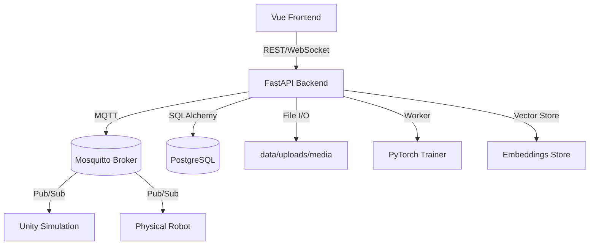
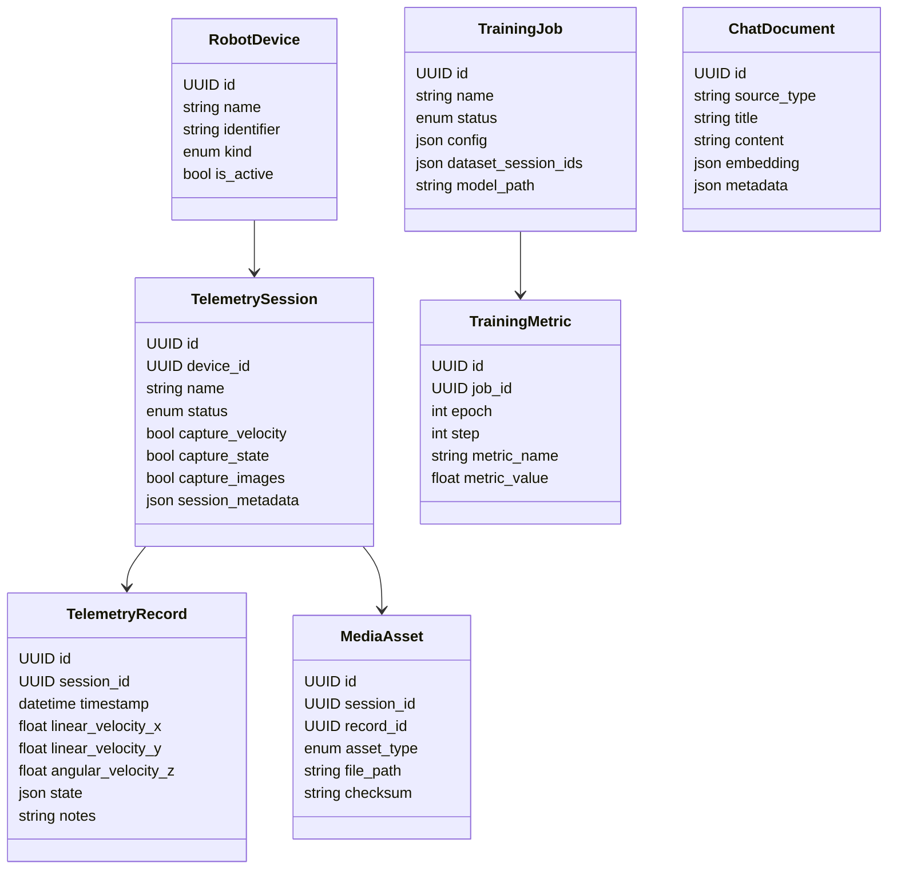
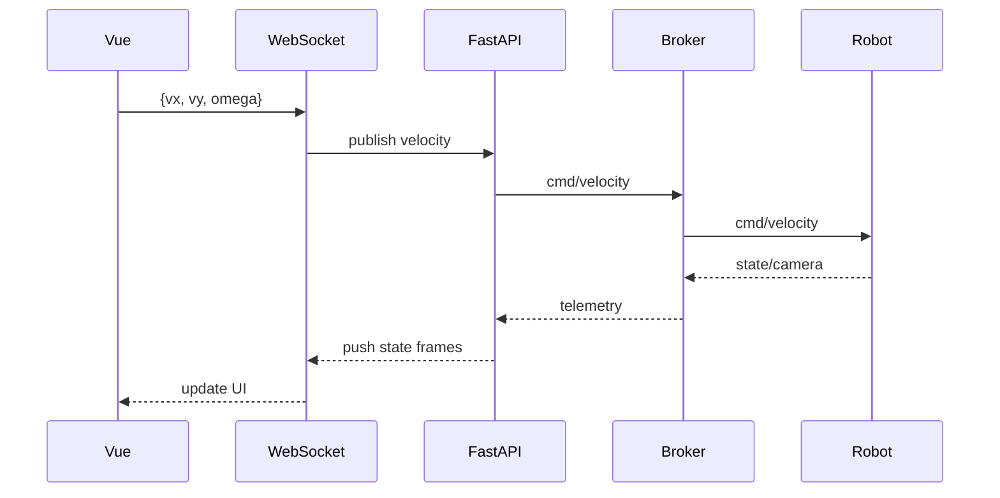
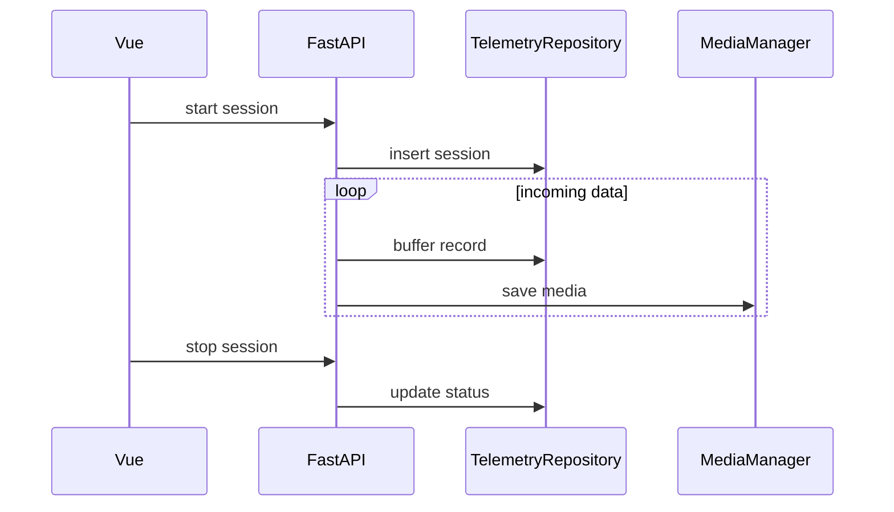
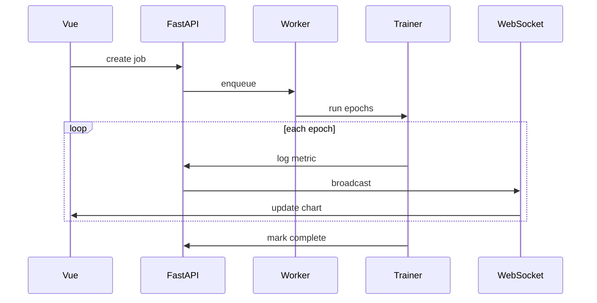

# Robot ML Web App – System Design

## 全体構成

## 主要モジュール

- **フロントエンド**: Vue 3 + Vite + Pinia。タブごとのディレクトリ分割。
- **バックエンド**: FastAPI。ドメイン単位のルータ、サービス、リポジトリ層。
- **メッセージング**: MQTT ブローカーを介したロボット制御とテレメトリ。
- **データ永続化**: PostgreSQL + SQLAlchemy。画像等はファイルシステムに保存しパスのみ DB 登録。
- **機械学習**: PyTorch トレーニングワーカー (非同期キュー) と WebSocket によるメトリクス配信。
- **Chatbot**: RAG パイプライン (埋め込み + リトリーバ + LLM スタブ)。

## API レイヤ

| エンドポイント | 概要 |
| --- | --- |
| `POST /api/v1/robot/control/velocity` | ジョイスティック操作を MQTT に転送 |
| `POST /api/v1/robot/control/navigation` | ナビゲーション指示 |
| `GET /api/v1/telemetry/sessions` | テレメトリセッション一覧 |
| `POST /api/v1/telemetry/sessions` | セッション開始 |
| `PATCH /api/v1/telemetry/sessions/{id}` | ステータス更新 |
| `POST /api/v1/ml/jobs` | 学習ジョブ登録 |
| `GET /api/v1/ml/jobs` | ジョブ一覧 |
| `POST /api/v1/chatbot/query` | Chatbot への質問 |
| `POST /api/v1/simulation/start` | Unity シミュレーション起動 |
| `POST /api/v1/simulation/stop` | Unity シミュレーション停止 |

## WebSocket チャネル

- `/ws/robot`: ロボット状態・カメラストリーム通知
- `/ws/telemetry`: テレメトリイベント
- `/ws/training`: 学習メトリクス
- `/ws/chatbot`: 将来拡張用

## データベース概要

## シーケンス図

### ジョイスティック制御

### テレメトリ保存

### ML 学習

## フォルダ構成ポリシー

- タブ別 (`robot-control`, `database`, `ml`, `chatbot`) にフロントエンドを分離
- バックエンドは `api` / `services` / `repositories` / `infrastructure` のレイヤ構成
- 追加モジュールは `infrastructure` 以下にまとめ、外部依存を隔離
- テストは `tests/unit`, `tests/integration`, `tests/e2e`

## 今後の課題

1. MQTT 実装を paho-mqtt 等で本結線
2. トレーニングワーカーを Celery/RQ や asyncio キューに統合
3. ベクターストア(Qdrant/FAISS)連携とドキュメントインジェストパイプライン
4. 認証・認可の導入
5. CI/CD と監視の整備