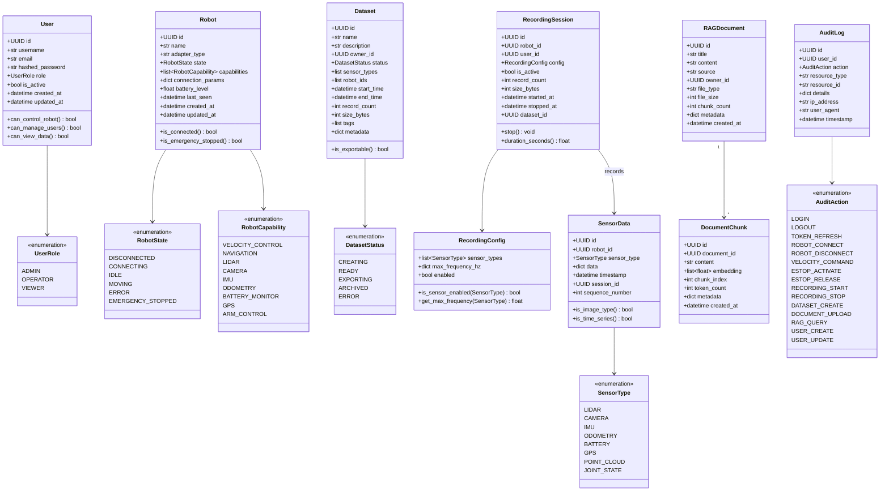
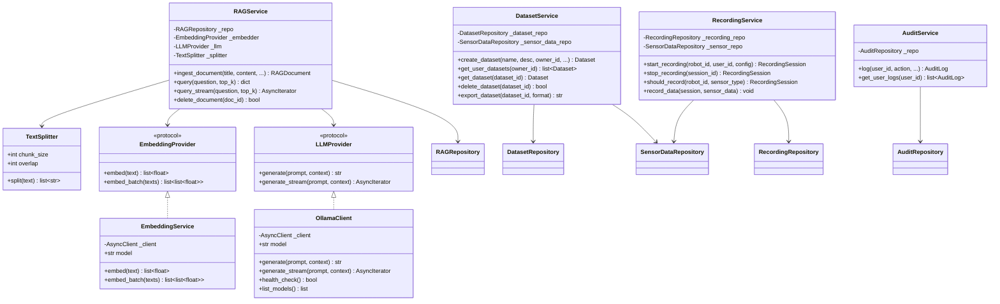

# Robot AI Web Application — Mermaid 図表集

> クラス図、シーケンス図、ER図、アーキテクチャ図をMermaidで表現

---

## 目次

1. [システムアーキテクチャ全体図](#1-システムアーキテクチャ全体図)
2. [ER図 (データベース)](#2-er図-データベース)
3. [バックエンド クラス図](#3-バックエンド-クラス図)
4. [ゲートウェイ クラス図](#4-ゲートウェイ-クラス図)
5. [フロントエンド クラス図](#5-フロントエンド-クラス図)
6. [シーケンス図 — 認証フロー](#6-シーケンス図--認証フロー)
7. [シーケンス図 — ロボット操作](#7-シーケンス図--ロボット操作)
8. [シーケンス図 — センサーデータ配信](#8-シーケンス図--センサーデータ配信)
9. [シーケンス図 — RAG質問応答](#9-シーケンス図--rag質問応答)
10. [シーケンス図 — 緊急停止 (E-Stop)](#10-シーケンス図--緊急停止-e-stop)
11. [シーケンス図 — データ記録](#11-シーケンス図--データ記録)
12. [状態遷移図 — ロボット状態](#12-状態遷移図--ロボット状態)
13. [状態遷移図 — データセット状態](#13-状態遷移図--データセット状態)
14. [依存性注入フロー図](#14-依存性注入フロー図)
15. [Docker ネットワーク構成図](#15-docker-ネットワーク構成図)
16. [CI/CD パイプライン図](#16-cicd-パイプライン図)

---

## 1. システムアーキテクチャ全体図


---

## 2. ER図 (データベース)


---

## 3. バックエンド クラス図

### 3.1 ドメインエンティティ



### 3.2 リポジトリ層 (抽象 + 実装)


### 3.3 サービス層




---

## 4. ゲートウェイ クラス図

### 4.1 サーバー・メッセージ処理


### 4.2 アダプタパターン


### 4.3 安全機能


### 4.4 プロトコル


---

## 5. フロントエンド クラス図


### 5.1 ページコンポーネント構成


### 5.2 センサーコンポーネント


---

## 6. シーケンス図 — 認証フロー


---

## 7. シーケンス図 — ロボット操作


---

## 8. シーケンス図 — センサーデータ配信


---

## 9. シーケンス図 — RAG質問応答


---

## 10. シーケンス図 — 緊急停止 (E-Stop)


---

## 11. シーケンス図 — データ記録


---

## 12. 状態遷移図 — ロボット状態


---

## 13. 状態遷移図 — データセット状態


---

## 14. 依存性注入フロー図

```mermaid
graph TD
    subgraph "FastAPI Request"
        REQ[HTTP Request]
    end

    subgraph "Dependencies Chain"
        DB_SESSION["get_db()<br/>AsyncSession"]
        SETTINGS["get_settings()<br/>Settings (@lru_cache)"]
        SECURITY["HTTPBearer<br/>credentials"]

        USER_REPO["get_user_repo(session)<br/>→ SQLAlchemyUserRepository"]
        ROBOT_REPO["get_robot_repo(session)<br/>→ SQLAlchemyRobotRepository"]
        SENSOR_REPO["get_sensor_data_repo(session)<br/>→ SQLAlchemySensorDataRepository"]
        DATASET_REPO["get_dataset_repo(session)<br/>→ SQLAlchemyDatasetRepository"]
        RAG_REPO["get_rag_repo(session)<br/>→ SQLAlchemyRAGRepository"]
        AUDIT_REPO["get_audit_repo(session)<br/>→ SQLAlchemyAuditRepository"]
        RECORDING_REPO["get_recording_repo(session)<br/>→ SQLAlchemyRecordingRepository"]

        CURRENT_USER["get_current_user()<br/>→ User"]
        ADMIN_USER["require_role(ADMIN)<br/>→ User"]
        OPERATOR_USER["require_role(ADMIN, OPERATOR)<br/>→ User"]

        DATASET_SVC["get_dataset_service()<br/>→ DatasetService"]
        RECORDING_SVC["get_recording_service()<br/>→ RecordingService"]
        AUDIT_SVC["get_audit_service()<br/>→ AuditService"]
    end

    subgraph "Endpoint"
        ENDPOINT["@router.post('/robots')"]
    end

    REQ --> DB_SESSION
    REQ --> SETTINGS
    REQ --> SECURITY

    DB_SESSION --> USER_REPO
    DB_SESSION --> ROBOT_REPO
    DB_SESSION --> SENSOR_REPO
    DB_SESSION --> DATASET_REPO
    DB_SESSION --> RAG_REPO
    DB_SESSION --> AUDIT_REPO
    DB_SESSION --> RECORDING_REPO

    USER_REPO --> CURRENT_USER
    SETTINGS --> CURRENT_USER
    SECURITY --> CURRENT_USER

    CURRENT_USER --> ADMIN_USER
    CURRENT_USER --> OPERATOR_USER

    DATASET_REPO --> DATASET_SVC
    SENSOR_REPO --> DATASET_SVC
    RECORDING_REPO --> RECORDING_SVC
    SENSOR_REPO --> RECORDING_SVC
    AUDIT_REPO --> AUDIT_SVC

    OPERATOR_USER --> ENDPOINT
    ROBOT_REPO --> ENDPOINT
    AUDIT_SVC --> ENDPOINT

    style REQ fill:#e0f2fe
    style ENDPOINT fill:#dcfce7
    style DB_SESSION fill:#fef3c7
    style CURRENT_USER fill:#fce7f3
    style ADMIN_USER fill:#fee2e2
    style OPERATOR_USER fill:#fee2e2
```

---

## 15. Docker ネットワーク構成図

```mermaid
graph TB
    subgraph frontend_network["frontend-network (bridge)"]
        FE[Frontend<br/>:5173 / :3000]
        BE_F[Backend<br/>:8000]
        GW_F[Gateway<br/>:8080]
    end

    subgraph backend_network["backend-network (bridge)"]
        BE_B[Backend<br/>:8000]
        GW_B[Gateway<br/>:8080 / :50051]
        PG[(PostgreSQL<br/>:5432<br/>TimescaleDB + pgvector)]
        RD[(Redis<br/>:6379<br/>Streams)]
        OL[Ollama<br/>:11434<br/>Llama3 + nomic-embed-text]
    end

    subgraph volumes["Persistent Volumes"]
        PG_VOL[(postgres-data)]
        RD_VOL[(redis-data)]
        OL_VOL[(ollama-data)]
        UP_VOL[(backend-uploads)]
        DA_VOL[(backend-data)]
    end

    FE -.->|REST API| BE_F
    FE -.->|WebSocket| GW_F

    BE_B -->|asyncpg| PG
    BE_B -->|redis-py| RD
    BE_B -->|httpx| OL
    GW_B -->|go-redis| RD

    PG --- PG_VOL
    RD --- RD_VOL
    OL --- OL_VOL
    BE_B --- UP_VOL
    BE_B --- DA_VOL

    BE_F -.- BE_B
    GW_F -.- GW_B

    style frontend_network fill:#dbeafe,stroke:#3b82f6
    style backend_network fill:#fef3c7,stroke:#f59e0b
    style volumes fill:#f3e8ff,stroke:#a855f7
```

---

## 16. CI/CD パイプライン図

```mermaid
graph LR
    subgraph Trigger["トリガー"]
        PUSH[Push to main/develop]
        PR[Pull Request to main]
        TAG[Tag v*.*.*]
    end

    subgraph CI["CI Pipeline (ci.yml)"]
        direction TB
        BT[Backend Test<br/>Python 3.12<br/>pytest --cov]
        FT[Frontend Test<br/>Node 20<br/>npm test + lint + build]
        GT[Gateway Test<br/>Go 1.22<br/>go test + vet + build]
        DC[Docker Compose<br/>Validation]
    end

    subgraph CD_STG["CD Staging (cd-staging.yml)"]
        BUILD_STG[Docker Build<br/>All Services]
        PUSH_STG[Push to GHCR<br/>:staging tag]
        DEPLOY_STG[Deploy to<br/>Staging]
    end

    subgraph CD_PROD["CD Production (cd-production.yml)"]
        BUILD_PROD[Docker Build<br/>All Services]
        PUSH_PROD[Push to GHCR<br/>:latest + :vX.Y.Z]
        DEPLOY_PROD[Deploy to<br/>Production]
    end

    PUSH --> CI
    PR --> CI

    PUSH -->|develop branch| CD_STG
    CI -->|pass| CD_STG
    BUILD_STG --> PUSH_STG --> DEPLOY_STG

    TAG --> CD_PROD
    CI -->|pass| CD_PROD
    BUILD_PROD --> PUSH_PROD --> DEPLOY_PROD

    style Trigger fill:#e0f2fe
    style CI fill:#dcfce7
    style CD_STG fill:#fef3c7
    style CD_PROD fill:#fee2e2
```

---

> **注意**: これらのMermaid図はGitHub、VS Code (Markdown Preview Mermaid Support拡張)、MkDocs (pymdownx.superfences) などで直接レンダリングできます。
