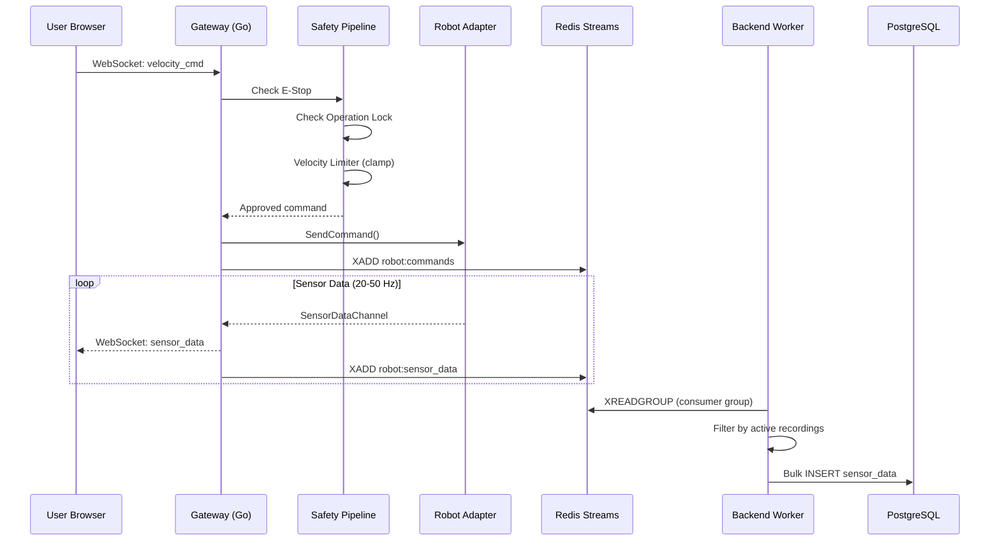
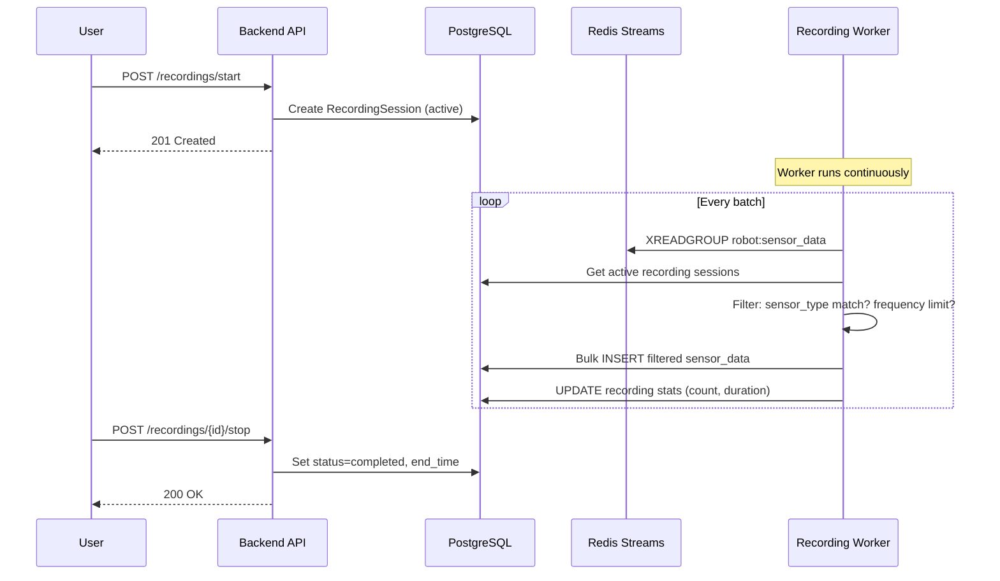
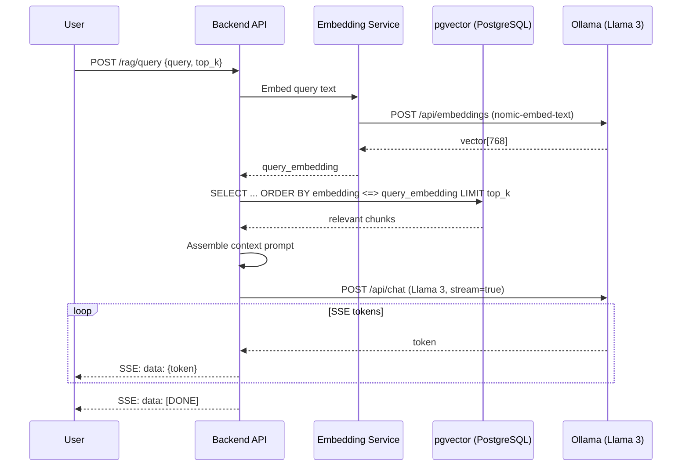
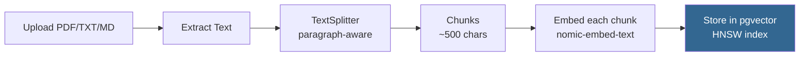
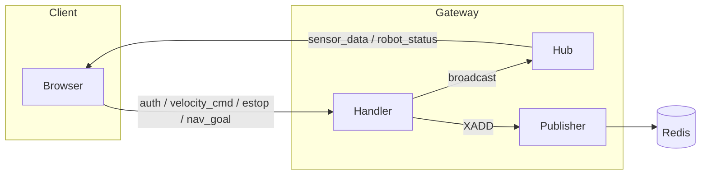

# Data Flow

## Real-Time Control Flow



## Recording Pipeline



### Recording Configuration

Users configure recording at the **sensor-type level**:

```json
{
  "sensor_types": ["lidar", "imu", "odometry"],
  "max_frequency_hz": 10,
  "exclude_sensor_types": ["camera"]
}
```

The worker respects:

- **Sensor type filtering**: Only records configured sensor types
- **Frequency limiting**: Drops samples exceeding `max_frequency_hz`
- **Per-session isolation**: Multiple users can record different sensor combinations simultaneously

## RAG Query Flow



### Document Ingestion



## WebSocket Message Flow



### Message Types

| Type | Direction | Description |
|------|-----------|-------------|
| `auth` | Client → Gateway | JWT token authentication |
| `velocity_cmd` | Client → Gateway | Velocity command (linear_x, linear_y, angular_z) |
| `estop` | Client → Gateway | Emergency stop activate/release |
| `nav_goal` | Client → Gateway | Navigation goal (x, y, theta) |
| `sensor_data` | Gateway → Client | Real-time sensor data |
| `robot_status` | Gateway → Client | Robot state updates |
| `error` | Gateway → Client | Error messages |
| `ping` / `pong` | Bidirectional | Keepalive |
