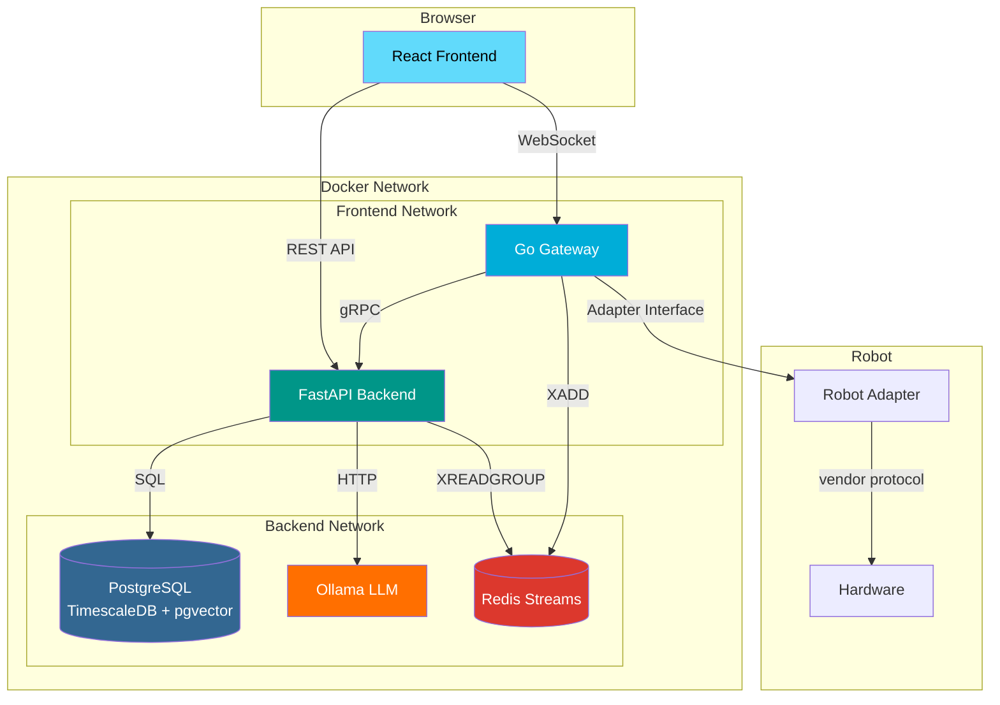
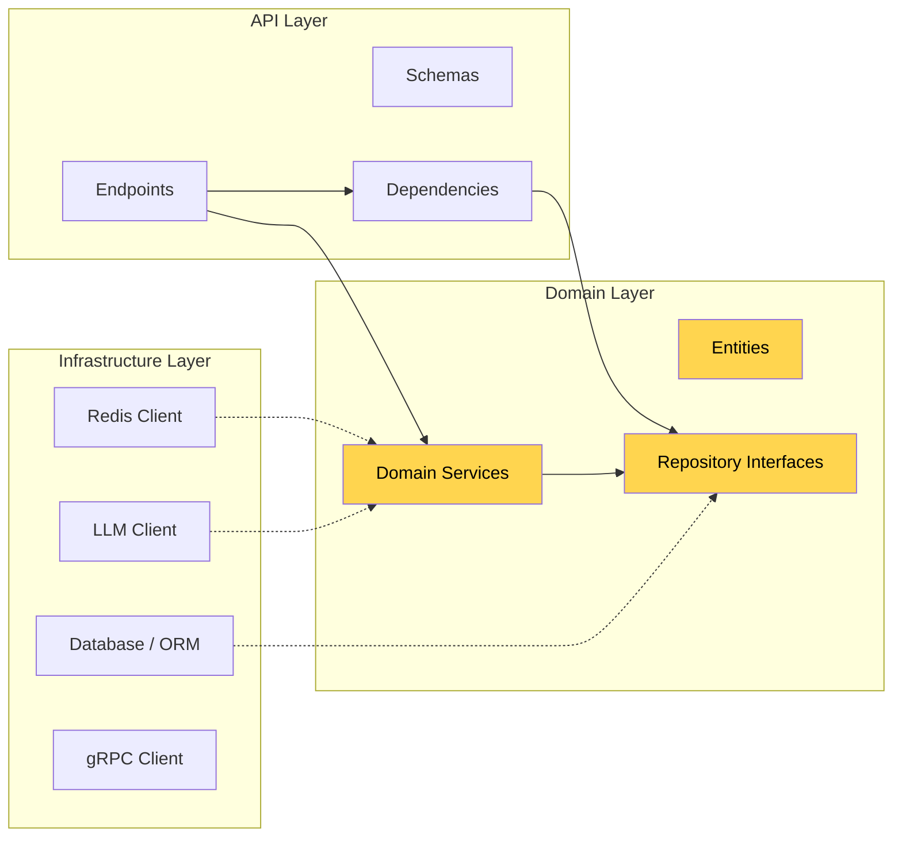
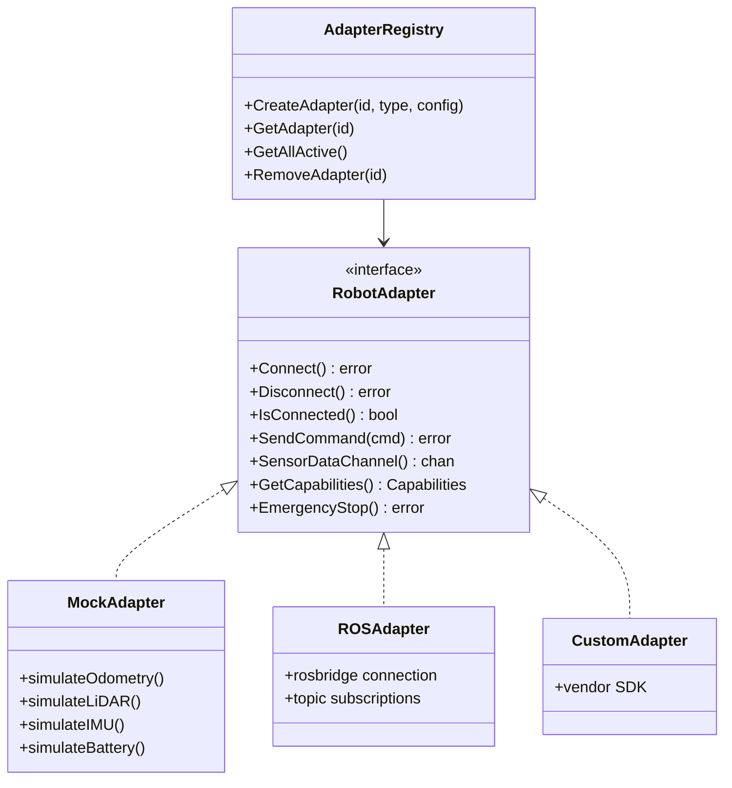

# Architecture Overview

## System Architecture

## Component Responsibilities

### Frontend (React + TypeScript)
- Real-time robot control via WebSocket (joystick, keyboard)
- Sensor data visualization (LiDAR canvas, IMU charts, odometry, battery)
- Dataset management UI with recording controls
- RAG chat interface with SSE streaming
- JWT authentication with role-based UI

### Gateway (Go)
- WebSocket server for real-time bidirectional communication
- MessagePack + JSON protocol with auto-detection
- Robot adapter plugin system (connect any robot via interface)
- Safety pipeline: E-Stop → Operation Lock → Velocity Limiter → Timeout Watchdog
- Redis Streams publisher for sensor data and commands

### Backend (FastAPI)
- REST API for CRUD operations (users, robots, datasets, recordings, RAG)
- Redis Streams consumer worker for recording sensor data
- RAG pipeline: document ingestion → chunking → embedding → pgvector similarity search → LLM generation
- JWT RS256 auth with RBAC (admin/operator/viewer)
- Alembic database migrations

### Database (PostgreSQL + TimescaleDB + pgvector)
- TimescaleDB hypertables for time-series sensor data
- pgvector HNSW index for embedding similarity search
- UUID primary keys, proper indexing, audit logging

## Clean Architecture

The backend follows **Clean Architecture** (Hexagonal):

- **Domain Layer**: Pure Python entities, repository interfaces (ABCs), domain services. No framework dependencies.
- **Infrastructure Layer**: Concrete implementations (SQLAlchemy repos, Ollama client, Redis worker).
- **API Layer**: FastAPI endpoints, Pydantic schemas, dependency injection.

## Robot Adapter Pattern

New robot types are supported by implementing the `RobotAdapter` interface and registering in the factory.
