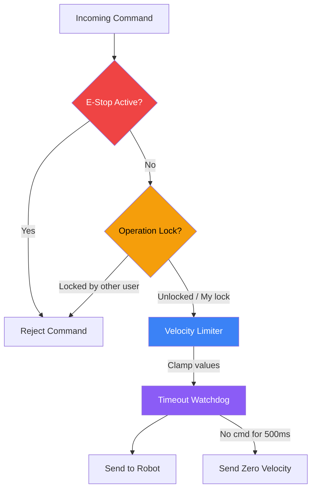
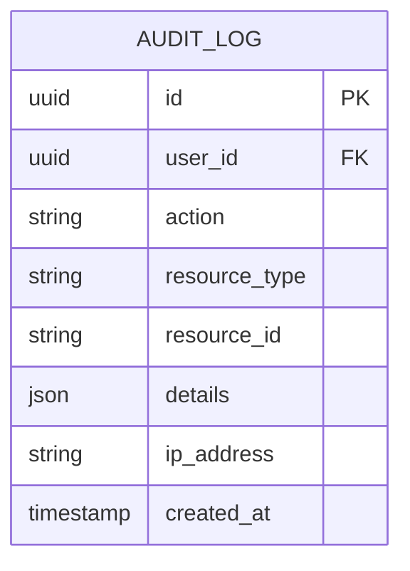
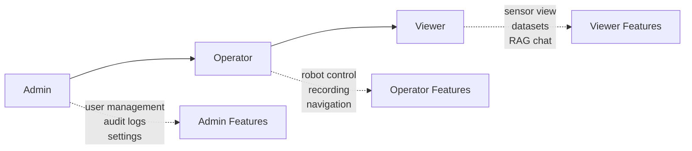

# Safety Features

## Safety Architecture

## E-Stop (Emergency Stop)

- **Hardware-level priority**: Immediately halts all robot motion
- **Per-robot or global**: Can stop individual robot or all connected robots
- **Requires explicit release**: Cannot be auto-released; operator must confirm
- **UI**: Large red button with pulse animation, ESC keyboard shortcut
- **Audit logged**: All activations/releases recorded with user and timestamp

## Velocity Limiter

Clamps velocity commands to configured maximums:

| Parameter | Default | Configurable |
|-----------|---------|:---:|
| Max Linear Speed | 1.0 m/s | ✅ |
| Max Angular Speed | 2.0 rad/s | ✅ |

If values exceed limits, they are clamped (not rejected), and the `Clamped` flag is set.

## Operation Lock

- Prevents concurrent control by multiple operators
- One user acquires lock per robot
- Auto-expiry (configurable, default 5 minutes)
- Background cleanup of expired locks
- Admin can force-release any lock

## Timeout Watchdog

- Monitors time since last velocity command
- If no command received within 500ms, sends zero-velocity
- Prevents "runaway" if WebSocket connection drops
- Check interval: 500ms

## Audit Trail

All safety-relevant actions are audit-logged:

### Audited Actions

| Category | Actions |
|----------|---------|
| Auth | login, logout, token_refresh |
| Robot | robot_create, robot_update, robot_delete |
| Control | command_sent, estop_activate, estop_release, lock_acquire, lock_release |
| Data | recording_start, recording_stop, dataset_create, dataset_delete, dataset_export |
| RAG | document_upload, document_delete, rag_query |
| Admin | user_create, user_update, user_delete, settings_change |

## RBAC (Role-Based Access Control)

| Feature | Admin | Operator | Viewer |
|---------|:-----:|:--------:|:------:|
| View Dashboard | ✅ | ✅ | ✅ |
| View Sensors | ✅ | ✅ | ✅ |
| RAG Chat | ✅ | ✅ | ✅ |
| Manual Control | ✅ | ✅ | ❌ |
| Navigation | ✅ | ✅ | ❌ |
| Start Recording | ✅ | ✅ | ❌ |
| Manage Datasets | ✅ | ✅ | ❌ |
| Upload RAG Docs | ✅ | ✅ | ❌ |
| User Management | ✅ | ❌ | ❌ |
| View Audit Logs | ✅ | ❌ | ❌ |
| System Settings | ✅ | ❌ | ❌ |
