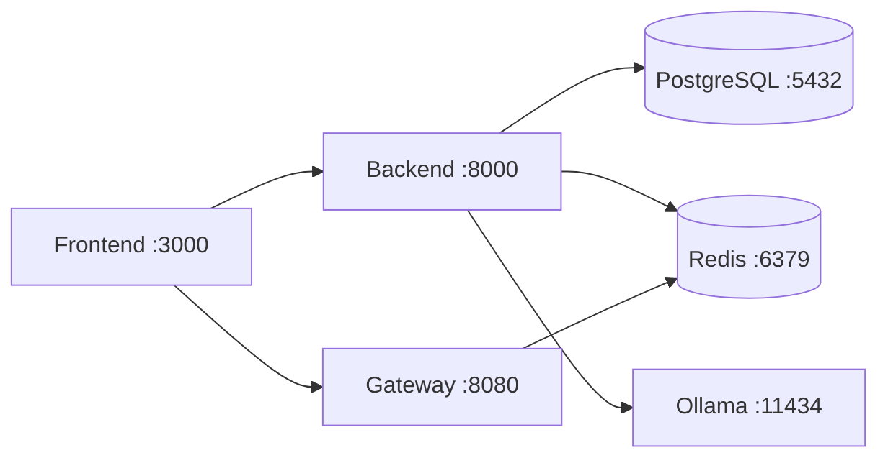

# Docker Setup

## Prerequisites

- Docker Engine 24+
- Docker Compose v2
- 8GB+ RAM (Ollama needs ~4GB for Llama 3)

## Quick Start

```bash
# Clone and setup
git clone https://github.com/your-org/robot-ml-web-app.git
cd robot-ml-web-app
cp .env.example .env

# Start all services
./scripts/setup.sh
docker compose up -d

# Run database migrations
./scripts/migrate.sh upgrade head
```

## Services



| Service | Port | Image |
|---------|------|-------|
| Frontend | 3000 (dev) / 80 (prod) | node:20 / nginx |
| Backend | 8000 | python:3.12-slim |
| Gateway | 8080 | golang:1.22-alpine |
| PostgreSQL | 5432 | timescale/timescaledb:latest-pg16 |
| Redis | 6379 | redis:7-alpine |
| Ollama | 11434 | ollama/ollama |

## Development Mode

```bash
docker compose -f docker-compose.yml -f docker-compose.dev.yml up
```

Features:
- Source code volume mounts (hot reload)
- Debug ports exposed
- Air (Go hot reload) for Gateway
- --reload flag for Backend
- Vite HMR for Frontend

## Environment Variables

See `.env.example` for all configuration options. Key settings:

| Variable | Description | Default |
|----------|-------------|---------|
| `DATABASE_URL` | PostgreSQL connection string | `postgresql+asyncpg://...` |
| `REDIS_URL` | Redis connection | `redis://redis:6379/0` |
| `JWT_SECRET_KEY` | JWT signing key | (generate) |
| `OLLAMA_URL` | Ollama API endpoint | `http://ollama:11434` |
| `LLM_MODEL` | Chat model | `llama3` |
| `EMBEDDING_MODEL` | Embedding model | `nomic-embed-text` |

## Data Persistence

Named volumes:
- `postgres_data` - Database files
- `redis_data` - Redis AOF
- `ollama_data` - Downloaded models
- `upload_data` - Uploaded documents
- `backup_data` - Database backups

## Backup

```bash
./scripts/backup-db.sh
```

Creates timestamped `pg_dump` backup in `./backups/`.
