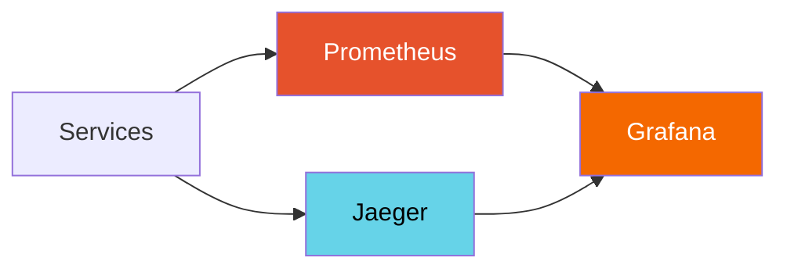

# Future Roadmap

Items planned for future development. These are **design doc only** — not yet implemented.

## Observability Stack

- Prometheus metrics export from all services
- Grafana dashboards (robot status, sensor throughput, API latency)
- Jaeger distributed tracing (request flow across frontend → gateway → backend)

## Kubernetes Deployment

- Helm chart with per-service replicas
- Horizontal Pod Autoscaler for gateway/backend
- PersistentVolumeClaim for PostgreSQL
- GPU node pool for Ollama

## Performance & Load Testing

- Locust / k6 load tests for:
    - WebSocket connection scaling (target: 100 concurrent)
    - Sensor data recording throughput
    - RAG query latency under load
- Benchmark results as CI artifacts

## Internationalization (i18n)

- Japanese (日本語) and English
- react-intl or next-intl
- Backend error messages in both languages

## Data Compliance

- GDPR-compatible data export/deletion
- Configurable retention policies
- Data anonymization tools

## Advanced Features

- **3D Visualization**: Three.js point cloud rendering from LiDAR data
- **SLAM Map**: Real-time map building from LiDAR + odometry
- **Model Training**: In-app ML model training (sensor data → behavior model)
- **Multi-robot Coordination**: Fleet management with conflict-free navigation
- **ROS 2 Bridge**: Native ROS 2 adapter via rosbridge_suite
